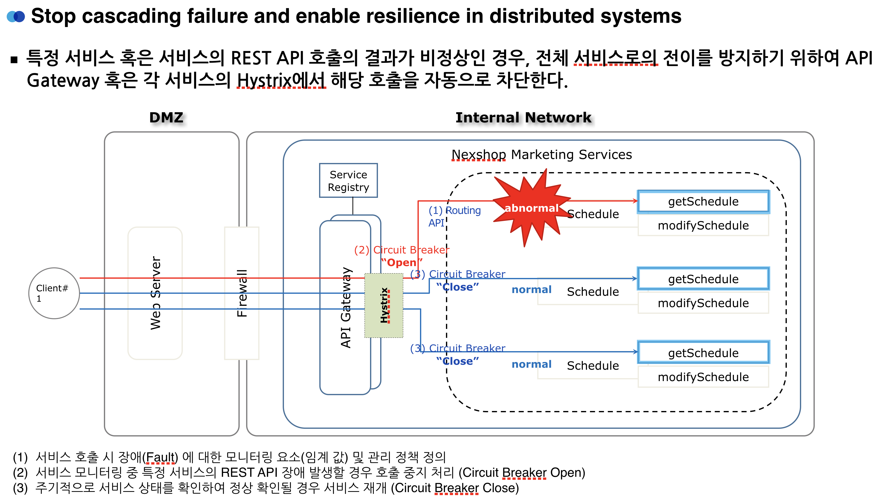

# 1. Hystrix


1. configuration - application.yml 수정
    ```yaml
    ...

    hystrix:
      threadpool:
        default:
          coreSize: 100  # Hystrix Thread Pool default size
          maximumSize: 500  # Hystrix Thread Pool default size
          keepAliveTimeMinutes: 1
          allowMaximumSizeToDivergeFromCoreSize: true
      command:
        default:
          execution:
            isolation:
              thread:
                timeoutInMilliseconds: 1800000     #설정 시간동안 처리 지연발생시 timeout and 설정한 fallback 로직 수행
          circuitBreaker:
            requestVolumeThreshold: 2            #설정수 만큼 처리가 지연될시 circuit open
            errorThresholdPercentage: 50
            enabled: true
    ```
    - Circuit Breaking을 위한 hystrix 설정
1. Fallback 처리를 위한 Provider 등록
    ```java
    @EnableZuulProxy
    @EnableDiscoveryClient
    @SpringBootApplication
    public class CoeZuulApplication {

      public static void main(String[] args) {
        SpringApplication.run(CoeZuulApplication.class, args);
      }

      @Bean
      public FallbackProvider nexshopZuulFallbackProvider() {
        return new ZuulFallbackProvider();
      }
    }
    ```
    
2. HystrixCommand, fallbackMethod 등록
```java
@Service
public class OrderService {

    private CustomerClient customerClient;

    public OrderService(CustomerClient customerClient) {
        this.customerClient = customerClient;
    }

    @HystrixCommand(fallbackMethod = "getDefaultAllCustomer")
    public List<Customer> getAllCustomer() {
        return customerClient.findAll();
    }

    public List<Customer> getDefaultAllCustomer() {
        Customer customer = new Customer();
        customer.setCustomerId(Integer.MAX_VALUE);
        customer.setName("fallback");
        customer.setEmail("fallback@gmail.com");

        return Arrays.asList(customer);
    }
}
```
```java
@EnableCircuitBreaker // cicuitBreaker를 사용하지 않아도 fallback 처리에서 필요 함.(starter-Hystrix의 경우.)
@EnableFeignClients
@EnableDiscoveryClient
@SpringBootApplication
@RestController
public class Service01Application {

    public static void main(String[] args) {
        SpringApplication.run(Service01Application.class, args);
    }

    @RequestMapping("/test")
    public String getTest(){
        return "test";
    }
}
```

3. FeignClient Hystrix 사용
```java
@RefreshScope
@FeignClient(
        name ="${coe.application.customer-service}",
        decode404 = true,
        fallback = CustomerFallback.class
)
public interface CustomerClient {
    @RequestMapping(method = RequestMethod.GET, value = API_V1_BASE_PATH + "/customers")
    List<Customer> findAll();
}
```
```java
public class CustomerFallback implements CustomerClient {
    @Override
    public List<Customer> findAll() {

        return Arrays.asList(new Customer(1,"coe", "coe@mail.com"));
    }
}
```
