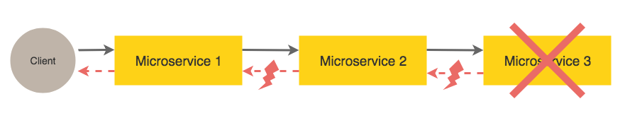
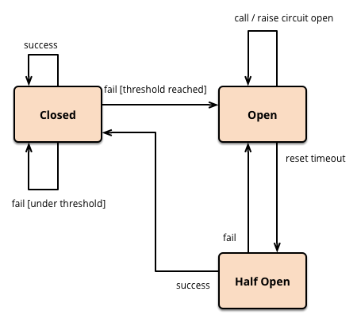
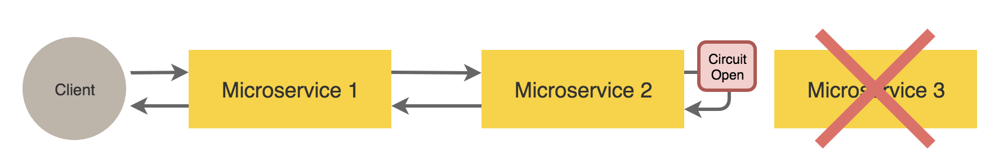
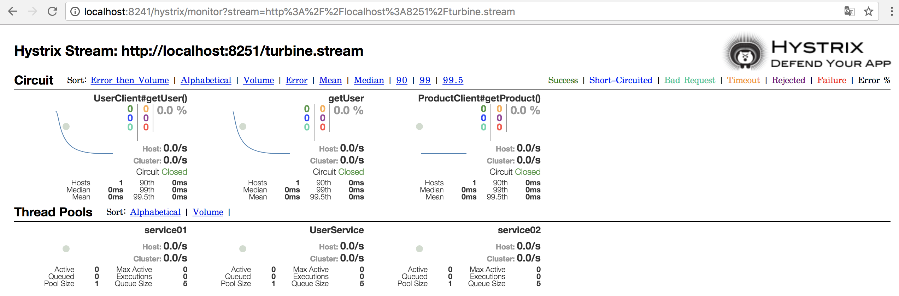
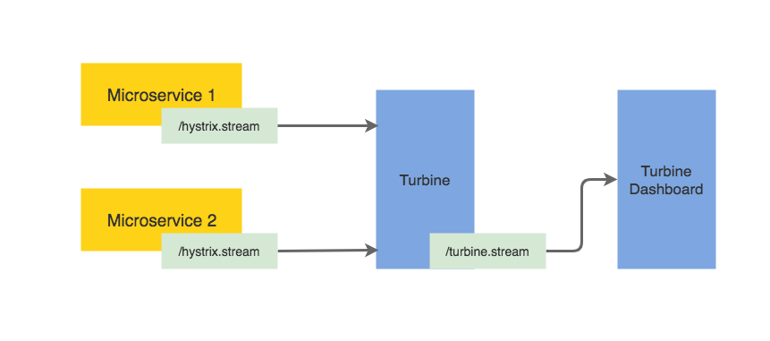
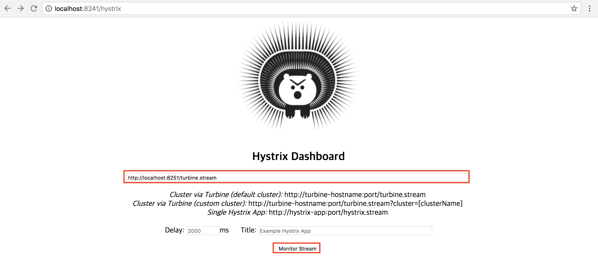
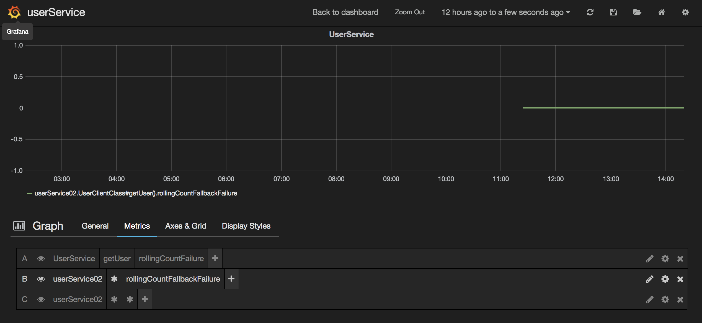

# 1. 개요

## Hystrix란?
서비스들이 많은 의존성을 가진 분산환경에서는 의존성으로 인한 장애나 지연이 발생한다.  
예를들어, 어떤 어플리케이션이 30개의 서비스들간 의존관계를 가지고 각 서비스들은 99.99% uptime을 가진다면,
> 99.99^30 = 99.7% uptime  
0.3% of 1 billion requests = 3,000,000 failures  
2+ hours downtime/month even if all dependencies have excellent uptime.  

모든 서비스들이 개별적으로 잘 동작하더라도 3,000,000번의 장애나 몇 시간의 downtime을 줄 수 있다.  

이런 문제를 해결하기 위해 Circuit Breaker 패턴으로 개발된 Hystrix는 장애 상황에 아래와 같이 대처 한다.
- 장애전파 방지: 서비스간 의존성이 발생하는 접근 포인트를 분리하여 장애 서비스 호출 안함
- fallback: 미리 정의된 값을 return 함  

> 특정 서비스 혹은 서비스의 REST API 호출 결과가 비정상인 경우, 전체 서비스로의 전이를 방지하기 위해 API Gateway 혹은 각 서비스의 Hystrix에서 해당 호출을 자동으로 차단합니다.


#### Hystrix 기능
- Latency and fault tolerance
- 장애 전파 방지
- 빠른 실패(Fail fast)와 빠른 복구(Rapid Recovery)
- 실시간 모니터링, 알람 및 설정 변경(Operational Control) 지원

#### Circuit Breaker란?
서비스 간 수많은 의존관계가 있는 MSA환경에서 특정 서비스 하나가 갑자기 응답하지 않게 되면 해당 서비스와 의존관계에 있는 모든 서비스들이 연쇄적으로 문제를 일으키게 되고 원인이 되는 서비스를 찾아 내기까지 시간도 오래 걸린다.   


이러한 연쇄적인 장애 발생을 막기 위해선 장애가 전파되지 않도록 문제가 발생한 서비스에 대한 접속 차단이 필요하고 Circuit Breaker 패턴을 적용하여 해결할 수 있다.   
Circuit Breaker 패턴에는 아래와 같이 세 가지 상태가 존재합니다.


- Closed : 초기 상태로 모든 접속은 평소와 같이 실행된다.
- Open(Failure state) : 에러율이 임계치를 넘어서면 OPEN 상태가 되고, 모든 접속은 차단(fail fast)된다.
- Half-open : OPEN 후 일정 시간이 지나면 HALF_OPEN 상태가 되고, 접속을 시도하여 성공하면 CLOSED, 실패하면 OPEN으로 되돌아간다.
#### Circuit open 상태 설명

- 초기 Service3 호출 정상 동작 상태시에는 Closed
- Service3 호출 시 이상 발생 한 경우 Open 상태로 변경되고 접속 차단(fail fast)
  - Service3 호출 결과는 fallback으로 정의된 내용이 return 됨
- 주기적으로 서비스 상태 확인하여 정상 확인될 경우 Close 상태로 변경

## Hystrix 모니터링
#### Hystrix Dashboard
Hystrix를 적용한 어플리케이션은 측정 지표 수집에 사용될 /hystrix.stream 종단점을 노출한다.  
각 어플리케이션의 API상태 및 Circuit 정보를 Hystrix Dashboard를 통해서 모니터링 할 수 있다. (적용 : 3. Hystrix Dashboard 참고)


#### Turbine을 통한 히스트릭스 스트림 통합
Turbine은 다수의 어플리케이션으로 부터 /hystrix.stream 의 데이터를 집계해 하나의 stream으로 통합해준다.  
이를 한개의 대시보드 화면에서 조회 할 수 있다. (적용 : 4. Hystrix Turbine 참고)


# 2. 구성방법

Hystrix를 적용하는 세 가지 샘플 코드를 제공한다.
- HystrixCommand: 단일 API에 대하여 Hystrix를 적용한다.(fallbackMethod 등록)
- FeignClient: Feign Interface 에 포함된 API에 Hystrix를 적용한다.(fallback class사용)
- Zuul: routing시 Hystrix를 적용한다. (FallbackProvider 등록)

## - HystrixCommand, fallbackMethod 등록(Service, Component만 사용 가능)
1. Hystrix dependency 추가
```xml
<dependency>
    <groupId>org.springframework.cloud</groupId>
    <artifactId>spring-cloud-starter-hystrix</artifactId>
    <version>1.4.4.RELEASE</version>
</dependency>
```        
2. configuration - application.yml 에 추가  
```yml
hystrix:
    threadpool:
    default:
        coreSize: 100  # Hystrix Thread Pool default size
        maximumSize: 500  # Hystrix Thread Pool default size
        keepAliveTimeMinutes: 1
        allowMaximumSizeToDivergeFromCoreSize: true
    command:
    default:
        execution:
        isolation:
            thread:
            timeoutInMilliseconds: 1800000     #설정 시간동안 처리 지연발생시 timeout and 설정한 fallback 로직 수행
        circuitBreaker:
        requestVolumeThreshold: 2            #설정수 만큼 처리가 지연될시 circuit open
        errorThresholdPercentage: 50
        enabled: true
```
3. HystrixCommand 정의
```java
@Service
public class OrderService {
    private CustomerClient customerClient;
    public OrderService(CustomerClient customerClient) {this.customerClient = customerClient; }

    @HystrixCommand(fallbackMethod = "getDefaultAllCustomer")   
    public List<Customer> getAllCustomer() { return customerClient.findAll();
    }

    public List<Customer> getDefaultAllCustomer() {
        Customer customer = new Customer();
        customer.setCustomerId(Integer.MAX_VALUE);
        customer.setName("fallback");
        customer.setEmail("fallback@gmail.com");

        return Arrays.asList(customer);
    }
}
```
4. Application annotation 추가
```java
@EnableHystrix
@EnableFeignClients
@EnableDiscoveryClient
@SpringBootApplication
@RestController
public class Service01Application {

    public static void main(String[] args) {
        SpringApplication.run(Service01Application.class, args);
    }

    @RequestMapping("/test")
    public String getTest(){
        return "test";
    }
}
```

## - FeignClient Hystrix의 fallback class사용
Feign dependency 에 hystrix가 기본 포함 되어 별도 dependency추가 불필요
1. configuration - application.yml 에 추가   
feign에서 hystrix 사용 여부를 선택 할 수 있음(hystrix 관련 config 는 모두 동일) 
```yml
feign:
  hystrix:
    enabled: true
hystrix:
  threadpool:
    default:
      coreSize: 100  # Hystrix Thread Pool default size
      maximumSize: 500  # Hystrix Thread Pool default size
      keepAliveTimeMinutes: 1
      allowMaximumSizeToDivergeFromCoreSize: true
  command:
    default:
      execution:
        isolation:
          thread:
            timeoutInMilliseconds: 3000     #설정 시간동안 처리 지연발생시 timeout and 설정한 fallback 로직 수행
      circuitBreaker:
        requestVolumeThreshold: 2            #설정수 만큼 처리가 지연될시 circuit open
        errorThresholdPercentage: 50
        enabled: true    
```
2. Feign Hystrix 정의
```java
@RefreshScope
@FeignClient(
        name ="${coe.application.customer-service}",
        decode404 = true,
        fallback = CustomerFallback.class   //fallback 클래스 정의
)
public interface CustomerClient {
    @RequestMapping(method = RequestMethod.GET, value = API_V1_BASE_PATH + "/customers")
    List<Customer> findAll();
}
```
3. Fallback class 정의
```java
@Component
public class CustomerFallback implements CustomerClient {
    @Override
    public List<Customer> findAll() {

        return Arrays.asList(new Customer(1,"coe", "coe@mail.com"));
    }
}
```

### - Zuul FallbackProvider 등록
Zuul Gateway에 Fallback Provider를 등록한다.  
Zuul dependency 에 hystrix가 기본 포함 되어 별도 dependency추가 불필요  
1. configuration - application.yml 에 추가(hystrix 관련 config 는 모두 동일)   
```yml
hystrix:
  threadpool:
    default:
      coreSize: 100  # Hystrix Thread Pool default size
      maximumSize: 500  # Hystrix Thread Pool default size
      keepAliveTimeMinutes: 1
      allowMaximumSizeToDivergeFromCoreSize: true
  command:
    default:
      execution:
        isolation:
          thread:
            timeoutInMilliseconds: 3000     #설정 시간동안 처리 지연발생시 timeout and 설정한 fallback 로직 수행
      circuitBreaker:
        requestVolumeThreshold: 2            #설정수 만큼 처리가 지연될시 circuit open
        errorThresholdPercentage: 50
        enabled: true    
```
2. routeFallbackProvider 예시  
```java
public class ZuulFallbackProvider implements FallbackProvider {
    private static final String SERVICE_ID = "serviceId";
    private static final String REQUEST_URI = "requestURI";
    @Value("${hystrix.command.default.execution.isolation.thread.timeoutInMilliseconds}")
    private String hystrixThreadTimeoutMilliseconds;
    @Override
    public String getRoute() {return "*";}
    @Override
    public ClientHttpResponse fallbackResponse(String route, Throwable cause) {
        if (cause instanceof HystrixTimeoutException) {
            return response(HttpStatus.GATEWAY_TIMEOUT, getInvalidParam(cause), getRootCauseMsg(cause));
        } else {
            return response(HttpStatus.INTERNAL_SERVER_ERROR, getInvalidParam(cause), getRootCauseMsg(cause));
        }
    }
    private ClientHttpResponse response(HttpStatus status, String invalidParam, String rootCauseMsg) {
        return new ClientHttpResponse() {
            @Override
            public HttpStatus getStatusCode() { return status; }
            @Override
            public int getRawStatusCode() {return status.value();}
            @Override
            public String getStatusText() {return status.getReasonPhrase();}
            @Override
            public void close() { }
            @Override
            public InputStream getBody() {
                HttpStatus status = getStatusCode();
                ErrorResponseBodyVO responseBodyVO;
                if (status == HttpStatus.GATEWAY_TIMEOUT) {
                    responseBodyVO = new ErrorResponseBodyVO("Error"
                                            , "Failed to handle the request in given thread time. (" + rootCauseMsg + ")"
                                            , invalidParam);
                } else if (status == HttpStatus.INTERNAL_SERVER_ERROR) {
                    responseBodyVO = new ErrorResponseBodyVO("Error"
                                            , "Service Unavailable. Please try after sometime. (" + rootCauseMsg + ")"
                                            , invalidParam);
                } else {
                    responseBodyVO = new ErrorResponseBodyVO();
                }
                return new ByteArrayInputStream(responseBodyVO.toJSONString().getBytes());
            }
            @Override
            public HttpHeaders getHeaders() {
                HttpHeaders headers = new HttpHeaders();
                headers.setContentType(MediaType.APPLICATION_JSON);
                return headers;
            }
        };
    }

    private String getInvalidParam(final Throwable cause) {
        if (cause instanceof HystrixTimeoutException) {
            return "hystrix....timeoutInMilliseconds: " + hystrixThreadTimeoutMilliseconds;
        } else {
            RequestContext context = RequestContext.getCurrentContext();
            String serviceId = context.get(SERVICE_ID).toString().toUpperCase();
            String requestURI = context.get(REQUEST_URI).toString();
            return serviceId + requestURI;
        }
    }

    private String getRootCauseMsg(final Throwable cause) {
        return ExceptionUtils.getRootCauseMessage(cause);
    }
}
```
3. Fallback 처리를 위한 Provider 등록
```java
@EnableZuulProxy
@EnableDiscoveryClient
@SpringBootApplication
public class CoeZuulApplication {

    public static void main(String[] args) {
    SpringApplication.run(CoeZuulApplication.class, args);
    }

    @Bean
    public FallbackProvider zuulFallbackProvider() {
    return new ZuulFallbackProvider();
    }
}
```

# 3. Hystrix Dashboard
Hystrix stream을 시각화하는 서비스

1. Hystrix Dashboard dependency 추가
```xml
<dependency>
    <groupId>org.springframework.cloud</groupId>
    <artifactId>spring-cloud-starter-hystrix-dashboard</artifactId>
    <version>1.4.4.RELEASE</version>
</dependency>
```
2. Application annotation 추가
```java
@EnableHystrixDashboard
@SpringBootApplication
public class HystrixDashboardApplication {
	public static void main(String[] args) {springApplication.run(HystrixDashboardApplication.class, args);	}
}
```
3. Client 서비스의 actuator hystrix stream endpoint 열기 위한 config 추가
> Actuator dependency가 client 서비스에 포함되어 있어야 함
```yml
management:
  endpoints:
    web:
      exposure:
        include: 'hystrix.stream'
```
> Hystrix dashboard 기본 endpoint -> http://localhost:port/hystrix  



main에 hystrix stream URL 입력 후 Monitor Stream 클릭 하면 아래화면 처럼 모니터링 가능


# 4. Hystrix Turbine
각 서비스별 Hystrix Stream 을 통합해주는 서비스
> turbine 기본 endpoint -> http://localhost:port/turbine.stream

1. turbine denpendencies 추가
```xml
<dependency>
    <groupId>org.springframework.cloud</groupId>
    <artifactId>spring-cloud-starter-netflix-turbine</artifactId>
</dependency>
```

2. Turbine config
```yml
turbine:
  appConfig: productService,userService    # 모니터 원하는 서비스 나열(eureka에 등록되어 있어야 함)
  clusterNameExpression: new String('default')    #default cluster를 사용하겠다고 정의
```
3. Application annotation 추가
```java
@EnableTurbine
@EnableDiscoveryClient
@SpringBootApplication
public class TurbinServiceApplication {
	public static void main(String[] args) {SpringApplication.run(TurbinServiceApplication.class, args);}
}
```

# 5. Graphite + Grafana
실시간으로 생성되는 Hystrix Stream 데이터를 historical하게 볼수 있도록 함  
Metrics를 dropwizard로 보내고 이를 graphite에 저장하는 형식으로 시스템 부하에 대한 모니터링 필요
* Graphite: Hystrix Merics 정보를 파일 형태로 저장
* Grafana: Graphite의 Metrics 이력을 챠트로 표현해 줌(Graphite외 다른 저장소 사용 가능)

> 예제에 사용된 Graphite + Grafana 이미지(choopooly/grafana-graphite)  
> docker run -d -p 8070:80 -p 2003:2003 -p 8125:8125/udp -p 8126:8126 --name grafana-dashboard choopooly/grafana_graphite  
> Metrics 저장소 상황에 따라 local에 volume 매핑 필요 (기본 /var/lib/graphite/storage/whisper)  

1.  Metrics 전송을 위한 dependencies 추가
```xml
<dependency>
    <groupId>io.dropwizard.metrics</groupId>
    <artifactId>metrics-graphite</artifactId>
    <version>3.1.0</version>
</dependency>
<dependency>
    <groupId>io.dropwizard.metrics</groupId>
    <artifactId>metrics-core</artifactId>
    <version>3.1.0</version>
</dependency>
<dependency>        <!-- hystrix metrics를 dropwizard로 publishing 하기 위해 필요 -->
    <groupId>com.netflix.hystrix</groupId>
    <artifactId>hystrix-codahale-metrics-publisher</artifactId>
    <version>1.5.12</version>
    <exclusions>
        <exclusion>
            <groupId>com.codahale.metrics</groupId>
            <artifactId>metrics-core</artifactId>
        </exclusion>
    </exclusions>
</dependency>
```
2.  service에 metrics publish 관련 Bean 등록
```java
@EnableFeignClients
@SpringBootApplication
@EnableHystrix
public class Service01Application {
    @Bean
    public MetricRegistry metricRegistry() {
        return new MetricRegistry();
    }
    @Bean   //metrics 전송 interval 설정 및 초기화
    public GraphiteReporter graphiteReporter(MetricRegistry metricRegistry) {
        final GraphiteReporter reporter = GraphiteReporter
                .forRegistry(metricRegistry)
                .build(graphite());
        reporter.start(1, TimeUnit.SECONDS);
        return reporter;
    }
    @Bean   //Graphite 데이터 취합 endpoints
    GraphiteSender graphite() {
        return new Graphite(new InetSocketAddress("localhost", 2003));
    }
    @Bean   // Hystrix에 publisher instance 등록
    HystrixMetricsPublisher hystrixMetricsPublisher(MetricRegistry metricRegistry) {
        HystrixCodaHaleMetricsPublisher publisher = new HystrixCodaHaleMetricsPublisher(metricRegistry);
        HystrixPlugins.getInstance().registerMetricsPublisher(publisher);
        return publisher;
    }
}
```
3.  Hystrix metrics 항목을 grafana에서 항목 매핑 하여 챠트 구성



# 참고
### 목적
https://medium.com/@goinhacker/hystrix-500452f4fae2  
https://engineering.linecorp.com/ko/blog/detail/76  
https://martinfowler.com/bliki/CircuitBreaker.html
