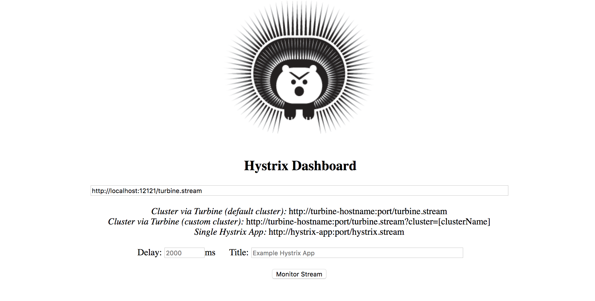
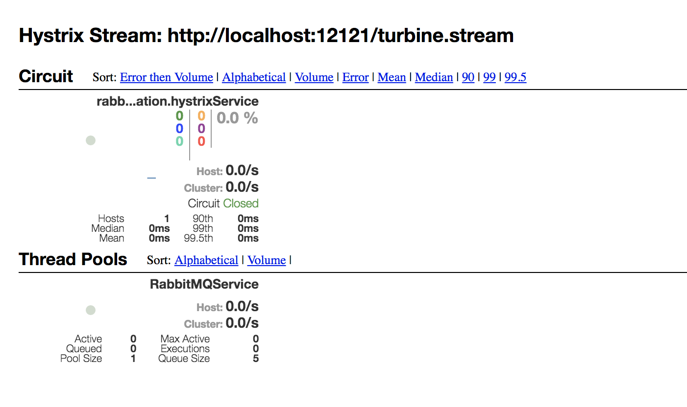
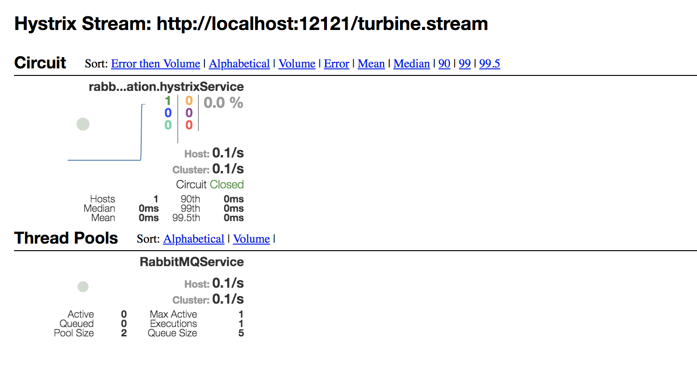
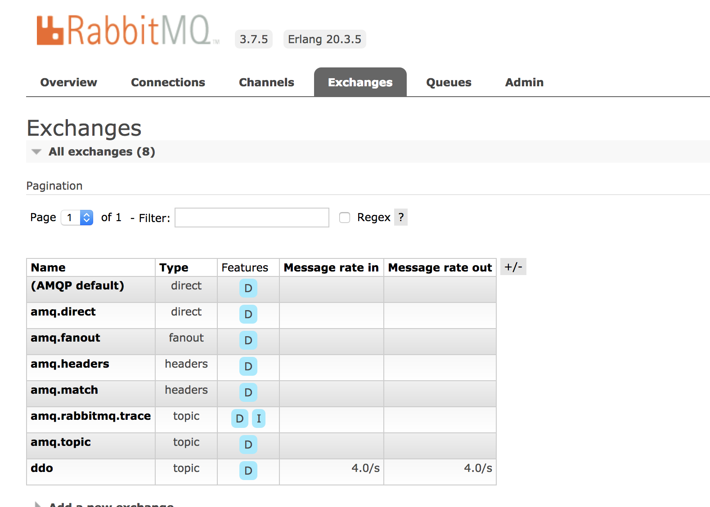
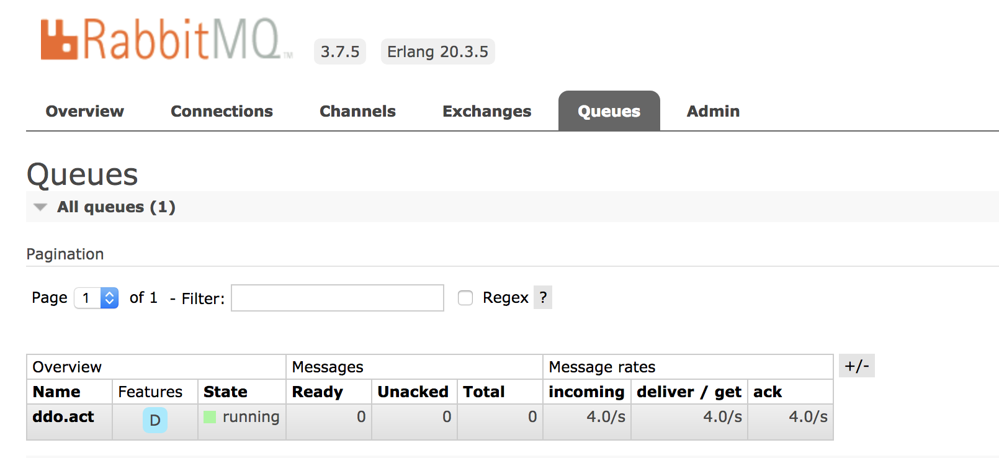

# Turbine With RabbitMQ

클러스터를 통해 hystrix 스트림의 정보를 집계하는 방법은 turbine을 사용하면 가능하였다.
하지만 이러한 집계(aggregation) 방법은 pull-based 방식이기 때문에 turbine 인스턴스가 각 인스턴스에게 스트림을 요청하게 된다. 이러한 방식은 인스턴스가 늘어날 때 마다 turbine에게 부담을 주게 된다. 그리고 일부 환경(ex: PaaS)에서는 모든 분산 Hystrix command를 가져오는 turbine이 작동하지 않을 때도 존재한다.

이러한 문제점을 해결하기 위해서 Spring Cloud Turbine AMQP가 제공 되며, 각 어플리케이션 인스턴스가 직접 중앙 RabbitMQ 브로커에게 정보를 제공하며 이러한 정보를 받은 RabbitMQ가 turbine으로 메트릭 정보를 푸시(push-based)하게 된다.

## 1. 준비
해당 샘플 프로젝트는 아래와 같이 총 5개로 구성이 되어 있으며
RabbitMQ의 경우 차후 컨테이너화를 대비해 도커로 구성해 본다.

* turbine dashboard application
* turbine stream application
* RabbitMQ
* Service application
* Eureka application

## 2. Docker Rabbit MQ 실행
[docker hub](https://hub.docker.com/)에서 rabbitmq 이미지를 받는다.

management ui를 사용하기 위해서 3.7.5-management tag를 받는다.(2018/06/18 기준 최신)

~~~bash
$ docker pull rabbitmq:3.7.5-management
~~~

이미지를 받았으면 컨테이너를 실행한다.
(위 다운 작업 없이 아래 명령어를 실행하면 로컬에 해당 이미지가 없을 경우 자동으로 pull 한 이후에 실행한다)

~~~bash
$ docker run -d \
  --hostname rabbit \
  --name rabbit \
  -p 15672:15672 \
  -p 5672:5672 \
  rabbitmq:3.7.5-management

docker run -d \
 --hostname rabbit2 \
 --name rabbit2 \
 -p 15673:15672 \
 -p 5673:5672 \
 rabbitmq:3.7.5-management
~~~

localhost:15672(15763)에 접속 한 이후 guest/guest로 로그인이 되는지 확인한다.

5672는 hystrix를 위한 rabbitmq, 5673은 일반적인 메시지 기능을 위한 rabbitmq이다.

## 3. Service Application 작성
Hystrix stream을 생성하는 어플리케이션을 작성한다.

기존에 RabbitMQ에 접근하기 위해서는
~~~yml
spring:
  rabbitmq:
    address:
~~~

위와 같은 설정을 사용하였으나 이런 경우 여러 broker(여기에서는 rabbitmq)를 사용하기 힘들어진다. 따라서 spring cloud stream에서 제공하는 binding을 이용하도록 한다.

먼저 아래와 같은 dependency를 추가한다

~~~xml
<dependency>
	<groupId>org.springframework.boot</groupId>
	<artifactId>spring-boot-starter-actuator</artifactId>
</dependency>
<dependency>
	<groupId>org.springframework.cloud</groupId>
	<artifactId>spring-cloud-starter-netflix-hystrix</artifactId>
</dependency>
<dependency>
	<groupId>org.springframework.cloud</groupId>
	<artifactId>spring-cloud-netflix-hystrix-stream</artifactId>
</dependency>
<dependency>
	<groupId>org.springframework.cloud</groupId>
	<artifactId>spring-cloud-starter-stream-rabbit</artifactId>
</dependency>
<dependency>
      <groupId>org.springframework.cloud</groupId>
      <artifactId>spring-cloud-starter-netflix-eureka-client</artifactId>
</dependency>
~~~

기본적으로 바인더는 응용프로그램의 스프링부터의 자동 구성을 공유하기 때문에 클래스 경로에 있는 각 바인더의 인스터스 하나가 만들어 진다.

 만약 하나의 응용프로그램이 동일한 유형의 둘 이상의 브로커(ex: rabbitmq)에 연결해야 하는 경우 서로 다른 환경 설정을 갖는 여러 바인더 구성을 아래와 같이 지정해줘야 한다.

~~~yml
management:
  endpoints:
    web:
      exposure:
        include: '*'

spring:
  application:
    name: rabbitmq-application
  cloud:
    stream:
      bindings:
        hystrixStreamOutput:
          destination: ddo
          binder: rabbit1
        messageOutput:
          destination: act
          binder: rabbit2
      binders:
        rabbit1:
          type: rabbit
          environment:
            spring:
              rabbitmq:
                host: localhost
                port: 5672
                username: guest
                password: guest
        rabbit2:
          type: rabbit
          environment:
            spring:
              rabbitmq:
                host: localhost
                port: 5673
                username: guest
                password: guest
~~~

해당 설정의 설명은 아래와 같다.

~~~yml
spring:
  cloud:
    stream:
      bindings:
        ...
~~~
bindings 설정은 입력 및 출력 채널을 식별하는 인터페이스 모임이다.

~~~yml
spring:
  cloud:
    stream:
      bindings:
        hystrixStreamOutput:
          destination: ddo
          binder: rabbit1
          ...
~~~

destination은 브로커의 목적지가 되며 rabbitmq에서는 해당 이름의 exchagne가 자동 생성 된다.

binder는 mapping 될 브로커의 정보를 가진 key 명칭이며 binders에 설정된 명칭을 사용한다.
(binders에 설정된 key명)

추가적으로 hystrixStreamOutput라는 key가 있으면

HystrixStreamAutoConfiguration에서 자동적으로 해당 정보를 읽어서

hystrix를 위한 브로커로 사용하게 된다.

~~~yml
spring:
  cloud:
    stream:
      ...
      ...
      ...
      binders:
        rabbit1:
          type: rabbit
          environment:
            spring:
              rabbitmq:
                host: localhost
                port: 5672
                username: guest
                password: guest
        ...
~~~
위에서 binders밑의 정보는 해당 어플리케이션에서 사용될 브로커(kafak, rabbitmq)의 정보를 나타낸다.

설정을 하였으니 java 코드를 작성한다.

GET 요청을 이용해서 테스트를 할 예정이기 때문에 총 2개의  RestAPI를 작성한다.

/ 요청은 hystrix 테스트를 위한 리퀘스트이고

/message 요청은 메시지 테스트를 위한 리퀘스트이다.

~~~java
import hystrix.amqp.service.message.Sender;
import hystrix.amqp.service.service.RabbitMQService;
import org.springframework.beans.factory.annotation.Autowired;
import org.springframework.web.bind.annotation.GetMapping;
import org.springframework.web.bind.annotation.RestController;

@RestController
public class RabbitMQController {

    @Autowired
    RabbitMQService rabbitMQService;

    @Autowired
    Sender sender;

    @GetMapping("/")
    public void hystrixTest() throws Exception{
        rabbitMQService.hystrixService();
    }

    @GetMapping("/message")
    public void messageTest() {
        sender.send("this is message");
    }
}
~~~

HystrixCommand 어노테이션을 이용한다.
(fallback 등의 기능은 다른 가이드에서 이미 소개를 하였기 때문에 가장 기본적인 형태만 작성하였음)
~~~java
import com.netflix.hystrix.contrib.javanica.annotation.HystrixCommand;
import org.springframework.stereotype.Service;

@Service
public class RabbitMQService {

    @HystrixCommand
    public void hystrixService() throws Exception {
    }
}
~~~

기존에 rabbitmq에 메시지를 보낼때는 RabbitMessagingTemplate을 이용하여 보냈지만 여기에서는 binder를 이용하기 때문에 별도의 설정이 추가적으로 필요하다.

아래와 같이 커스텀 채널을 작성한다.
~~~java
import org.springframework.cloud.stream.annotation.Output;
import org.springframework.messaging.MessageChannel;

public interface Processor {
    @Output("messageOutput")
    MessageChannel anOutPut();
}
~~~

위에서 @Output 안에 주는 값은 application.yml에 작성하였던 bindings 중 하나의 이름과 동일하다.

반대로 @Input 어노테이션도 가능하며 MessageChannel 대신 SubscribableChannel을 사용한다.

이제 위의 커스텀채널을 호출하는 컴포넌트를 아래와 같이 작성한다.
~~~java
import org.springframework.beans.factory.annotation.Autowired;
import org.springframework.messaging.Message;
import org.springframework.messaging.support.MessageBuilder;
import org.springframework.stereotype.Component;

@Component
public class Sender {

    @Autowired
    Processor processor;

    public void send(String message) {
        processor.anOutPut().send(message(message));
    }

    private static final <T> Message<T> message(T val) {
        return MessageBuilder.withPayload(val).build();
    }
}
~~~

이 상태로 실행을 하게 되면 서버가 실행이 되지 않는데 왜냐하면 해당 어플리케이션에 Input 및 Output을 작성한 커스텀채널을 브로커에 바인딩이 가능하도록 spinrg에게 알려줘야 하기 때문이다.
따라서 아래와 같은 @EnableBinding 어노테이션을 추가한다.

~~~java
import hystrix.amqp.service.message.Processor;
import org.springframework.boot.SpringApplication;
import org.springframework.boot.autoconfigure.SpringBootApplication;
import org.springframework.cloud.netflix.hystrix.EnableHystrix;
import org.springframework.cloud.stream.annotation.EnableBinding;

@EnableHystrix
@SpringBootApplication
@EnableEurekaClient
@EnableBinding(Processor.class)
public class RabbitMQApplication {
	public static void main(String[] args) {
		SpringApplication.run(RabbitMQApplication.class, args);
	}
}
~~~

## 4. Turbine Stream Application 작성
위에서 작성한 어플리케이션에서 rabbitmq의 exchange로 보낸 메시지들을 취합하는 turnbine 어플리케이션을 작성한다.

만약 위의 단계까지 했단 rabbitmq의 management ui에서 exchagne만 생성이 되고 queue는 생성되지 않는 것을 확인 할수 있는데

여기서 Turbine Stream application을 작성하면 queue가 생성되는 것을 볼 수 있다.

pom에서 아래와 같이 dependency를 추가한다.
~~~xml
<dependency>
	<groupId>org.springframework.cloud</groupId>
	<artifactId>spring-cloud-starter-netflix-turbine-stream</artifactId>
</dependency>
<dependency>
	<groupId>org.springframework.cloud</groupId>
	<artifactId>spring-cloud-stream-binder-rabbit</artifactId>
</dependency>
~~~

아래와 같이 application.yml을 수정한다.

hystrix에서는 hystrixStreamOutput라는 key가 있었지만
여기서는 입력받을 turbineStreamInput이 존재한다.

추가적으로 group이 존재하는데 메시지를 주고 받을 queue 이름에 해당된다.
~~~yml
server:
  port: 12121

spring:
  cloud:
    stream:
      bindings:
        turbineStreamInput:
          binder: rabbit2
          destination: ddo
          group: act
      binders:
        rabbit2:
          type: rabbit
          environment:
            spring:
              rabbitmq:
                host: localhost
                port: 5672
                username: guest
                password: guest
  application:
    name: turbine-application
~~~

아래와 같이 main 클래스에 Turbine과 Eureka 관련 어노테이션을 추가하였다. (eureka의 경우 추가적으로 application.yml에서 설정을 하지 않았기 때문에 8761포트의 eureak를 바라본다.)
~~~java
import org.springframework.boot.SpringApplication;
import org.springframework.boot.autoconfigure.SpringBootApplication;
import org.springframework.cloud.client.discovery.EnableDiscoveryClient;
import org.springframework.cloud.netflix.turbine.stream.EnableTurbineStream;

@EnableTurbineStream
@SpringBootApplication
@EnableDiscoveryClient
public class DemoApplication {
	public static void main(String[] args) {
		SpringApplication.run(DemoApplication.class, args);
	}
}
~~~

## 5. Hystrix Dashboard 작성
다른 가이드 문서에도 적혀 있지만 turbine.stream 또는 hystrix.stream을 시각화 해서 보기 위해서는 별도의 Dashboard가 필요하다.

pom에 아래와 같은 dependency를 추가한다.
~~~xml
<dependency>
	<groupId>org.springframework.cloud</groupId>
	<artifactId>spring-cloud-starter-hystrix-dashboard</artifactId>
	<version>1.4.4.RELEASE</version>
</dependency>
~~~

그리고 아래와 같이 @EnableHystrixDashbaord 어노테이션을 추가한다
~~~java
package com.example.demo;

import org.springframework.boot.SpringApplication;
import org.springframework.boot.autoconfigure.SpringBootApplication;
import org.springframework.cloud.netflix.hystrix.dashboard.EnableHystrixDashboard;

@SpringBootApplication
@EnableHystrixDashboard
public class DashboardApplication {

	public static void main(String[] args) {
		SpringApplication.run(DashboardApplication.class, args);
	}
}
~~~

## 6. Eureka Server 작성
pom에 아래와 같은 dependency를 추가한다.
~~~xml
<dependency>
	<groupId>org.springframework.cloud</groupId>
	<artifactId>spring-cloud-starter-netflix-eureka-server</artifactId>
</dependency>
~~~

그리고 아래와 같이 @EnableEurekaServer 어노테이션을 추가한다.
~~~java
import org.springframework.boot.SpringApplication;
import org.springframework.boot.autoconfigure.SpringBootApplication;
import org.springframework.cloud.netflix.eureka.server.EnableEurekaServer;

@SpringBootApplication
@EnableEurekaServer
public class EurekaServerApplication {

	public static void main(String[] args) {
		SpringApplication.run(EurekaServerApplication.class, args);
	}
}
~~~

## 7. 실행

위에서 작성한 어플리케이션을 실행 한 이후 http://localhost:9999/hystrix 로 접속한다.

dashboard 화면이 나오면 turbine의 스트림 주소(http://localhost:12121/turbine.stream)를 입력한다.

hystrixcommand를 실행하기 위해서 (http://localhost:10001/)을 브라우저 또는 터미널에서 실행한다.

dashboard에서 Circuit이 변경되는 것을 확인한다.

rabbitmq management 화면(http://localhost:15672)에서 guest/guest로 로그인하여 exchange와 queue가 존재하는지 확인한다.

