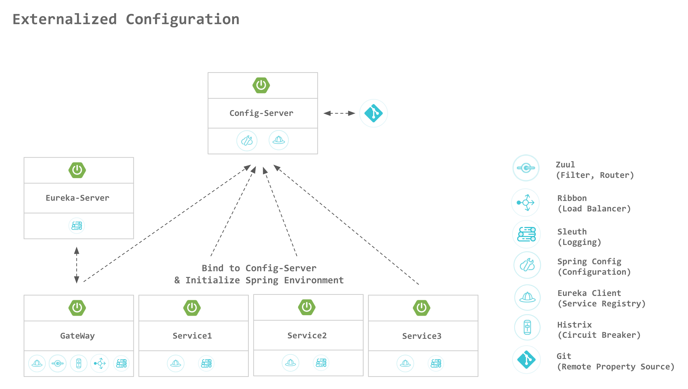
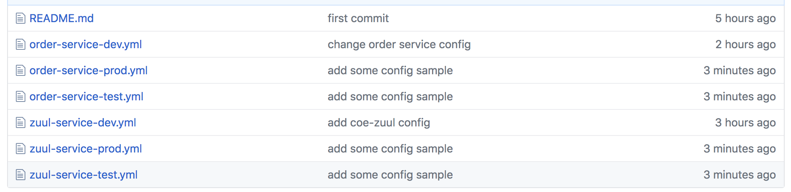
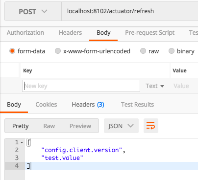

# Spring Cloud Config

Spring Cloud Config는 분산 시스템에서 환경설정을 외부로 분리하여 관리할 수 있는 기능을 제공한다.

Config Server를 사용하여 모든 환경(개발, 테스트, 프로덕션 등)에 대한 어플리케이션들의 속성을 한 곳에서 관리할 수 있다.



### 장점
- 설정 관리의 용이성
- **운영중에 서버 빌드 및 배포 없이 환경설정 변경 가능**


### 기능
Spring Cloud Config Server
- 환경설정(name-value pair, YAML 파일)을 위한 HTTP, 리소스 기반 API
- 속성 값 암호화 및 암호 해독 (대칭 또는 비대칭)
- **@EnableConfigServer** 어노테이션을 사용하여 쉽게 Spring Boot 어플케이션에 적용

Config Client(for Spring Boot 어플리케이션)
- Config Server에 붙어 원격 속성 소스로 Spring 환경 초기화
- 속성 값 암호화 및 암호 해독 (대칭 또는 비대칭)

### Spring Cloud Config Server 설치방법
pom.xml에 dependency추가
```xml
<dependencyManagement>
    <dependencies>
        <dependency>
            <groupId>org.springframework.cloud</groupId>
            <artifactId>spring-cloud-config</artifactId>
            <version>1.4.4.BUILD-SNAPSHOT</version>
            <type>pom</type>
            <scope>import</scope>
        </dependency>
    </dependencies>
</dependencyManagement>
<dependencies>
    <dependency>
        <groupId>org.springframework.cloud</groupId>
        <artifactId>spring-cloud-starter-config</artifactId>
    </dependency>
</dependencies><repositories>
    <repository>
        <id>spring-snapshots</id>
        <name>Spring Snapshots</name>
        <url>https://repo.spring.io/libs-snapshot</url>
        <snapshots>
            <enabled>true</enabled>
        </snapshots>
    </repository>
</repositories>
```

application.yaml 설정
```yaml
spring:
  application:
    name: {configServiceId}
  cloud:
    config:
      server:
        git:
          uri: {remote.property.source.uri} # git repository 주소
          username: {username}
          password: {password}
server:
  port: 8888

# Eureka(service discovery)를 사용할 경우 아래 설정 추가
eureka:
  client:
    serviceUrl:
      defaultZone: {eurekaServerUrl}
    enabled: true
```

Application.java에 @EnableConfigServer 어노테이션 추가
```java
@SpringBootApplication
@EnableDiscoveryClient
@EnableConfigServer
public class ConfigApplication {

	public static void main(String[] args) {
		SpringApplication.run(CoeConfigApplication.class, args);
	}
}
```

### Spring Cloud Config Client 설치방법
pom.xml에 dependency추가
```xml
'''
  <dependency>
      <groupId>org.springframework.cloud</groupId>
      <artifactId>spring-cloud-config-client</artifactId>
  </dependency>
  <!-- Actuator는 변경된 config를 client에서 반영하기 위해 필요함 -->
  <dependency>
    <groupId>org.springframework.boot</groupId>
    <artifactId>spring-boot-starter-actuator</artifactId>
</dependency>
'''
```
application.yml(또는 properties)등 client의 환경설정은 Remote Property Source(ex. Git)으로 이동 시킴

Remote Property Source 생성
> {serviceId}-{profile}.yml 형식으로 환경설정 파일 추가



Client에 bootstrap.yml 추가
```yaml
spring:
  application:
    name: {serviceId}  # 서비스 자신의 이름
  cloud:
    config:
      discovery:
        enabled: true
        service-id: {configServiceId} # eureka에 등록된 config service 이름

eureka:
  client:
    serviceUrl:
      defaultZone: {eurekaServerUrl}
    enabled: true

server:
  port: {port}
```
#### Config Refresh 방법
운영 중에 서버 빌드 및 배포 없이 서비스의 환경설정을 변경할 수 있다.
1. 아래 예제와 같이 @RefreshScope 어노테이션을 환결설정 값을 사용하는 모든 클래스에 추가한다
```java
@RefreshScope
@FeignClient(
        name ="${coe.application.customer-service}",
        decode404 = true
)
public interface CustomerClient {
    @RequestMapping(method = RequestMethod.GET, value = API_V1_BASE_PATH + "/customers")
    List<Customer> findAll();
}
```
2. 환경 설정이 변경 된다.
3. Client의 bootstrap.yml에 아래 내용 추가
```yml
management:
  endpoints:
    web:
      exposure:
        include: "refresh"
```
> 2.0 이하의 경우
>  yml파일에 management.security.enabled=false 설정 필요
>  
> Actuator in Spring Boot 2.0 이상
> API : /health /info 두개만 기본 open 됨. 따라서 위 설정이 추가 되어야 RefreshScope을 이용할 수 있다. 

4. Remote Property Source의 환경설정 변경 후 http://{serviceUrl}/actuator/refresh POST 호출 함  
  (Actuator in Spring Boot 2.0 이전 버전인 경우 http://{serviceUrl}/refresh)
> 정상 처리 결과 Body에 아래와 같이 표시되고, 변경 내용이 없다면 아무 내용도 표시되지 않음   
> 
