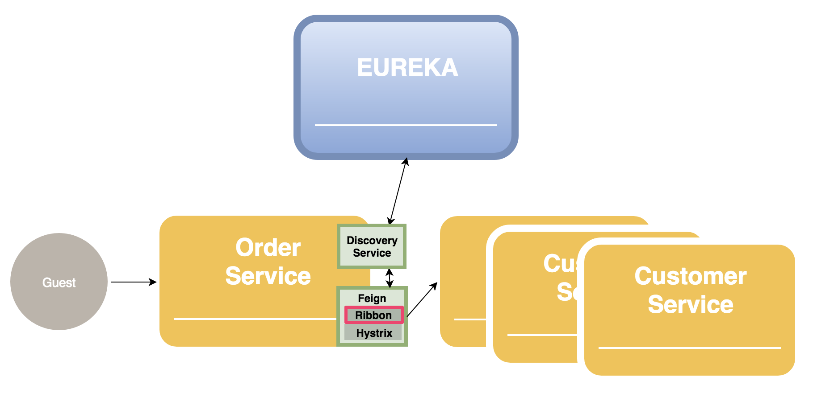
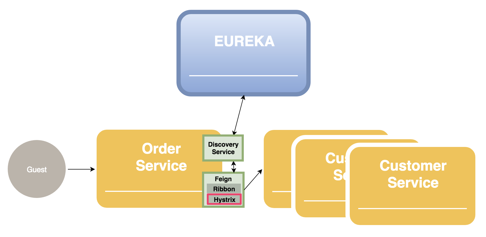

# 1.개요
## 배경 & 목적
//TODO: 그럼 과거에는 어떻게 했지?  

Feign은 REST API 기반의 client 서비스들을 쉽게 사용하기 위해 만들어 짐  
- 다른 서비스들의 REST API 호출을 간단한 코드로 수행 할 수 있음
- 에러 처리를 쉽게 구현 할 수 있음  
- Eureka에 등록 된 여러 instance의 서비스를 바로 사용 가능
- Ribbon을 통한 load Balancing 가능
- api에 대한 unit test를 쉽게 구현 할 수 있음

## Architecture
//TODO: Overview에서 사용될 그림 중 feign 부분 껴넣기

# 2. Features
## Client API Call
Feign을 통해 다른 서비스의 API를 호출합니다.

#### URL 사용
  

Client 서비스의 url을 소스나 config에 명시하여 사용 할 수 있습니다.  
아래 소스코드는 Order 서비스에서 Customer Service의 customer API를 호출 하기 위한 customer interface를 생성하는 예제 입니다.

```java
// Application Main class
@EnableFeignClients		// Feign을 사용
@RestController			// Rest API를 사용할 class임을 명시
@SpringBootApplication
public class OrderApplication { ... }

//=========================================================

// Customer interface
@FeignClient(
        name = "order-service"  //feign 서비스 명
        url = "http://customer-service-host:portnumber",
        decode404 = true //TODO: 404 에러를 feign에서 처리하지 않음
)
public interface CustomerClient {
  @RequestMapping(method = RequestMethod.GET, value = "/customer")    
  String getCustomer();
 }
```
> getCustomer 함수 호출 시 해당 url의 customer API를 호출 합니다.
- @EnableFeignClients : 해당 application에서 feign을 사용할 것을 명시  
- @FeingClient : 어느 서비스의 API를 호출 할지를 url에 명시  
- 해당 서비스의 어느 api를 호출 할지를 interface method로 정의

```yml
# feign의 timeout 설정
feign:
  client:
    config:
      default:    # or feign name
        connectTimeout: 5000  
        readTimeout: 5000     
```
> - connectTimeout: Client에서 서버로 요청시 서버와의 Connection 맺기 까지의 delay time
> - readTimeout: Connection 맺은 후 response 받기 까지 delay time
#### Eureka 정보 사용
  

Client 서비스의 url정보를 eureka를 통해 가지고 올수 있습니다.  
아래 소스코드는 기존의 소스코드에 eureka와 관련된 부분만 수정 된 것입니다.

```java
// Application Main class
@EnableDiscoveryClient
@EnableFeignClients		// Feign을 사용
@RestController			// Rest API를 사용할 class임을 명시
@SpringBootApplication
public class OrderApplication { ... }

// Customer interface
@FeignClient(
        name ="CUSTOMER-SERVICE"   // eureka에 등록된 instance명으로 서비스 조회
)
public interface CustomerClient {
  @RequestMapping(method = RequestMethod.GET, value = "/customer")    // customer-service의 customer api 호출
  String getCustomer();
 }
```
> getCustomer 함수 호출 시 customer-service의 customer API를 호출 합니다.  
> customer-service의 접속 정보는 eureka로부터 가져옵니다.  
> eureka 서비스들의 접속 정보는 local에도 caching되어 존재 합니다.  
- @EnableDiscoveryClient : Eureka의 registry에 자신을 등록하고, 다른 서비스 접속 정보를 조회 할수 있음  
- feign 어노테이션의 name 속성으로 서비스 이름을 명시

## Load Balancing by ribbon
  

서비스의 instance가 여럿 실행 중인 경우 Feign에 포함된 Ribbon을 통해 load balancing 기능을 이용하게 됩니다.  
Round robin 방식을 기본으로 사용하고 instance별 가중치를 주는 방법으로도 지정 가능합니다.

## Hystrix 사용
  

Hystrix를 사용하여 client 서비스 API 호출 시 에러가 발생한 경우 처리할 방법을 정의할 수 있다.  
그리고 특정 횟수 이상 에러가 연속 발생하게 되면 circuit이 open 되어 해당 서비스로 요청이되지 않고 바로 fallback 처리 되게 된다.  
//TODO: [Hystrix 상세설명 링크]
