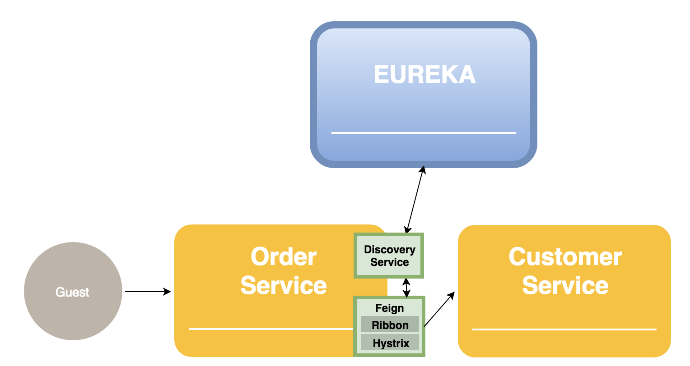

# 1.개요
## 배경 & 목적
//TODO: 그럼 과거에는 어떻게 했지?  

Feign은 REST API 기반의 client 서비스들의 사용을 쉽게 하기 위해 만들어 짐  
- 다른 서비스들의 REST API 호출을 간단한 코드로 수행 할 수 있음
- 에러 처리를 쉽게 구현 할 수 있음  
- Eureka에 등록 된 여러 instance의 서비스를 바로 사용 가능
- Ribbon을 통한 load Balancing이 가능

## Architecture
//TODO: Overview에서 사용될 그림 중 feign 부분 껴넣기

# 2. Features & 동작방식
## Client API Call
Feign을 통해 다른 서비스의 API를 호출합니다.

#### URL 사용
  
Client 서비스의 url을 소스나 config에 명시하여 사용 할 수 있습니다.  
아래 소스코드는 Order 서비스에서 Customer Service의 customer API를 호출 하기 위한 customer interface를 생성하는 예제 입니다.
- @EnableFeignClients : 해당 application에서 feign을 사용할 것을 명시  
- @FeingClient : 어느 서비스의 API를 호출 할지를 url에 명시  
- 해당 서비스의 어느 api를 호출 할지를 interface method로 정의

```java
// Application Main class
@EnableFeignClients		// Feign을 사용
@RestController			// Rest API를 사용할 class임을 명시
@SpringBootApplication
public class OrderApplication { ... }

// Customer interface
@FeignClient(
        url = "http://order-service-host:portnumber"   
)
public interface CustomerClient {
  @RequestMapping(method = RequestMethod.GET, value = "/customer")    // customer-service의 customer api 호출
  String getCustomer();
 }
```
#### Eureka 정보 사용
  
Client 서비스의 url정보를 eureka를 통해 가지고 올수 있습니다.  
아래 소스코드는 기존의 소스코드에 eureka와 관련된 부분만 수정 된것입니다.
- @EnableDiscoveryClient : Eureka의 registry에서 자신을 등록하고, 다른 서비스 정보를 조회 할수 있음  
- 해당 서비스의 어느 api를 호출 할지를 interface method로 정의

```java
// Application Main class
@EnableDiscoveryClient
@EnableFeignClients		// Feign을 사용
@RestController			// Rest API를 사용할 class임을 명시
@SpringBootApplication
public class OrderApplication { ... }

// Customer interface
@FeignClient(
        name ="CUSTOMER-SERVICE"   // eureka에 등록된 instance명으로 서비스 조회
)
public interface CustomerClient {
  @RequestMapping(method = RequestMethod.GET, value = "/customer")    // customer-service의 customer api 호출
  String getCustomer();
 }
```
## Load Balancing
## Hystrix 처리
## decode


# Order Service

## Description

본 프로젝트는 Microservice를 위한 Sample Project 입니다.

## Require Software

### RabbitMQ on docker
~~~
docker run -d --name rabbitmq -p 5672:5672 -p 15672:15672 --restart=unless-stopped -e RABBITMQ_DEFAULT_USER=username -e RABBITMQ_DEFAULT_PASS=password rabbitmq:management
~~~

## Feign Client
 - REST 기반 서비스 호출을 추상화한 Spring Cloud Netflix 라이브러리
 - 인터페이스를 통해 클라이언트 측 프로그램 작성

### 설치
1. pom.xml에 feign dependency 추가
```xml
<dependency>
    <groupId>org.springframework.cloud</groupId>
    <artifactId>spring-cloud-starter-feign</artifactId>
    <version>Version!</version>
</dependency>
```

2. @EnableFeignClients annotation 추가

  ```java
  @SpringBootApplication
  @EnableFeignClients
  public class Application {

      public static void main(String[] args) {
          SpringApplication.run(Application.class, args);
      }

  }
  ```

3. Client Interface 생성
```java
@FeignClient(
        name ="CUSTOMER-SERVICE",
        url = "http://testhost:portnumber",
        decode404 = true
)
public interface CustomerClient {
    @RequestMapping(method = RequestMethod.GET, value = "/customers")
    List<Customer> findAll();
}
```

  - name : 서비스ID 혹은 논리적인 이름, spring-cloud의 eureka, ribbon에 사용
  - url : 실제 호출할 서비스의 URL, eureka, ribbon을 사용하지 않고서도 동작
  - decode404 : 404응답이 올 때 FeignExeption을 발생시킬지, 아니면 응답을 decode할 지 여부
