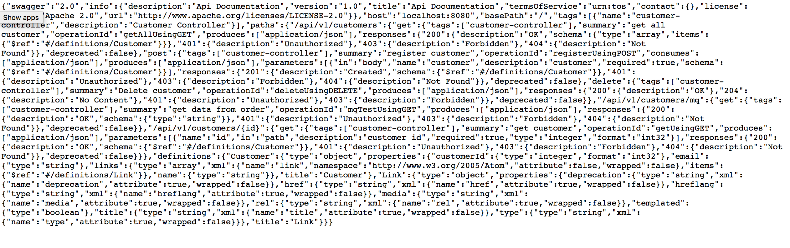
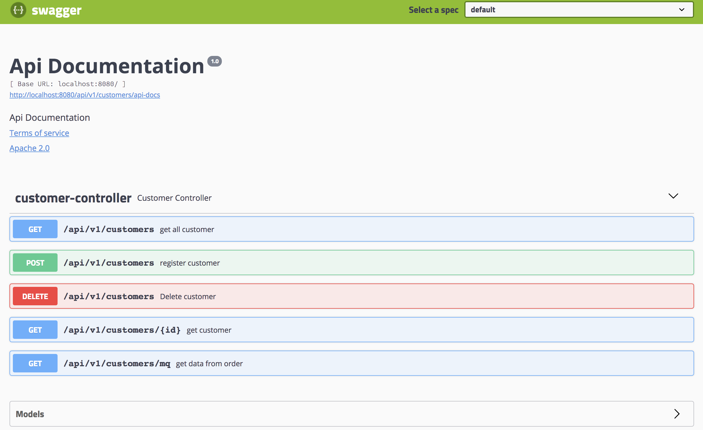
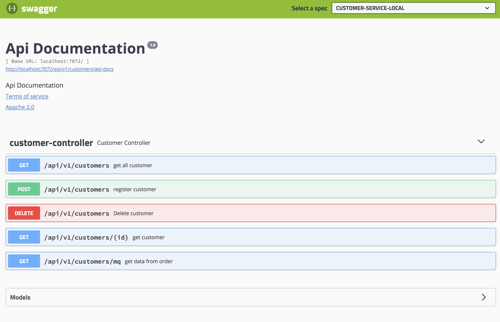
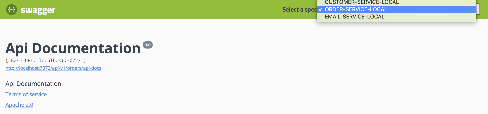
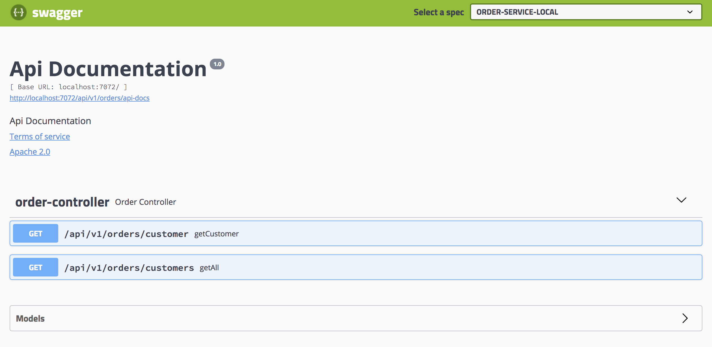

# Swagger

## 1. 개요
마이크로서비스에서 뿐만 아니라 모든 시스템에서 REST API를 문서화 하는 것은 매우 중요합니다.

REST API란 사용자 뿐만 아니라 다른 모듈, 응용 프로그램, 개발자들이 사용 할 수 있는 공용 인터페이스 입니다.

어떠한 API를 개발한 사람은 보통 해당 API 사용자가 아닙니다.

따라서 실제 사용자(혹은 모듈)에게 문서화해서 보여주는 것이 매우 중요합니다.

그 중 가장 많이 알려진 방법이 Swagger 입니다.

JSON 또는 YAML 메타 데이터를 이용하여 다수의 REST API를 설명 할 수 있습니다.

하지만 JSON 또는 YAML으로 사용자에게 보여주는 것은 불편하고 보기 힘들기 때문에 그에 맞는 UI도 제공합니다.

UI를 통해서 단순히 REST API 명세만 보여주는 것이 아니라 실제로 호출하고 응답을 검사 할 수 있습니다.

## 2. 어플리케이션에 swagger dependency 추가

REST API를 명세로 만들 즉 swagger를 통해서 제공 될 어플리케이션을 만듭니다.

기존의 customer-service와 order-service를 이용합니다.

먼저 pom.xml에 dependency를 추가합니다.

~~~xml
<!--swagger 기능을 제공하는 dependency 입니다.-->
<dependency>
	<groupId>io.springfox</groupId>
	<artifactId>springfox-swagger2</artifactId>
	<version>2.9.2</version>
</dependency>

<!--swagger로 생성된 json 등의 정보를 ui로 보여주기 위한 dependency 입니다.-->
<dependency>
	<groupId>io.springfox</groupId>
	<artifactId>springfox-swagger-ui</artifactId>
	<version>2.9.2</version>
</dependency>
~~~

swagger 관련 config를 작성합니다.
~~~java
import com.google.common.base.Predicates;
import io.swagger.annotations.Contact;
import io.swagger.annotations.Info;
import io.swagger.annotations.License;
import io.swagger.annotations.SwaggerDefinition;
import org.springframework.context.annotation.Bean;
import org.springframework.context.annotation.Configuration;
import springfox.documentation.builders.PathSelectors;
import springfox.documentation.builders.RequestHandlerSelectors;
import springfox.documentation.spi.DocumentationType;
import springfox.documentation.spring.web.plugins.Docket;
import springfox.documentation.swagger2.annotations.EnableSwagger2;

import static com.sds.act.coe.customer.web.rest.ApiConstants.API_V1_BASE_PATH;

@Configuration
@EnableSwagger2
@SwaggerDefinition(
        info = @Info(description = "MSA-COE-CUSTOMER",
                version = "1.0.0",
                title = "MSA-COE-CUSTOMER",
                termsOfService = "Term of Service",
                contact = @Contact(
                        name = "Samsung SDS",
                        url = "https://www.samsungsds.com/",
                        email = "samsungsds@samsung.com"),
                license = @License(name = "Apache License Version 2.0",
                        url = "https://www.apache.org/licenses/LICENSE-2.0")
        )
)
public class SwaggerConfig {
    @Bean
    public Docket api() {
        return new Docket(DocumentationType.SWAGGER_2)
                .select()
                .apis(Predicates.not(RequestHandlerSelectors.basePackage("org.springframework.boot")))
                .apis(Predicates.not(RequestHandlerSelectors.basePackage("org.springframework.cloud")))
//                .paths(PathSelectors.regex(API_V1_BASE_PATH + "/.*"))
                .paths(PathSelectors.any())
                .build();

    }

/* @SwaggerDefinition 어노테이션 말고 아래와 같은 방법으로 정의 할 수 있습니다.

  private ApiInfo getApiInfo() {
        StringVendorExtension vendorExtension1 = new StringVendorExtension("name1", "value1");
        StringVendorExtension vendorExtension2 = new StringVendorExtension("name2", "value2");
        List<VendorExtension> vendorExtensionList = new ArrayList<>();
        vendorExtensionList.add(vendorExtension1);
        vendorExtensionList.add(vendorExtension2);

        return new ApiInfo(
                "This is swagger title",
                "This is swagger description.",
                "1.0.0",
                "TERMS OF SERVICE URL",
                new Contact("name","url","mail address"),
                "Samsung SDS",
                "www.samsungsds.com",
                vendorExtensionList
        );
    }
  */
}
~~~
위에서 보다시피 swagger api에 title, description, contact user 정보 등을 추가 할 수 있습니다.

이제 서버를 기동 시킨 이후
브라우저에 http://localhost:8080/v2/api-docs 를 입력하면 아래와 같이 해당 어플리케이션에서 제공하는 REST API에 대한 정보를 볼 수 있습니다.

하지만 이러한 방식으로는 사용자가 보기 힘들기 때문에 swagger-ui를 이용하여 보도록 합니다.

http://localhost:8080/swagger-ui.html 로 접속하면 아래와 같이 해당 어플리케이션이 제공하는 REST API를 볼 뿐 아니라 model 정보도 볼 수 있습니다.
그리고 해당 REST API를 테스트 해 볼 수 있습니다.

만약 .../v2/api-docs의 경로를 변경하고 싶다면
아래와 같이 application.yml을 추가합니다.
(다음 단계를 위해서 아래와 같이 변경 하십시오. order-server의 경우 path를 /api/v1/orders/api-docs로 하십시오)
~~~yml
springfox:
  documentation:
    swagger:
      v2:
        path: /api/v1/customers/api-docs
~~~

## 3. zuul에 swagger 추가하기
swagger ui를 통해서 개발자가 작성한 REST API 명세를 사용자가 쉽게 이해 할 수 있지만 마이크로서비스아키텍처 안에서는 몇개의 어플리케이션이 있을지 모릅니다.

따라서 각각의 어플리케이션이 제공하는 swagger 정보를 취합하는 기능이 필요합니다.

zuul gateway를 이용하거나 별도의 서버를 이용하여 구현이 가능합니다.

먼저 동일하게 gateway에 dependency를 추가합니다.
~~~xml
<dependency>
	<groupId>io.springfox</groupId>
	<artifactId>springfox-swagger2</artifactId>
	<version>2.9.2</version>
</dependency>

<!--swagger로 생성된 json 등의 정보를 ui로 보여주기 위한 dependency 입니다.-->
<dependency>
	<groupId>io.springfox</groupId>
	<artifactId>springfox-swagger-ui</artifactId>
	<version>2.9.2</version>
</dependency>
~~~

customer 어플리케이션과 동일하게 SwaggerConfig 파일을 작성합니다.
~~~java
import com.google.common.base.Predicates;
import io.swagger.annotations.Contact;
import io.swagger.annotations.Info;
import io.swagger.annotations.License;
import io.swagger.annotations.SwaggerDefinition;
import org.springframework.context.annotation.Bean;
import org.springframework.context.annotation.Configuration;
import org.springframework.context.annotation.Profile;
import springfox.documentation.builders.PathSelectors;
import springfox.documentation.builders.RequestHandlerSelectors;
import springfox.documentation.spi.DocumentationType;
import springfox.documentation.spring.web.plugins.Docket;
import springfox.documentation.swagger.web.UiConfiguration;
import springfox.documentation.swagger2.annotations.EnableSwagger2;

@Profile("!prod")
@Configuration
@EnableSwagger2
@SwaggerDefinition(
        info = @Info(description = "MSA-COE",
                version = "1.0.0",
                title = "MSA-COE",
                termsOfService = "Term of Service",
                contact = @Contact(
                        name = "Samsung SDS",
                        url = "https://www.samsungsds.com/",
                        email = "samsungsds@samsung.com"),
                license = @License(name = "Apache License Version 2.0",
                        url = "https://www.apache.org/licenses/LICENSE-2.0")
        )
)
public class SwaggerConfig {

    @Bean
    public Docket api() {
        return new Docket(DocumentationType.SWAGGER_2)
                .select()
                .apis(Predicates.not(RequestHandlerSelectors.basePackage("org.springframework.boot")))
                .apis(Predicates.not(RequestHandlerSelectors.basePackage("org.springframework.cloud")))
//                .paths(PathSelectors.regex("/api/.*"))
                .paths(PathSelectors.any())
                .build();

    }
}
~~~
여기서 눈여겨 볼 점은 @Profile 어노테이션인데
개발계, 운영계에 따라서 해당 swagger 기능을 닫아야 할 필요가 존재합니다. 따라서 해당 어노테이션을 사옹하면 spring active profile에 따라서 기능을 on/off  할 수 있습니다.

그 다음 Swagger Resource들을 모으는 controller를 작성합니다.
~~~java
import org.springframework.boot.autoconfigure.EnableAutoConfiguration;
import org.springframework.cloud.netflix.zuul.filters.RouteLocator;
import org.springframework.context.annotation.Primary;
import org.springframework.context.annotation.Profile;
import org.springframework.stereotype.Component;
import springfox.documentation.swagger.web.SwaggerResource;
import springfox.documentation.swagger.web.SwaggerResourcesProvider;

import java.util.List;
import java.util.stream.Collectors;

import static springfox.documentation.spi.DocumentationType.SWAGGER_2;

@Profile("!prod")
@Component
@Primary
@EnableAutoConfiguration
public class SwaggerController implements SwaggerResourcesProvider {

    private final RouteLocator routeLocator;

    public SwaggerController(RouteLocator routeLocator) {
        this.routeLocator = routeLocator;
    }

    @Override
    public List get() {
        List<SwaggerResource> resources = routeLocator.getRoutes().stream().distinct().map(route -> {
            SwaggerResource swaggerResource = new SwaggerResource();
            swaggerResource.setName(route.getLocation());
            swaggerResource.setLocation(route.getFullPath().replace("**", "api-docs"));
            swaggerResource.setSwaggerVersion(SWAGGER_2.getVersion());

            return swaggerResource;

        }).collect(Collectors.toList());

        return resources;
    }
}
~~~
RouteLocator 를 사용하여 zuul gateway에 등록 된 라우팅 정보로 부터 각 어플리케이션의 api-docs 정보를 가져옵니다. 설정 부분은 아래와 같습니다.

~~~yml
...
zuul:
  ignoredServices: '*'
  sensitive-headers:
  routes:
    customer:
      path: /api/v1/customers/**
      serviceId: CUSTOMER-SERVICE-LOCAL
      strip-prefix: false
    order:
      path: /api/v1/orders/**
      serviceId: ORDER-SERVICE-LOCAL
      strip-prefix: false
...
~~~

위와 같이 설정 이후 http://[gateway-ip]:[gateway-port]/swagger-ui.html 로 접속하면 아래와 같은 화면을 볼 수 있습니다.

오른 쪽 상단의 select box를 클릭하면 아래와 같은 리스트가 보이고 원하는 어플리케이션을 선택 하면 해당 swagger정보로 이동하게 됩니다.

zuul로 swagger-ui가 이동하였기 때문에 필요에 따라 각 어플리케이션에서 swagger-ui dependency를 제거하면 됩니다.

## 4. 기타 방법
위와 같이 zuul gateway에 swagger dependency를 추가하며 routing 정보로부터 가져오는 방법도 있지만 다른 방법들도 존재합니다.

### 4.1 swagger-aggregator, swagger-ui

각 어플리케이션으로부터 json파일을 다운 받아

json파일들을 취합하는 별도의 aggregator를 이용하여 (https://www.npmjs.com/package/swagger-aggregator)

취합된 json 파일을 바라보는 swagger-ui(https://www.npmjs.com/package/swagger-ui) 서버를 띄우는 방법도 있습니다.

### 4.2 별도의 어플리케이션 작성

zuul gateway에 swagger를 설치하기 싫다면 별도의 어플리케이션을 작성하여

SwaggerResource에 들어갈 각 어플리케이션 api-docs url정보를 하드코딩하거나

config-server 에 저장 하고 사용하는 방법이 있습니다.
