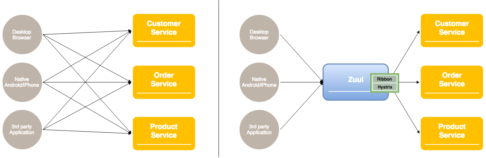

## Tables of Contents
- Zuul 개요
  - 마이크로서비스 아키텍처에서 정의
  - Netflix 설계 목적
  - Netflix 활용 예시
  
- Zuul Core Features
  - **Routing Rules**
  - **Filters**
  - **Service Discovery**
  - **Load Balancing**


## Zuul 개요
#### 마이크로서비스 아키텍처에서 정의
- API Gateway 또는 Edge service application
  
### Netflix 설계 목적
- JVM-based router and server-side load balancer
- 마이크로 서비스 아키텍처에서 여러 클라이언트 요청을 적절한 서비스로 프록시하거나 라우팅하기 위한 컴포넌트


### API Gateway 필요 배경
- Monolithic Architecture vs. Microservice Architecture
  - 하나의 서버에서 동작하는 모놀리틱 어플리케이션과 달리 마이크로서비스 어플리케이션은 마이크로는 일반적으로 fine-grained API들을 통해 의미있는 데이터 조각을 제공하기 때문에 client가 필요한 데이터를 사용자에게 보여주기 위해서는 하나 이상의 마이크로서비스와 통신하여 데이터를 조회해야 한다. 즉 
- 


### Zuul 목적
- 1
  - 모든 비지니스 로직이 하나의 서버에 존재하는 Monolithic Architecture와 달리 MSA는 도메인별 데이터를 저장하고 도메인별로 하나 이상의 서버가 따로 존재한다.
한 서비스에 한개 이상의 서버가 존재하기 때문에 이 서비스를 사용하는 클라이언트 입장에서는 다수의 end point가 생기게 되며,
end point를 변경이 일어났을때, 관리하기가 힘들기 때문에 Zuul 을 사용하여 관리한다.
- 2
  - avoid the need to manage CORS and authentication concerns independently for all the backends
- 다야항 Front-end
  - HTML5/JavaScript-based UI for desktop and mobile browesrs
  - Android, iPhone clients
  - 3rd party applications
- UI가 필요한 데이터가 여러 서비스에 걸쳐있다. 따라서 모든 서비스로부터 데이터를 fetch 해야한다

- 마이크로 서비스 세계에서는 데이터가 나눠져 있기 때문에 client가 원하는 데이터 모양이 다를 수 있다. 커스터마이징이 필요하다.
- client 특성에 따라 데이터 형태가 달라져야 한다 (desktop browser, mobile version)
- 클라우드 환경에서는 서비스 인스턴스의 위치가 동적으로 변한다
- 시간이 지남에 다라 서비스가 나눠지고 쪼개지고합쳐질 수 있다
- 서비스는 웹 친화적이지 않은 하나 이상의 프로토콜을 사용할 수 있다

### Netflix Zuul 활용 예시
- Rather than provide a one-size-fits-all style API, the API gateway can expose a different API for each client. For example, the Netflix API gateway runs client-specific adapter code that provides each client with an API that’s best suited to its requirements.
- The API gateway might also implement security, e.g. verify that the client is authorized to perform the request


>https://www.nginx.com/blog/introduction-to-microservices/
### Zuul 역할

Zuul is a JVM-based router and server-side load balancer from Netflix.

```text
Zuul is the front door for all requests from devices and web sites to the backend of
the Netflix streaming application. As an edge service application, Zuul is built to enable
dynamic routing, monitoring, resiliency and security. It also has the ability to route requests
to multiple Amazon Auto Scaling Groups as appropriate.
```

+front-end -----routing rules:shard traffic with path------ zuul -----service discovery:instance lookup---- back-end REST API
+그림


### Netflix Zuul Architecture


### Zuul 2.0 동작방식


# 2. Features
### Zuul 의 기능
- **Dynamic Routing**
- Load Balancing
- Authentication
- Insights
- Stress Testing
- Canary Testing
- Service Migration
- Security
- Static Response handling
- Active/Active traffic management

---
  - Connection Pooling
  - Status Categories
  - Retries
  - Request Passport
  - Request Attempts
  - Origin Concurrency Protection
  - HTTP/2
  - Mutual TLS
  - Proxy Protocol
  - GZip


# 2. 구성방법
1. Spring boot project 생성
1. pom.xml에 zuul, eureka-client dependency 추가
    ```xml
    <dependency>
        <groupId>org.springframework.cloud</groupId>
        <artifactId>spring-cloud-starter-netflix-zuul</artifactId>
    </dependency>
    <dependency>
        <groupId>org.springframework.cloud</groupId>
        <artifactId>spring-cloud-starter-netflix-eureka-client</artifactId>
    </dependency>
    ```
1. configuration - application.yml 수정
    ```yaml
    spring:
      application:
        name: zuul-service

    zuul:
      ignoredServices: '*'  # routes에 정의되지 않은 모든 요청은 무시 함
      sensitive-headers:    # header의 모든 정보를 bypass 함
      routes:
        customer:
          path: /api/v1/customers/**  
          serviceId: CUSTOMER-SERVICE
          strip-prefix: false
        order:
          path: /api/v1/orders/**
          serviceId: ORDER-SERVIC
          strip-prefix: false        #true인 경우 path를 제거 후 각 서비스에 포워딩

    eureka:
      client:
        serviceUrl:
          defaultZone: http://192.168.1.19:8761/eureka/
        enabled: true
    ribbon:
      ConnectTimeout: 5000    # Client에서 서버로 요청시 서버와의 Connection 맺기 까지의 delay time
      ReadTimeout: 2000       # Connection 맺은 후 response 받기 까지 delay time
    #  SocketTimeout: 500     # Response 데이터의 packet 들을 받을 때 서로 다른 패킷을 받기 까지의 delay time (참고: http://tomining.tistory.com/164)
      
    ```
    - 서비스명 zuul-sevice로 설정
    - Gateway의 라우팅 정보 설정
    - Eureka client 등록
1. @EnableZuulProxy annotation 추가를 통해 Zuul Proxy 선언
    ```java
    @EnableZuulProxy
    @EnableDiscoveryClient
    @SpringBootApplication
    public class CoeZuulApplication {

      public static void main(String[] args) {
        SpringApplication.run(CoeZuulApplication.class, args);
      }
    }
    ```
    - Gateway 도 Eureka Client로 등록
    - Fallback 처리를 위한 Provider 등록
    - Filter 등록

# 3. Router setting

...

# 4. Filter

1. Filter 생성 및 등록
    ```java
    public class SimpleFilter extends ZuulFilter {
        private static Logger logger = LoggerFactory.getLogger(SimpleFilter.class);

        @Override
        public String filterType() {  return "pre";      } // "post", "routing", "error"

        @Override
        public int filterOrder() {  return 0;  }

        @Override
        public boolean shouldFilter() { return true; }

        @Override
        public Object run() throws ZuulException {
            RequestContext ctx = RequestContext.getCurrentContext();
            HttpServletRequest request = ctx.getRequest();

            logger.info(String.format("%s request to %s", request.getMethod(), request.getRequestURL().toString()));

            return null;
        }
    }
    ```
    ```java
    @EnableZuulProxy
    @EnableDiscoveryClient
    @SpringBootApplication
    public class CoeZuulApplication {

      public static void main(String[] args) {
        SpringApplication.run(CoeZuulApplication.class, args);
      }

      @Bean
      public SimpleFilter simpleFilter() {
        return new SimpleFilter();
      }
    }
    ```


# 4. RouteLocator
RouteLocator를 통해 Zuul 설정에 등록된 route 정보를 확인할 수 있다.

1. RouteLocator 생성 및 등록
```java
public class RouteLocater extends SimpleRouteLocator {
    private Logger logger = LoggerFactory.getLogger(RouteLocater.class);

    public RouteLocater(String servletPath, ZuulProperties properties) {
        super(servletPath, properties);
    }

    @Override
    protected ZuulProperties.ZuulRoute getZuulRoute(String adjustedPath) {
        ZuulProperties.ZuulRoute zuulRoute = super.getZuulRoute(adjustedPath);  
        logger.info(">>>>>>>" + zuulRoute.toString());

        return zuulRoute;
    }
}
```
```java
public class CoeZuulApplication {

	@Autowired
	private ServerProperties serverProperties;
	@Autowired
	private ZuulProperties zuulProperties;

	@Bean
	public RouteLocater routeLocater() {
		return new RouteLocater(serverProperties.getServlet().getServletPrefix(), zuulProperties); //zuul의 route 설정 사용한다.
	}

	public static void main(String[] args) {
		SpringApplication.run(ZuulApplication.class, args);
	}

}
```
# 5. 파일 전송 크기 제한 설정
아래 속성을 추가하고, 파일전송의 시간을 감안하여 ribbon, hystrix등의 timeout 설정을 변경해 준다.
```yml
# 2.0 이전의 경우
spring:
  http:
    multipart:
      max-file-size: 100MB	# 한개 파일의 전송 크기
      max-request-size: 100MB	# 하나의 요청에 포함되는 전체 파일 크기
      
# 2.0 이후의 경우
spring:
  servlet:
    multipart:
      max-file-size: 128MB
      max-request-size=128MB
```
