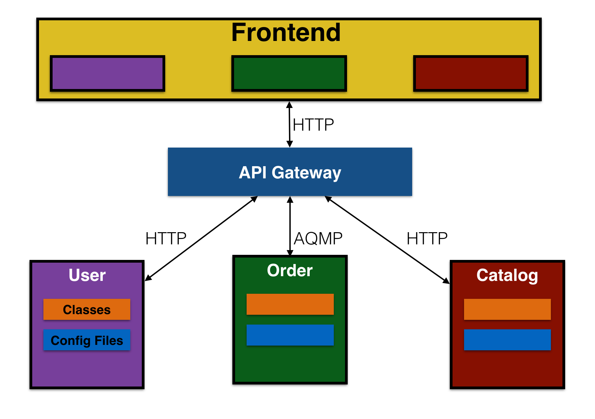

## Tables of Contents
- **Netflix Zuul 개요**
  - 마이크로서비스 아키텍처에서 정의
  - Netflix Zuul 설계 목적
    - Zuul in Netflix’s Cloud Architecture
    - Netflix Zuul 2.0 Architecture
  - Netflix Zuul 필요 배경
  
- **Netflix Zuul Core Features**
  - Netflix Zuul 동작방식
  - Routing Rules
  - Filters
  - Service Discovery
  - Load Balancing


## Netflix Zuul 개요
### Definitions in Microservice Architecture
- 정의
  - API Gateway 또는 API Service, Edge Service
- 역할
  - 마이크로서비스 아키텍처에서 여러 클라이언트 요청을 적절한 서비스로 프록시하거나 라우팅하기 위한 서비스
  - web app, mobile app, 3rd party app --> api gateway --> account, inventory, shipping service
<p align="center></p>
						    
### Netflix Zuul 설계 목적
- 정의
  - JVM-based router and Server-side load balancer
- 목적
  - 동적 라우팅, 모니터링, 회복 탄력성, 보안 기능을 지원 (*Filters*를 통한 구현)
  - 필요에 따라 여러 개의 Amazon Auto Scaling Groups로 요청을 라우팅 (*Ribbon*을 통한 구현)

### Zuul in Netflix’s Cloud Architecture
<p align="center"></p>

### Netflix Zuul 2.0 Architecture
<p align="center"></p>

### Netflix Zuul (API Service) 필요 배경
- Monolithic 에서 Microservice Architecture 분산 서비스 환경으로의 변화
  - 하나의 서버에서 하나의 어플리케이션으로 동작하는 모놀리틱 아키텍처와 달리 마이크로서비스 아키텍처는 클라이언트 요청을 처리하기 위해 작게 나뉘어진 여러 개의 서비스가 서로 커뮤니케이션하고 협업하는 소프트웨어 아키텍처 패턴이다.
  <p align="center"></p>

- 특징
  - 클라이언트와 백엔드 서비스간 커뮤니케이션 방법의 변화
    - Monolithic: 어플리케이션 내부에서 객체 주입, 메서드 호출 등을 통해 서로 다른 도메인 서비스와 협업하여 데이터 생성
    - Microservices: 클라이언트가 하나 이상의 서비스와 직접 통신해서 데이터 생성
  
  - 기능적 측면에서 변화
    - 백엔스 서비스를 대상으로 인증, 권한, CORS 관리 등과 같은 공통 관심사 로직을 클라이언트에서 분리
    - 백엔드 서비스들의 다양한 통신 프로토콜(HTTP, AMQP 등) 사용에 대한 지원
    - 다양한 클라이언트(web/mobile browser, native mobile app 등) 특성에 맞는 다양한 데이터 포맷 지원
    <p align="center"></p> 
  - 인프라 측면
    - 클라우드 환경에서 Auto Scaling과 같은 기능을 이용해 서비스 인스턴스를 트래픽에 따라 동적으로 생성/운영하거나 컨테이너로 배포하면서 인스턴스의 위치(host,port)가 동적으로 변한다.
    - 시간이 지남에 따라 서비스가 합쳐지거나 쪼개질 수 있다
 
## Netflix Zuul Core Features
### Netflix Zuul 동작방식
- 그림추가) front-end -----routing rules:shard traffic with path------ zuul -----service discovery:instance lookup---- back-end REST API

### Routing Rules
### Filters
### Service Discovery
### Load Balancing
### Other features
- Dynamic Routing
- Load Balancing
- Authentication
- Insights
- Stress Testing
- Canary Testing
- Service Migration
- Security
- Static Response handling
- Active/Active traffic management
--- 2.0
  - Connection Pooling
  - Status Categories
  - Retries
  - Request Passport
  - Request Attempts
  - Origin Concurrency Protection
  - HTTP/2
  - Mutual TLS
  - Proxy Protocol
  - GZip


# 2. 구성방법
1. Spring boot project 생성
1. pom.xml에 zuul, eureka-client dependency 추가
    ```xml
    <dependency>
        <groupId>org.springframework.cloud</groupId>
        <artifactId>spring-cloud-starter-netflix-zuul</artifactId>
    </dependency>
    <dependency>
        <groupId>org.springframework.cloud</groupId>
        <artifactId>spring-cloud-starter-netflix-eureka-client</artifactId>
    </dependency>
    ```
1. configuration - application.yml 수정
    ```yaml
    spring:
      application:
        name: zuul-service

    zuul:
      ignoredServices: '*'  # routes에 정의되지 않은 모든 요청은 무시 함
      sensitive-headers:    # header의 모든 정보를 bypass 함
      routes:
        customer:
          path: /api/v1/customers/**  
          serviceId: CUSTOMER-SERVICE
          strip-prefix: false
        order:
          path: /api/v1/orders/**
          serviceId: ORDER-SERVIC
          strip-prefix: false        #true인 경우 path를 제거 후 각 서비스에 포워딩

    eureka:
      client:
        serviceUrl:
          defaultZone: http://192.168.1.19:8761/eureka/
        enabled: true
    ribbon:
      ConnectTimeout: 5000    # Client에서 서버로 요청시 서버와의 Connection 맺기 까지의 delay time
      ReadTimeout: 2000       # Connection 맺은 후 response 받기 까지 delay time
    #  SocketTimeout: 500     # Response 데이터의 packet 들을 받을 때 서로 다른 패킷을 받기 까지의 delay time (참고: http://tomining.tistory.com/164)
      
    ```
    - 서비스명 zuul-sevice로 설정
    - Gateway의 라우팅 정보 설정
    - Eureka client 등록
1. @EnableZuulProxy annotation 추가를 통해 Zuul Proxy 선언
    ```java
    @EnableZuulProxy
    @EnableDiscoveryClient
    @SpringBootApplication
    public class CoeZuulApplication {

      public static void main(String[] args) {
        SpringApplication.run(CoeZuulApplication.class, args);
      }
    }
    ```
    - Gateway 도 Eureka Client로 등록
    - Fallback 처리를 위한 Provider 등록
    - Filter 등록

# 3. Router setting

...

# 4. Filter

1. Filter 생성 및 등록
    ```java
    public class SimpleFilter extends ZuulFilter {
        private static Logger logger = LoggerFactory.getLogger(SimpleFilter.class);

        @Override
        public String filterType() {  return "pre";      } // "post", "routing", "error"

        @Override
        public int filterOrder() {  return 0;  }

        @Override
        public boolean shouldFilter() { return true; }

        @Override
        public Object run() throws ZuulException {
            RequestContext ctx = RequestContext.getCurrentContext();
            HttpServletRequest request = ctx.getRequest();

            logger.info(String.format("%s request to %s", request.getMethod(), request.getRequestURL().toString()));

            return null;
        }
    }
    ```
    ```java
    @EnableZuulProxy
    @EnableDiscoveryClient
    @SpringBootApplication
    public class CoeZuulApplication {

      public static void main(String[] args) {
        SpringApplication.run(CoeZuulApplication.class, args);
      }

      @Bean
      public SimpleFilter simpleFilter() {
        return new SimpleFilter();
      }
    }
    ```


# 4. RouteLocator
RouteLocator를 통해 Zuul 설정에 등록된 route 정보를 확인할 수 있다.

1. RouteLocator 생성 및 등록
```java
public class RouteLocater extends SimpleRouteLocator {
    private Logger logger = LoggerFactory.getLogger(RouteLocater.class);

    public RouteLocater(String servletPath, ZuulProperties properties) {
        super(servletPath, properties);
    }

    @Override
    protected ZuulProperties.ZuulRoute getZuulRoute(String adjustedPath) {
        ZuulProperties.ZuulRoute zuulRoute = super.getZuulRoute(adjustedPath);  
        logger.info(">>>>>>>" + zuulRoute.toString());

        return zuulRoute;
    }
}
```
```java
public class CoeZuulApplication {

	@Autowired
	private ServerProperties serverProperties;
	@Autowired
	private ZuulProperties zuulProperties;

	@Bean
	public RouteLocater routeLocater() {
		return new RouteLocater(serverProperties.getServlet().getServletPrefix(), zuulProperties); //zuul의 route 설정 사용한다.
	}

	public static void main(String[] args) {
		SpringApplication.run(ZuulApplication.class, args);
	}

}
```
# 5. 파일 전송 크기 제한 설정
아래 속성을 추가하고, 파일전송의 시간을 감안하여 ribbon, hystrix등의 timeout 설정을 변경해 준다.
```yml
# 2.0 이전의 경우
spring:
  http:
    multipart:
      max-file-size: 100MB	# 한개 파일의 전송 크기
      max-request-size: 100MB	# 하나의 요청에 포함되는 전체 파일 크기
      
# 2.0 이후의 경우
spring:
  servlet:
    multipart:
      max-file-size: 128MB
      max-request-size=128MB
```
