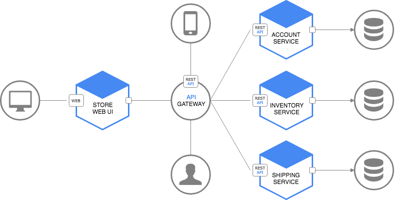

# 1. 개요
## Zuul 이란?
Monolithic 과 다르게 Microservice 는 많은 API 서비스들이 있고 서로 연계되어 client의 요청을 처리한다.  
이런 분산 서비스 환경에서는 다음과 같은 이슈가 발생 할 수 있다.   
- UI에서 여러 서비스들을 직접 호출하게 됨
- Auto scaling으로 인해 host, port 정보가 동적으로 변경 됨
- API 서비스들에 대해 각각 인증, CORS 처리 등을 해야 함
- API 서비스들이 다양한 프로토콜을 갖게 될 수 있음
- API 서비스들이 언제든 합쳐지거나 쪼개질 수 있음

Zuul Filter나 Zuul의 라우팅 서비스를 사용하여 위 이슈들을 모두 해결 할 수 있다.(Eureka 포함)  




Zuul은 API Gateway 또는 Edge 서비스 역할을 한다.   
Frontend로 부터 모든 요청을 받아 내부 마이크로서비스들에게 요청을 전달하므로 단일 종단점을 갖게한다.   
따라서 CORS, 인증, 보안과 같은 공통 설정을 Zuul 서비스에서 처리할 수 있다.   
또한 클라이언트 요청을 적절한 서비스로 라우팅하거나 필터를 적용하여 헤더에 특정 정보를 추가할 수 있다.  

## Zuul 기능


## Routing Rules
- front-end로부터 들어온 request를 path에 따라 특정 service로 라우팅하기 위한 규칙을 정의
```yml
zuul:
  routes:
    users:
      path: /myusers/**
      url: http://example.com/users_service
```

## Filters
클라이언트가 보낸 요청을 라우팅 하기 전, 라우팅할 때, 라우팅한 후 응답을 돌려 받았을 때 필요한 작업을 수행한다.  
다음 분야에 filter를 적용할수 있다.
- Authentication and Security  
  API 서비스들에 대한 인증을 적용하여 접근을 제한 할 수 있음   

- Insights and Monitoring   
  접점에서의 의미있는 데이터를 취합하여 분석에 활용할 수 있음   

- Dynamic Routing  
  비즈니스 로직에 따른 동적인 라우팅 적용이 가능

- Stress Testing   
  트래픽 양을 조절하며 성능 테스트 가능

- Load Shedding   
  요청 별 처리량을 제한하여 제한을 넘는 요청들은 drop 함

- Static Response handling   
  특정 요청에 대하여 미리 정의된 값을 바로 return 할 수 있음

- Multiregion Resiliency   
  서로 다른 AWS regions 으로도 요청을 라우팅 할 수 있음

## Service Discovery
- 라우팅을 연결할 서비스 찾음
  - Eureka (dynamic)

   ```yml
   zuul:
     routes:
       users:
         path: /myusers/**
         serviceId: users

   eureka:
     client:
       serviceUrl:
         defaultZone: http://localhost:8761/eureka/
   ```
  - static list of servers  

   ```yml
   zuul:
     routes:
       users:
         path: /myusers/**
         serviceId: users

   ribbon:
     eureka:
       enabled: false

   users:
     ribbon:
       listOfServers: example1.com,example2.com
   ```

## Load Balancing
- Ribbon을 이용해 여러 instance에 대하여 정의된 알고리즘으로 매핑이 가능  
- round-robin, weighted response time, availability이 있음

## Other features
- Connection Pooling
- Status Categories
- Retries
- Request Passport
- Request Attempts
- Origin Concurrency Protection
- HTTP/2
- Mutual TLS
- Proxy Protocol
- GZip  
[참고](https://github.com/Netflix/zuul/wiki/Core-Features)

# 2. 구성방법
## Routing  
1. pom.xml에 zuul, eureka-client dependency 추가
    ```xml
    <dependency>
        <groupId>org.springframework.cloud</groupId>
        <artifactId>spring-cloud-starter-netflix-zuul</artifactId>
    </dependency>
    <dependency>
        <groupId>org.springframework.cloud</groupId>
        <artifactId>spring-cloud-starter-netflix-eureka-client</artifactId>
    </dependency>
    ```
2. configuration - application.yml 수정
    ```yaml
    spring:
      application:
        name: zuul-service

    zuul:
      ignoredServices: '*'  # routes에 정의되지 않은 모든 요청은 무시 함
      sensitive-headers:    # header의 모든 정보를 bypass 함
      routes:
        customer:
          path: /api/v1/customers/**  
          serviceId: CUSTOMER-SERVICE
          strip-prefix: false
        order:
          path: /api/v1/orders/**
          serviceId: ORDER-SERVIC
          strip-prefix: false        #true인 경우 path를 제거 후 각 서비스에 포워딩

    eureka:
      client:
        serviceUrl:
          defaultZone: http://192.168.1.19:8761/eureka/
        enabled: true
    ribbon:
      ConnectTimeout: 5000    # Client에서 서버로 요청시 서버와의 Connection 맺기 까지의 delay time
      ReadTimeout: 2000       # Connection 맺은 후 response 받기 까지 delay time
    #  SocketTimeout: 500     # Response 데이터의 packet 들을 받을 때 서로 다른 패킷을 받기 까지의 delay time (참고: http://tomining.tistory.com/164)

    ```
3. @EnableZuulProxy annotation 추가
    ```java
    @EnableZuulProxy
    @EnableDiscoveryClient
    @SpringBootApplication
    public class CoeZuulApplication {

      public static void main(String[] args) {
        SpringApplication.run(CoeZuulApplication.class, args);
      }
    }
    ```

## Filter

|  Filter 구성 요소 |                 설명                        |
|:---------------:|:-------------------------------------------|
|     Type        |   pre, route, post (ZuulFilter를 상속받아 구현)    |
|     Order       |   filter 실행 순서를 결정 (filterOrder())    |
|     Criteria    |   filter 실행 여부 결정 (shouldFilter())    |
|     Action      |   filter criteria 만족 시 실행할 비즈니스 로직 (run())    |

1. Filter 생성 및 등록
    ```java
    public class SimpleFilter extends ZuulFilter {
        private static Logger logger = LoggerFactory.getLogger(SimpleFilter.class);

        @Override
        public String filterType() {  return "pre";      } // "post", "routing", "error"

        @Override
        public int filterOrder() {  return 0;  }

        @Override
        public boolean shouldFilter() { return true; }

        @Override
        public Object run() throws ZuulException {
            RequestContext ctx = RequestContext.getCurrentContext();
            HttpServletRequest request = ctx.getRequest();

            logger.info(String.format("%s request to %s", request.getMethod(), request.getRequestURL().toString()));

            return null;
        }
    }
    ```
    ```java
    @EnableZuulProxy
    @EnableDiscoveryClient
    @SpringBootApplication
    public class CoeZuulApplication {

      public static void main(String[] args) {
        SpringApplication.run(CoeZuulApplication.class, args);
      }

      @Bean
      public SimpleFilter simpleFilter() {
        return new SimpleFilter();
      }
    }
    ```

# 3. 기타

## RouteLocator
- RouteLocator를 통해 Zuul 설정에 등록된 route 정보를 확인할 수 있다.  


#### RouteLocator 생성 및 등록
```java
public class RouteLocater extends SimpleRouteLocator {
    private Logger logger = LoggerFactory.getLogger(RouteLocater.class);

    public RouteLocater(String servletPath, ZuulProperties properties) {
        super(servletPath, properties);
    }

    @Override
    protected ZuulProperties.ZuulRoute getZuulRoute(String adjustedPath) {
        ZuulProperties.ZuulRoute zuulRoute = super.getZuulRoute(adjustedPath);  
        logger.info(">>>>>>>" + zuulRoute.toString());

        return zuulRoute;
    }
}
```

```java
public class CoeZuulApplication {

	@Autowired
	private ServerProperties serverProperties;
	@Autowired
	private ZuulProperties zuulProperties;

	@Bean
	public RouteLocater routeLocater() {
		return new RouteLocater(serverProperties.getServlet().getServletPrefix(), zuulProperties); //zuul의 route 설정 사용한다.
	}

	public static void main(String[] args) {
		SpringApplication.run(ZuulApplication.class, args);
	}

}
```

## 파일 전송 크기 제한 설정
아래 속성을 추가하고, 파일전송의 시간을 감안하여 ribbon, hystrix등의 timeout 설정을 변경해 준다.
```yml
# 2.0 이전의 경우
spring:
  http:
    multipart:
      max-file-size: 100MB	# 한개 파일의 전송 크기
      max-request-size: 100MB	# 하나의 요청에 포함되는 전체 파일 크기

# 2.0 이후의 경우
spring:
  servlet:
    multipart:
      max-file-size: 128MB
      max-request-size=128MB
```
