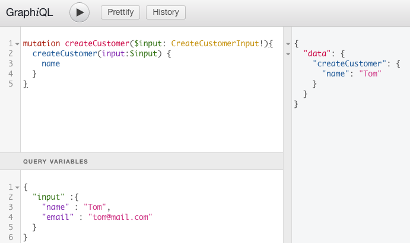
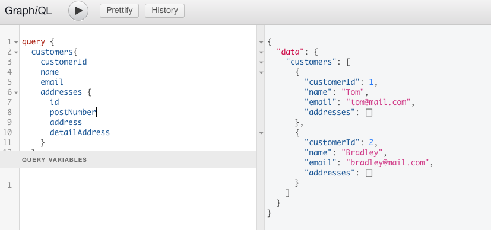
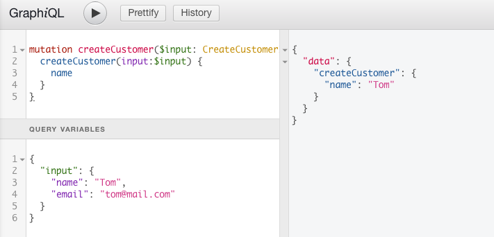
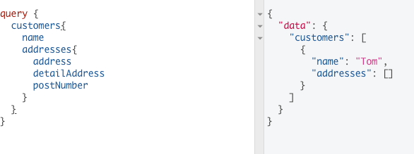

# Graphql

GraphQL은 API를 구현하기 위한 REST 대신 사용되는 유연하고 강력한 대안입니다.

하나의 Endpoint가 모든 CRUD를 비롯한 행위를 처리합니다.

기존의 REST로 구현된 API는 URL과 리소스를 매칭시키는 개념적 모델을 사용했기 때문에 수 많은 엔드포인트를 사용하였지만 GraphQL은 모든 리소스가 마치 서로 연결 되어 있는 것처럼 보이기 때문에 URL을 별도로 분리 할 필요는 없습니다.

GraphQL은 URL이 아니라 쿼리를 통해서 표현하는 것이 핵심입니다.

기존 RestAPI의 경우 N+1쿼리로 인해서 엔드포인트가 무분별하게 늘어나는 경우가 많았습니다.

예를 들어 고객 정보를 가져오는 REST API가 아래와 같다고 가정합니다.

~~~
/customers
~~~

만약 id가 1번 고객의 정보를 가져오고 싶으면 아래와 같은 API를 호출합니다.

~~~
/customers/1
~~~

만약 해당 고객(1번)의 주문 목록을 가져오고 싶으면 아래와 같은 API를 호출 해야 합니다.

~~~
/orders?customerId=1
또는
/ordersbycustomerid/1
...
~~~

하지만 GraphQL을 사용하면 적당한 쿼리를 통해서 단일 Endpoint에 요청을 할 수 있습니다.

~~~
/graphql

query {
  customers(id: 1) {
    name
    address
    phone
    orders {
      orderId
    }
  }
}

~~~

## 1. 용어

### 1.1 Fields
GraphQL은 객체에 대한 특정 필드를 요구하는 것이 기본입니다.

아래와 같이 쿼리에 name이라는 필드를 적어서 요청을 보낼 경우
~~~
{
  customers {
    name
  }
}
~~~

쿼리의 형식과 동일한 모양을 가진 결과를 받을 수 있습니다.

항상 요청한 대로 돌아오고 서버는 클라이언트가 요구하는 필드를 정확히 알고 있어야 합니다.

~~~json
{
  "data" : {
    "customers" : {
      "name" : "act"
    }
  }
}
~~~

당연히 하위 객체에 대한 쿼리를 요청 할 수도 있습니다.

~~~
{
  customers{
    name
    orders {
      orderId
    }
  }
}
~~~

~~~json
{
  "data" : {
    "customers" : {
      "name" : "act",
      "orders" : [
        {
          "orderId" : 1
        }
      ]
    }
  }
}
~~~

## 1.2 Arguments

arguments를 통해서 원하는 값을 가져오도록 쿼리를 작성 할 수 있습니다.

~~~
{
  customers(id : 1){
    name
    orders {
      orderId
    }
  }
}
~~~

~~~json
{
  "data" : {
    "customers" : {
      "name" : "act",
      "orders" : [
        {
          "orderId" : 1
        }
      ]
    }
  }
}
~~~

물론 int형과 같은 기본 자료형 뿐만이 아니라 사용자 정의 유형을 선언해서 보낼 수도 있습니다.

## 1.3 Aliases
객체 필드가 쿼리의 필드 이름과 일치하지만 인수는 포함하지 않으므로 다른 인수를 사용하여 같은 필드를 직접 쿼리를 할 수는 없습니다.
그렇기 때문에 필드의 결과를 원하는 이름으로 바꿔야만 합니다.

~~~
{
  first : customers(id : 1) {
    name
  }
  second : customers(id : 2) {
    name
  }
}
~~~

~~~json
{
  "data" : {
    "first" : {
      "name" : "act"
    },
    "second" : {
      "name" : "sds"
    }
  }
}
~~~

## 1.4 Fragments
공통된 부분이 있을 경우 쿼리가 상대적으로 복잡해 질 수 있습니다.
즉 동일한 필드를 두번 이상 쿼리에 작성해야 할 필요가 생기는데 이런 경우 프래그먼트를 사용하여 해결합니다.

~~~
{
  first : customers(id : 1) {
    ...commonFileds
  }
  second : customers(id : 2) {
    ...commonFileds
  }
}

fragment commonFileds on Charcater {
  name
  address
  phone
}
~~~

## 1.5 Operation name

코드를 모호하게 표현하고 싶지 않고 동적변수를 전달할 필요가 있다면 operation type과 operation name을 명시하도록 합니다.

operation type에는 query, mutation, subscription이 존재하며

operation name은 의미있고 명시적인 이름입니다. 즉 디버깅이나 서버측 로깅에 도움이 될 수 있는 이름입니다.

~~~
query GetCustomers{
  customers {
    name
  }
}
~~~

## 1.6 Variables

모든 인수를 쿼리 문자열 안에 작성하였지만 필드에 대한 인수(arguments)는 동적일 수 있습니다.

클라이언트 측 코드는 쿼리 문자열을 런타임에 조직하기 때문에 쿼리 문자열에 직접 전달하는 방법은 적절하지 않습니다.

변수를 사용하기 위한 방법은 3가지 과정이 존재합니다.

* 쿼리의 정적 값을 $[변수명]으로 변경합니다.
~~~
// 변경 전
query GetCustomers{
  customers(id : 1) {
    name
  }
}

//변경 후
query GetCustomers {
  customers(id : $customerId) {
    name
  }
}
~~~

* $[변수명]을 쿼리의 변수 중 하나로 선언합니다.

  (변수 정의는 $[변수명] : 타입)

~~~
//변경 전
query GetCustomers {
  customers(id : $customerId) {
    name
  }
}

//변경 후
query GetCustomers($customerId : Int) {
  customers(id : $customerId) {
    name
  }
}
~~~

* 변수 사전에 [변수명] : [value]를 작성합니다.

~~~
query GetCustomers($customerId : Int) {
  customers(id : $customerId) {
    name
  }
}

////
{
  "customerId" : 1
}
~~~

## 1.7 Mutations
서버측에 데이터 수정(CUD)을 요청하기 위해서는 query가 아닌 mutation을 사용합니다.

~~~
mutaion CreateCustomers ($customer: Customer!) {
  createCustomer(customer: $customer) {
    name
    phone
    address
  }
}
////

{
  "customer" : {
    "name" : "act2",
    "phone" : "010-1111-2222",
    "address" : "Seoul"
  }
}
~~~

## 2. Spring Boot GraphQL

### 2.1 pom.xml

pom.xml에

아래와 같이 graphql 관련 라이브러리를 추가합니다.

* graphql-spring-boot-starter : GraphQL 서버를 실행할 수 있는 환경을 제공

* graphql-java-tools : GraphQL 스키마 언어를 사용하도록 하고 GraphQL 객체에 매핑 할 수 있도록 도와 줍니다.

* graphql-java-annotations : GraphQL 스키마 정의를 위한 주석 기반 구문을 제공

~~~xml
<properties>
  ...
 <graphql-java.version>5.0.2</graphql-java.version>
 <graphql-java-tools.version>5.2.4</graphql-java-tools.version>
 <graphql-java-annotations.version>3.0.3</graphql-java-annotations.version>
 <ratpack-core.version>1.4.6</ratpack-core.version>
</properties>

<dependency>
   <groupId>com.graphql-java</groupId>
   <artifactId>graphql-spring-boot-starter</artifactId>
   <version>${graphql-java.version}</version>
</dependency>
<dependency>
   <groupId>com.graphql-java</groupId>
   <artifactId>graphql-java-tools</artifactId>
   <version>${graphql-java-tools.version}</version>
</dependency>
<dependency>
   <groupId>com.graphql-java</groupId>
   <artifactId>graphql-java-annotations</artifactId>
   <version>${graphql-java-annotations.version}</version>
</dependency>
~~~

### 2.2 스키마 작성
GraphQL Tool 라이브러리는 GraphQL 스키마 파일을 처리하고 GraphQL Starter 라이브러리는 자동으로 이 스키마 파일을 찾습니다.

이러한 스키마 파일들은 ".graphqls" 형식으로 저장해야 하며 클래스 패스 어디서나 존재가 가능합니다.

갯수에도 제한이 없기 때문에 원하는대로 모듈로 나눌 수 있습니다.

하나의 요구사항은 아래와 같이 정확하게 하나의 루트 query와 하나의 루트 mutation이 존재해야 합니다.

~~~schema.graphqls
type Query {

}

type Mutation {
}
~~~

아래의 스크립트는

위의 Query 타입과 Mutation 타입을 확장해서 만든 행위와

그 행위를 하기 위해 필요한 스키마 타입과 Input을 정의하고 있습니다.

type Object 는 implements로 다른 type Object를 확장 또는 구현 할 수 있지만

input Object는 implements로 확장을 하지 못합니다.

~~~
//Customer 타입을 정의하고 해당 타입이 가진 필드들을 나열합니다.
// 필드명:자료형 으로 선언하며 !는 필수값을 의미합니다.
// []는 리스트 오브젝트를 의미합니다.
type Customer{
    customerId: Int!
    name: String!
    email: String!
    addresses: [Address]
}

// input의 경우 Query 또는 Mutation의 행위를 위해서 입력받는 오브젝트를 의미합니다.
input CreateCustomerInput {
    name: String!
    email: String!
}

input UpdateCustomerInput {
    customerId: Int!
    name: String!
    email: String!
}

extend type Query {
    customers: [Customer]
    customer(customerId: Int!): Customer
}

extend type Mutation {
    createCustomer(input: CreateCustomerInput!): Customer!
    updateCustomer(input: UpdateCustomerInput!): Customer!
    deleteCustomer(customerId: Int!): Boolean
}
~~~

~~~address.graphqls
type Address{
    id: Long!
    customerId: Int!
    postNumber: String!
    address: String!
    detailAddress: String!
}

input CreateAddressInput {
    customerId: Int!
    postNumber: String!
    address: String!
    detailAddress: String!
}

extend type Query {
    addresses: [Address]
    address(id: Int!): Address
}

extend type Mutation{
    createAddress(input: CreateAddressInput): Address
    deleteAddresses(customerId: Int!): Boolean
}
~~~

### 2.3 Bean

GraphQL의 모든 타입들은 어떠한 곳에서 오더라도 자바 빈으로 표현 됩니다.

자반 빈 내의 모든 필드들은 GraphQL 응답의 필드에 직접 매핑 됩니다.

자바 빈과 GraphQL 스키마에 매핑되지 않는 필드나 메소드는 무시 됩니다.

위에서 생성한 스크립트(type 오브젝트, input)에 맞춰서 매핑될 빈을 생성합니다.

~~~java
@Entity
@Data
@Table(name = "customers", schema = "customer")
@AllArgsConstructor
@NoArgsConstructor
@JsonIgnoreProperties({"hibernateLazyInitializer", "handler"})
public class Customer extends ResourceSupport implements Serializable {

    @Id
    @Column(name = "customerId", nullable = false)
    @GeneratedValue(strategy = GenerationType.IDENTITY)
    private int customerId;

    @Column(name = "name", nullable = false, length = 50)
    private String name;

    @Column(name = "email", nullable = false, length = 50)
    private String email;

    public Customer(String name, String email) {
        this.name = name;
        this.email = email;
    }
}
~~~

~~~java
@Entity
@Data
@Table(name = "address", schema = "customer")
@AllArgsConstructor
@NoArgsConstructor
@JsonIgnoreProperties({"hibernateLazyInitializer", "handler"})
public class Address implements Serializable {
    @Id
    @Column(name = "id", nullable = false)
    @GeneratedValue(strategy = GenerationType.IDENTITY)
    private long id;
    private String postNumber;
    private String address;
    private String detailAddress;

    @ManyToOne
    @JoinColumn(name="customer_id", updatable = false)
    private Customer customer;
}
~~~

~~~java
@Data
@NoArgsConstructor
@AllArgsConstructor
public class CreateCustomerInput {
    private String name;
    private String email;
}
~~~

~~~java
@Data
@NoArgsConstructor
@AllArgsConstructor
public class UpdateCustomerInput {
    private int customerId;
    private String name;
    private String email;
}
~~~

### 2.4 GraphQLResolver
일반적인 스칼라 필드의 경우 getter, setter 메서드로 해결이 가능하지만

조금 더 복잡한 오브젝트 타입의 경우 (여기서는 Address안의 Customer) Resolver를 통해서 해당 필드의 값을 확인해야 합니다.

GraphQLResolver 인터페이스를 구현하여 해결이 가능합니다.

~~~java
@NoArgsConstructor
@AllArgsConstructor
public class CustomerQueryResolver implements GraphQLResolver<Customer> {

    @Autowired
    private AddressRepository addressRepository;

    public List<Address> getAddresses(Customer customer) {
        return addressRepository.findAllByCustomerCustomerId(customer.getCustomerId());
    }
}
~~~

### 2.5 GraphQLQueryResolver
위에서 작성 된 루트 query는 루트 query 내의 다양한 필드를 처리하기 위해 Spring Context에 정의 된 특수한 빈을 가져야 합니다.

해당 빈의 메소드 명명 규칙은 다음 중 하나를 따라야 합니다.

* [field]

* is[field]

* get[field]

아래의 코드에서 getCustomers 메소드는 GraphQL 스키마의 customers 필드에 대한 GraphQL query를 처리하는데 사용 됩니다.

~~~java
@NoArgsConstructor
@AllArgsConstructor
public class QueryResolver implements GraphQLQueryResolver {

    @Autowired
    private CustomerRepository customerRepository;

    @Autowired
    private AddressRepository addressRepository;

    public List<Customer> getCustomers() {
        return customerRepository.findAll();
    }

    public Customer getCustomer(int id) {
        return customerRepository.findById(id).get();
    }

    public List<Address> getAddresses() {
        return addressRepository.findAll();
    }

    public Address getAddress(int id) {
        return addressRepository.findById(id).get();
    }

}
~~~

### 2.6 GraphQLMutationResolver
query와 마찬가지로 mutation에 대한 처리를 하려면 GraphQLMutationResolver를 구현해야 합니다.

~~~java
@AllArgsConstructor
@NoArgsConstructor
public class MutationResolver implements GraphQLMutationResolver {

    @Autowired
    private CustomerRepository customerRepository;

    @Autowired
    private AddressRepository addressRepository;

    @Transactional
    public Customer createCustomer(CreateCustomerInput input) {
        return customerRepository.saveAndFlush(new Customer(input.getName(), input.getEmail()));
    }

    @Transactional
    public Customer updateCustomer(UpdateCustomerInput input) {
        Customer customer = customerRepository
                .findById(input.getCustomerId())
                .orElseThrow(() -> new CustomerNotFoundException(input.getCustomerId()));
        customer.setEmail(input.getEmail());
        customer.setName(input.getName());
        return customer;
    }

    @Transactional
    public Customer deleteCustomer(Integer customerId) {
        customerRepository.deleteById(customerId);
        return null;
    }

    @Transactional
       public Address createAddress(CreateAddressInput input){
           Address address = new Address();
           address.setCustomer(customerRepository.findById(input.getCustomerId()).get());
           address.setAddress(input.getAddress());
           address.setPostNumber(input.getPostNumber());
           address.setDetailAddress(input.getDetailAddress());
           return  addressRepository.saveAndFlush(address);

    }

    @Transactional
    public void deleteAddresses(Integer customerId) {
        addressRepository.deleteAllByCustomerCustomerId(customerId);
    }
}
~~~

### 2.7 테스트
graphql-spring-boot-starter 라이브러리를 추가하였다면

Spring boot 실행 시 자동으로 테스트 가능한 엔드포인트가 추가 됩니다.

서버 실행 이후

localhost:[port]/graphiql 로 접속합니다.

아래와 같이 입력하고 실행을 합니다.

~~~
mutation createCustomer($input: CreateCustomerInput!){
  createCustomer(input:$input) {
    name
  }
}

//QUERY VARIABLES
{
  "input" :{
    "name" : "Tom",
    "email" : "tom@mail.com"
  }
}
~~~

data가 입력 되었고 리턴 값으로 명시한 name에 대한 값이 리턴 되는 것을 확인 할 수 있습니다.

추가적으로 다른 데이터를 입력하고 query문을 실행합니다.

~~~
query {
  customers{
    customerId
    name
    email
    addresses {
      id
      postNumber
      address
      detailAddress
    }
  }
}
~~~

### 2.8 code-first style

위와 같은 방식을 schema-first 라고 합니다.

개발에 있어서 스키마를 항상 정의하고 이러한 방식은 레거시 코드가 없는 새로운 프로젝트에 적합합니다.

하지만 이러한 방식은 중복이 많이 발생합니다.

예를 들어서 위에서 Customer의 경우

type Customer 스크립트 뿐만 아니라 class Customer를 반드시 정의해야 합니다.

즉, 형식만 다를 뿐 동일한 정보를 포함하고 있습니다.

만약 필드의 변경이나 추가가 발생할 경우 2가지 모두 수정해야 하는 단점이 존재합니다.

code-first style의 경우 기존 모델에 어노테이션을 이용하여 스키마를 생성하게 됩니다.

이러한 방식은 모델이 동기화 되기 때문에 리팩토링이 쉽고 기존 코드 베이스위에 GraphQL이 도입 된 프로젝트에서도 효과적입니다.

다만 단점으로는 서버의 코드가 작성 될 때까지 스키마가 존재하지 않아 클라이언트 측과 서버 측 작업간에 종속성이 있다는 점입니다.

이러한 단점을 해결하기 위해서 서버에서 stub을 사용하여 스키마를 빠르게 생성한 다음 실제 서버 코드를 클라이언트와 병렬로 개발하는 것입니다.

이러한 방식을 제공해주는 라이브러리들은 아래와 같습니다.

* graphql-java-type-generator

* graphql-java-annotations

* spring-graphql-common

* graphql-jpa

* graphql-spqr

아래 예제에서는 graphql-spqr을 사용하겠습니다.

먼저 pom에 아래와 같은 의존성을 추가합니다.

~~~xml
<dependency>
    <groupId>io.leangen.graphql</groupId>
    <artifactId>spqr</artifactId>
    <version>0.9.1</version>
</dependency>
~~~

그 다음으로 위의 예제에서 만든 graphqls를 모두 삭제합니다.

그 이후에 AddressQuery 클래스를 아래와 같이 작성합니다.

~~~java
@NoArgsConstructor
@AllArgsConstructor
@Component
public class AddressQuery {

    @Autowired
    private AddressRepository addressRepository;

    @GraphQLQuery
    public List<Address> getAddresses() {
        return addressRepository.findAll();
    }

    @GraphQLQuery
    public Address getAddress(@GraphQLArgument(name="id") int id){
        return addressRepository.findById(id).get();
    }

}
~~~

이전에는 graphqls 스크립트에서 입력되는 argument를 정의하였지만 위에서는 @GraphQLArgument 어노테이션을 이용하여 정의합니다.

마찬가지로 CustomerQuery 클래스를 아래와 같이 작성합니다.

~~~java
@AllArgsConstructor
@NoArgsConstructor
@Component
public class CustomerQuery {

    @Autowired
    private CustomerRepository customerRepository;

    @GraphQLQuery
    public List<Customer> getCustomers() {
        return customerRepository.findAll();
    }

    @GraphQLQuery
    public Customer getCustomer(@GraphQLArgument(name = "id") int id) {
        return customerRepository.findById(id).get();
    }
}
~~~

이후에 mutation에 해당하는 클래스를 만들어줍니다.

~~~java
@AllArgsConstructor
@NoArgsConstructor
@Component
public class AddressMutation {
    @Autowired
    private CustomerRepository customerRepository;

    @Autowired
    private AddressRepository addressRepository;

    @GraphQLMutation
    public Address createAddress(@GraphQLArgument(name="input") CreateAddress input){
        Address address = new Address();
        address.setCustomer(customerRepository.findById(input.getCustomerId()).get());
        address.setAddress(input.getAddress());
        address.setPostNumber(input.getPostNumber());
        address.setDetailAddress(input.getDetailAddress());
        return  addressRepository.saveAndFlush(address);

    }

    @GraphQLMutation
    public void deleteAddresses(@GraphQLArgument(name="customerId") Integer customerId) {
        addressRepository.deleteAllByCustomerCustomerId(customerId);
    }
}
~~~

기존에 스크립트에 정의된 CreateAddressInput을 위와 같이 @GraphQLArgument를 이용하하여 대체하였습니다.

위와 마찬가지로 CustomerMutation도 정의합니다.

~~~java
@NoArgsConstructor
@AllArgsConstructor
@Component
public class CustomerMutation {
    @Autowired
    private CustomerRepository customerRepository;

    @GraphQLMutation
    public Customer createCustomer(@GraphQLArgument(name="input") CreateCustomer input) {
        return  customerRepository.saveAndFlush(new Customer(input.getName(), input.getEmail()));
    }

    @GraphQLMutation
    public Customer updateCustomer(@GraphQLArgument(name="input") UpdateCustomer input) {
        Customer customer = customerRepository
                .findById(input.getCustomerId())
                .orElseThrow(() -> new CustomerNotFoundException(input.getCustomerId()));
        customer.setEmail(input.getEmail());
        customer.setName(input.getName());
        return customer;
    }

    @GraphQLMutation
    public Customer deleteCustomer(@GraphQLArgument(name="customerId") Integer customerId) {
        customerRepository.deleteById(customerId);
        return null;
    }
}
~~~

코드상에서 알 수 있듯이 GraphQLQueryResolver와 GraphQLMutationResolver 인터페이스가 사라졌음을 확인 할 수 있습니다.

대신 위에서 만든 Component가 스키마를 생성할수 있도록 GraphQLSchemaGenerator를 이용합니다.

~~~java
@RestController
public class GraphQLController {

    private final GraphQL graphQL;

    @Autowired
    public GraphQLController( AddressQuery addressQuery
                            , CustomerQuery customerQuery
                            , AddressMutation addressMutation
                            , CustomerMutation customerMutation
                            , CustomerResolver customerResolver
                           ) {

        //Schema generated from query classes
        GraphQLSchema schema = new GraphQLSchemaGenerator()
                .withOperationsFromSingletons(customerQuery, addressQuery, customerMutation, addressMutation, customerResolver)
                .withValueMapperFactory(JacksonValueMapperFactory.builder().build())
                .generate();

        graphQL = GraphQL.newGraphQL(schema).build();

    }

    @PostMapping(value = "/graphql", consumes = {MediaType.APPLICATION_JSON_VALUE, MediaType.APPLICATION_JSON_UTF8_VALUE}, produces = MediaType.APPLICATION_JSON_VALUE)
    @ResponseBody
    public Map<String, Object> indexFromAnnotated(@RequestBody Map<String, Object> request, HttpServletRequest raw) {
        ExecutionResult executionResult = graphQL.execute(ExecutionInput.newExecutionInput()
                .query((String)request.get("query"))
                .variables((Map)request.get("variables"))
                .operationName((String)request.get("operationName"))
                .context(raw)
                .build());
        return executionResult.toSpecification();
    }
}
~~~

다음으로 서버시를 실행하여 테스트를 합니다.

~~~
mutation createCustomer($input: CreateCustomerInput){
  createCustomer(input:$input) {
    name
  }
}

//QUERY VARIABLES
{
  "input": {
    "name": "Tom",
    "email": "tom@mail.com"
  }
}
~~~

~~~
query {
  customers{
    name
  	addresses{
      address
      detailAddress
      postNumber
    }
  }
}
~~~

## 3. 결론

GraphQL은 때때로 REST 보다 효율적이고 유연하게 대안이 될 수 있는 API 표준입니다.

클라이언트가 API에서 필요한 데이터만 정확하게 지정하여 선언적으로 데이터 가져오기가 가능합니다.
따라서 실제로 필요하지 않는 데이터를 검색하고 다운로드하여 분석하는데 오래 걸리는 오버 페치(Over fetching) 문제를 해결 할수 있습니다.

그리고 반대로 충분한 데이터가 포함되지 않는 문제(Under fetching) 문제 또한 해결 할 수 있습니다. 최악의 경우 N+1 요청 문제(여러 endpoint를 호출)가 발생하는데 graphql의 경우 선언적으로 필요한 것을 요청하기 때문에 이를 해결 할 수 있습니다.

데이터베이스 기술과 종종 혼동을 하는데 데이터베이스가 아닌 API를 위한 쿼리 언어입니다. 따라서 데이터베이스에 의존적이지 않고 API가 사용되는 모든 환경에서 사용 될 수 있습니다.

## 4. 참고 및 출처
https://www.pluralsight.com/guides/building-a-graphql-server-with-spring-boot

https://www.baeldung.com/spring-graphql

https://graphql-kr.github.io/learn/queries/

https://medium.com/@FourwingsY/graphql%EC%9D%84-%EC%98%A4%ED%95%B4%ED%95%98%EB%8B%A4-3216f404134

https://www.prisma.io/blog/top-5-reasons-to-use-graphql-b60cfa683511
