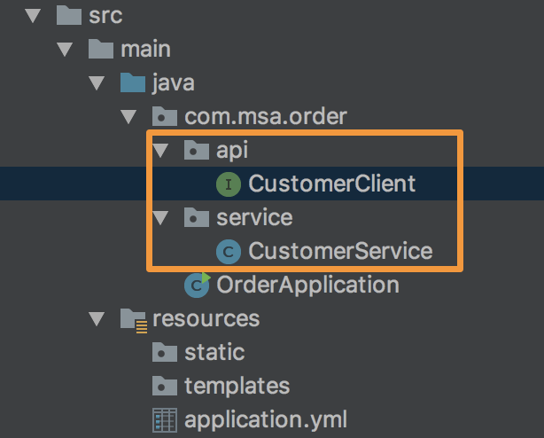

# Intellij Community 설치
[JetBrains](https://www.jetbrains.com/idea/download/#section=windows) 홈페이지에서 Intellij Community 버젼을 다운 받아 설치 합니다.  
SDK 설정이 되어 있지않다면, Project Settings > Project 메뉴에서 SDK에서 Java8을 추가합니다.

# 1. Eureka
Service discovery 역할을 수행하는 eureka 서비스를 설정하도록 하겠습니다.  

Spring Initializer 페이지 [(start.spring.io)](http://start.spring.io) 로 이동하여 아래와 같이 개발환경과 dependencies를 선택 합니다.
- Generate...Maven Project, Java, 1.5.15
- Artifact: eureka
- Dependencies: eureka server 입력 후 엔터


GenerateProject를 클릭하여 zip파일을 다운 받습니다.  
다운받은 파일을 원하는 경로에 압축 해제 합니다.  
IDE를 이용하여 해당 프로젝트를 엽니다.

pom.xml파일을 열어보면 아래와 같은 내용이 추가된 것을 확인할 수 있습니다.
```xml
#Spring Boot 1.5.15를 사용함
<parent>
  <groupId>org.springframework.boot</groupId>
  <artifactId>spring-boot-starter-parent</artifactId>
  <version>1.5.15.BUILD-SNAPSHOT</version>  #
  <relativePath/> <!-- lookup parent from repository -->
</parent>
#Spring Cloud Edgware 사용함
<properties>
  <project.build.sourceEncoding>UTF-8</project.build.sourceEncoding>
  <project.reporting.outputEncoding>UTF-8</project.reporting.outputEncoding>
  <java.version>1.8</java.version>
  <spring-cloud.version>Edgware.BUILD-SNAPSHOT</spring-cloud.version>
</properties>
... ...
#eureka dependency 추가
<dependency>
  <groupId>org.springframework.cloud</groupId>
  <artifactId>spring-cloud-starter-netflix-eureka-server</artifactId>
</dependency>

```

src > resources > application.properties 파일명을 application.yml로 변경 합니다.
(가독성 및 작성 편의를 위함)  
해당 파일에 아래 내용을 작성합니다.

```yml
server:
  port: 8761  # 서비스 port
spring:
  application:
    name: discovery-service # 서비스명
eureka:
  client: # Eureka Server는 기본적으로 Client로서도 작동을 해서 아래 설정 필요 함
    registerWithEureka: false # Eureka서버를 peer 구성시 true 되어야 함
    fetchRegistry: false  #?? local에 registry cache를 사용 함
    serviceUrl:
      defaultZone: http://localhost:${server.port}/eureka/ # peer구성 시 상대서버 ip:port 작성
  server:
    enable-self-preservation: false
```
Application Main 클래스에 @EnableEurekaServer 어노테이션을 추가합니다.
```Java
@EnableEurekaServer
@SpringBootApplication
public class EurekaApplication {
	public static void main(String[] args) {
		SpringApplication.run(EurekaApplication.class, args);
	}
}
```

EurekaApplication을 실행 하고 localhost:8761로 접속하여 Eureka Dashboard 화면이 열리면 정상 작동 하는것입니다.  
현재는 Instances 항목이 No instances available로 표시 됩니
다.

# 2. Customer service
string을 return 하는 API를 갖는 단순한 application을 만들어 보겠습니다.  
이 서비스는 eureka에 자동 등록되게 되고, 사용자가 zuul을 통한 라우팅으로 접근하게 구성될 겁니다.

Spring Initializer 페이지 [(start.spring.io)](http://start.spring.io) 로 이동하여 아래와 같이 개발환경과 dependencies를 선택 합니다.
- Generate...Maven Project, Java, 1.5.15
- Artifact: customer
- Dependencies: web, eureka discovery 입력 후 엔터

GenerateProject를 클릭하여 zip파일을 다운 받습니다.  
다운받은 파일을 원하는 workspace경로에서 압축 해제 합니다.  
IDE를 이용하여 해당 프로젝트를 엽니다.

pom.xml파일을 열어보면 아래와 같은 내용이 추가된 것을 확인할 수 있습니다.
```xml
#web dependency 추가
<dependency>
  <groupId>org.springframework.boot</groupId>
  <artifactId>spring-boot-starter-web</artifactId>
</dependency>
#eureka client dependency 추가
<dependency>
  <groupId>org.springframework.cloud</groupId>
  <artifactId>spring-cloud-starter-netflix-eureka-client</artifactId>
</dependency>

```

src > resources > application.properties 파일명을 application.yml로 변경 합니다.
해당 파일에 아래 내용을 작성합니다.

```yml
server:
  port: 8771  # 서비스 port
spring:
  application:
    name: customer-service # 서비스명
eureka:
  client:
    serviceUrl:
      defaultZone: http://localhost:8761/eureka/
  instance:
    preferIpAddress: true # 서비스간 통신 시 hostname 보다 ip 를 우선 사용 함    
```
Application Main 클래스에 아래 어노테이션을 추가합니다.  
그리고 /customer 로 호출 시 임의 고객명을 return 하는 API를 생성합니다.
```Java
@EnableDiscoveryClient //해당 application을 eureka serverㅇ에 등록. eureka, consul, zookeeper의 implements를 모두 포함. @EnableEurekaClient는 only works for eureka.
@RestController // Rest API를 사용할 class임을 명시.
@SpringBootApplication
public class CustomerApplication {
	@RequestMapping(method = RequestMethod.GET, value = "/customer")
	public String getCustomer() {
		return "John";
	}
	public static void main(String[] args) {
		SpringApplication.run(CustomerApplication.class, args);
	}
}
```
application을 실행 합니다.  
localhost:8761 로 이동하여 customer-service가 instance로 등록된 것을 확인 합니다. 이때 instance명은 모두 대문자로 표시됩니다.  
localhost:8771/customer 를 호출하여 John이 표시되는것을 확인 합니다.  

# 3. Zuul
Gateway 역할을 수행하는 zuul 서비스를 설정하도록 하겠습니다.  

Spring Initializer 페이지 [(start.spring.io)](http://start.spring.io) 로 이동하여 아래와 같이 개발환경과 dependencies를 선택 합니다.
- Generate...Maven Project, Java, 1.5.15
- Artifact: zuul
- Dependencies: zuul, eureka discovery 입력 후 엔터

GenerateProject를 클릭하여 zip파일을 다운 받습니다.  
다운받은 파일을 원하는 workspace경로에서 압축 해제 합니다.  
IDE를 이용하여 해당 프로젝트를 엽니다.

pom.xml파일을 열어보면 아래와 같은 내용이 추가된 것을 확인할 수 있습니다.
```xml
#zuul dependency 추가
<dependency>
  <groupId>org.springframework.cloud</groupId>
  <artifactId>spring-cloud-starter-netflix-zuul</artifactId>
</dependency>
```

src > resources > application.properties 파일명을 application.yml로 변경 합니다.  
해당 파일에 아래 내용을 작성합니다.
```yml
spring:
  application:
    name: zuul-service

server:
  port: 8781

zuul:
  ignoredServices: '*'  # routes에 정의되지 않은 모든 요청은 무시 함
  sensitive-headers:    # header의 모든 정보를 bypass 함
  routes:
    customer:
      path: /api/v1/customer/** # 사용자가 입력할 url
      serviceId: CUSTOMER-SERVICE # routing을 처리할 endpoint service
      strip-prefix: true  # path에서 /** 앞의 경로는 제거 후 뒷단 서비스로 요청 함

eureka:
  client:
    serviceUrl:
      defaultZone: http://localhost:8761/eureka/

ribbon:
  ConnectTimeout: 5000    # Client에서 서버로 요청시 서버와의 Connection 맺기 까지의 delay time
  ReadTimeout: 2000       # Connection 맺은 후 response 받기 까지 delay time
```
> Ribbon  
> Load Balancing(eureka에 등록된 여러 instance들을 대상) 기능을 하며, routing 정보에 정의된 endpoint로 요청을 전달 한다.  

Application Main 클래스에 아래 어노테이션을 추가합니다.

```Java
@EnableDiscoveryClient
@EnableZuulProxy  //Zuul Proxy 사용.
@SpringBootApplication
public class ZuulApplication {

	public static void main(String[] args) {
		SpringApplication.run(ZuulApplication.class, args);
	}
}
```
application을 실행 합니다.    
localhost:8761 로 이동하여 zuul-service가 instance로 등록된 것을 확인 합니다.    
localhost:8781/api/v1/customer/customer 를 호출하여 John이 표시되는것을 확인 합니다.    

# 4. Order service
Order-service의 API를 호출하면 Customer-serivce로 부터 데이터를 가져다가 처리 후 return 하는 API를 갖는 application을 만들어 보겠습니다.


Spring Initializer 페이지 [(start.spring.io)](http://start.spring.io) 로 이동하여 아래와 같이 개발환경과 dependencies를 선택 합니다.
- Generate...Maven Project, Java, 1.5.15
- Artifact: order
- Dependencies: web, eureka discovery, feign 입력 후 엔터

GenerateProject를 클릭하여 zip파일을 다운 받습니다.  
다운받은 파일을 원하는 workspace경로에서 압축 해제 합니다.  
IDE를 이용하여 해당 프로젝트를 엽니다.  

pom.xml파일을 열어보면 아래와 같은 내용이 추가된 것을 확인할 수 있습니다.
```xml
#feign dependency 추가
<dependency>
  <groupId>org.springframework.cloud</groupId>
  <artifactId>spring-cloud-starter-openfeign</artifactId>
</dependency>
```

src > resources > application.properties 파일명을 application.yml로 변경 합니다.  
해당 파일에 아래 내용을 작성합니다.

```yml
server:
  port: 8772  # 서비스 port
spring:
  application:
    name: order-service # 서비스명
eureka:
  client:
    serviceUrl:
      defaultZone: http://localhost:8761/eureka/
  instance:
    preferIpAddress: true # 서비스간 통신 시 hostname 보다 ip 를 우선 사용 함
ribbon:
  ConnectTimeout: 5000    # Client에서 서버로 요청시 서버와의 Connection 맺기 까지의 delay time
  ReadTimeout: 2000       # Connection 맺은 후 response 받기 까지 delay time    
```
아래 화면과 같이 package를 생성하고 feign을 사용하기 위한 CustomerClient interface, CustomerService 를 생성합니다.  


- CustomerClient 파일 내용
```Java
@FeignClient(
        name ="CUSTOMER-SERVICE",   // eureka에 등록된 instance명으로 서비스 조회
        //url = "http://testhost:portnumber",   //eureka 사용하지 않아도 url로 서비스 지정 가능.
        decode404 = true    // 404 에러 발생시 feign 자체 에러 발생 안함
)
public interface CustomerClient {

    @RequestMapping(method = RequestMethod.GET, value = "/customer")    // customer-service의 customer api 호출
    String getCustomer();
}
```
> Feign  
> REST 기반 client 서비스의 API 호출을 지원

- CustomerService 파일 내용
```Java
@Service
public class CustomerService {
    private CustomerClient customerClient;
    public CustomerService(CustomerClient customerClient) {
        this.customerClient = customerClient;
    }
    public String getCustomer(){
        return customerClient.getCustomer();    // CustomerClient를 이용하여 서비스 호출
    }
}
```

Application Main 클래스에 아래 어노테이션을 추가하고, customer service를 호출하여 값을 return 하는 orders API를 추가 합니다.
```Java
@EnableFeignClients		// Feign을 사용
@RestController			// Rest API를 사용할 class임을 명시
@SpringBootApplication
public class OrderApplication {

	private CustomerService customerService;

	public OrderApplication(CustomerService customerService) {
		this.customerService = customerService;
	}

	@RequestMapping(method = RequestMethod.GET, value = "orders")
	public String getOrder(){
		return customerService.getCustomer() + "'s order list";
	}

	public static void main(String[] args) {
		SpringApplication.run(OrderApplication.class, args);
	}
}
```
application을 실행 합니다.
localhost:8761 로 이동하여 order-service가 instance로 등록된 것을 확인 합니다.  
localhost:8772/orders 를 호출하여 John's order list가 표시되는것을 확인 합니다.  

### Hystrix
TBD

# 5. Sleuth
TBD
# 6. Stream(Kafka, RabbitMQ)
TBD
# Config
TBD
config 파일명도 바꿔야 하고
초반에 넣으면 혼란스러울수 있다고 생각되어 마지막에 넣기로 함
