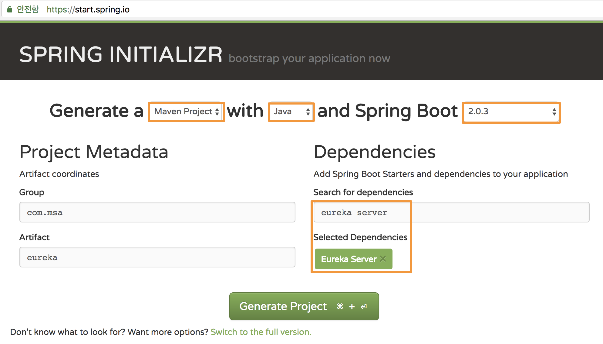
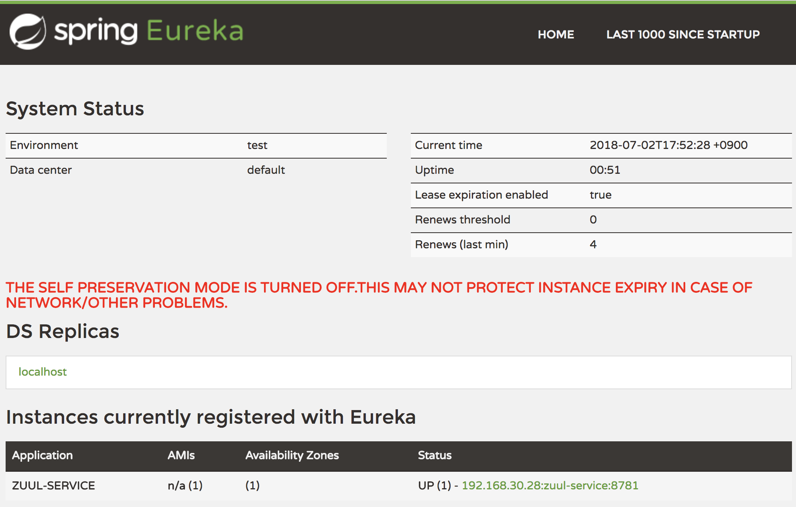

# 사용가능한 IDE
## Intellij Community
[JetBrains](https://www.jetbrains.com/idea/download/#section=windows) 홈페이지에서 Intellij Community 버젼을 다운 받아 설치 합니다.  
SDK 설정이 되어 있지않다면, Project Settings > Project 메뉴에서 SDK에서 Java8을 추가합니다.

## Spring Tools Suite
Spring application 개발하기 위한 Eclipse 기반의 IDE   
[STS](https://spring.io/tools/sts/all) 홈페이지에서 STS를 다운 받아 설치 합니다.  
(또는 기존에 사용하는 Eclipse에서 STS Plugin을 설치해서 사용합니다.)

# 실습개요
  

총 네 개의 프로젝트를 생성하는 실습을 진행합니다. 각 서비스별 간략 정보는 아래와 같습니다.  

|  서비스  | 포트 |              역할              |
|:--------:|:----:|:------------------------------:|
|  Eureka  | 8000 | Service Discvoery              |
|   Zuul   | 8500 | Gateway                        |
| Customer | 8701 |                                |
|   Order  | 8702 | Feign을 통한 Customer API 호출 |
|   Zipkin  | 9411 | Zipkin UI 서버 |

# 1. Eureka Server
Service discovery 역할을 수행하는 eureka 서비스를 설정하도록 하겠습니다.  

Spring Initializer 페이지 [(start.spring.io)](http://start.spring.io) 로 이동하여 아래와 같이 개발환경과 dependencies를 선택 합니다.
- Generate...Maven Project, Java, 2.0.3
- Artifact: eureka
- Dependencies: eureka server 입력 후 엔터



GenerateProject를 클릭하여 zip파일을 다운 받습니다.  
다운받은 파일을 원하는 경로에 압축 해제 합니다.  
IDE를 이용하여 해당 프로젝트를 엽니다.    

##### 참고) Eclipse STS를 사용하여 프로젝트 생성
Spring Starter Project 생성  
  

Project 정보 설정 (https 접속이 불가한 경우 Service URL을 http://start.spring.io 로 변경)
  

Project Dependency(Eureka Server) 추가  


프로젝트 구조는 아래와 같습니다.
```
eureka
└── src
│   └── main
│        └── java
│        │     └── com.msa.eureka
│        │            └── EurekaApplication.java
│        └── resources
│              └── application.properties
└── pom.xml
```

pom.xml파일을 열어보면 아래와 같은 내용이 추가된 것을 확인할 수 있습니다.
```xml
<!--Spring Boot 2.0.3를 사용함-->
<parent>
  <groupId>org.springframework.boot</groupId>
  <artifactId>spring-boot-starter-parent</artifactId>
  <version>2.0.3.RELEASE</version>
  <relativePath/> <!-- lookup parent from repository -->
</parent>
<!--Spring Cloud Finchley 사용함-->
<properties>
  <project.build.sourceEncoding>UTF-8</project.build.sourceEncoding>
  <project.reporting.outputEncoding>UTF-8</project.reporting.outputEncoding>
  <java.version>1.8</java.version>
  <spring-cloud.version>Finchley.RELEASE</spring-cloud.version>
</properties>
... ...
<!--eureka dependency -->
<dependency>
  <groupId>org.springframework.cloud</groupId>
  <artifactId>spring-cloud-starter-netflix-eureka-server</artifactId>
</dependency>

```

src > main > resources > application.properties 파일명을 application.yml로 변경 합니다.
(가독성 및 작성 편의를 위함)  
해당 파일에 아래 내용을 작성합니다.

```yml
server:
  port: 8000  # 서비스 port
spring:
  application:
    name: discovery-service # 서비스명
eureka:
  client: # Eureka Server는 기본적으로 Client로서도 작동을 해서 아래 설정 필요 함
    registerWithEureka: false
    fetchRegistry: false  
    serviceUrl:
      defaultZone: http://localhost:${server.port}/eureka/
  server:
    enable-self-preservation: false
```
eureka-service 프로젝트의 EurekaApplication.java 파일에 @EnableEurekaServer 어노테이션을 추가합니다.
```Java
@EnableEurekaServer
@SpringBootApplication
public class EurekaApplication {
	public static void main(String[] args) {
		SpringApplication.run(EurekaApplication.class, args);
	}
}
```

EurekaApplication을 실행 하고 http://localhost:8000 로 접속하여 Eureka Dashboard 화면이 열리면 정상 작동 하는것입니다.  
현재는 등록된 서비스가 없어 Instances 항목이 No instances available로 표시 됩니다.  
 

# 2. Zuul
Gateway 역할을 수행하는 zuul 서비스를 설정하도록 하겠습니다.  

Spring Initializer 페이지 [(start.spring.io)](http://start.spring.io) 로 이동하여 아래와 같이 개발환경과 dependencies를 선택 합니다.
- Generate...Maven Project, Java, 2.0.3
- Artifact: zuul
- Dependencies: zuul, eureka discovery 입력 후 엔터

GenerateProject를 클릭하여 zip파일을 다운 받습니다.  
다운받은 파일을 원하는 workspace경로에서 압축 해제 합니다.  
IDE를 이용하여 해당 프로젝트를 엽니다.

pom.xml파일을 열어보면 아래와 같이 dependency가 추가된 것을 확인할 수 있습니다.
```xml
<!--zuul dependency 추가-->
<dependency>
  <groupId>org.springframework.cloud</groupId>
  <artifactId>spring-cloud-starter-netflix-zuul</artifactId>
</dependency>
```

src > main > resources > application.properties 파일명을 application.yml로 변경 합니다.  
해당 파일에 아래 내용을 작성합니다. 앞으로 만들 서비스(CUSTOMER, ORDER)에 대한 라우팅 정보를 추가합니다.
```yml
spring:
  application:
    name: zuul-service

server:
  port: 8500

zuul:
  ignoredServices: '*'  # routes에 정의되지 않은 모든 요청은 무시 함
  sensitive-headers:    # header의 모든 정보를 bypass 함
  routes:
    customer:
      path: /api/v1/customer/**   # 사용자가 입력할 url
      serviceId: CUSTOMER-SERVICE # routing을 처리할 endpoint service
      strip-prefix: true          # path에서 /** 앞의 경로는 제거 후 뒷단 서비스로 요청 함
    order:
      path: /api/v1/order/**      # 사용자가 입력할 url
      serviceId: ORDER-SERVICE    # routing을 처리할 endpoint service
      strip-prefix: true          # path에서 /** 앞의 경로는 제거 후 뒷단 서비스로 요청 함      

eureka:
  client:
    serviceUrl:
      defaultZone: http://localhost:8000/eureka/

ribbon:
  ConnectTimeout: 5000    # Client에서 서버로 요청시 서버와의 Connection 맺기 까지의 delay time
  ReadTimeout: 2000       # Connection 맺은 후 response 받기 까지 delay time
```

zuul-service 프로젝트의 ZuulApplication.java 파일에 @EnableZuulProxy, @EnableDiscoveryClient 어노테이션을 추가합니다.

```Java
@EnableDiscoveryClient
@EnableZuulProxy  //Zuul Proxy 사용.
@SpringBootApplication
public class ZuulApplication {

	public static void main(String[] args) {
		SpringApplication.run(ZuulApplication.class, args);
	}
}
```
application을 실행 합니다.    
http://localhost:8000 로 접속하여 zuul-service가 instance로 등록된 것을 확인 합니다.    
 

# 3. Customer service (Eureka Client)
string을 return 하는 API를 갖는 단순한 application을 만들어 보겠습니다.  
이 서비스는 eureka에 자동 등록되고, 사용자가 zuul을 통한 라우팅으로 접근하게 구성될 것입니다.  

Spring Initializer 페이지 [(start.spring.io)](http://start.spring.io) 로 이동하여 아래와 같이 개발환경과 dependencies를 선택 합니다.
- Generate...Maven Project, Java, 2.0.3
- Artifact: customer
- Dependencies: web, eureka discovery 입력 후 엔터

GenerateProject를 클릭하여 zip파일을 다운 받습니다.  
다운받은 파일을 원하는 workspace경로에서 압축 해제 합니다.  
IDE를 이용하여 해당 프로젝트를 엽니다.

pom.xml파일을 열어보면 아래와 같은 내용이 추가된 것을 확인할 수 있습니다.
```xml
<!--web dependency 추가-->
<dependency>
  <groupId>org.springframework.boot</groupId>
  <artifactId>spring-boot-starter-web</artifactId>
</dependency>
<!--eureka client dependency -->
<dependency>
  <groupId>org.springframework.cloud</groupId>
  <artifactId>spring-cloud-starter-netflix-eureka-client</artifactId>
</dependency>

```

src > main > resources > application.properties 파일명을 application.yml로 변경 합니다.  
해당 파일에 아래 내용을 작성합니다.

```yml
server:
  port: 8701  # 서비스 port
spring:
  application:
    name: customer-service # 서비스명
eureka:
  client:
    serviceUrl:
      defaultZone: http://localhost:8000/eureka/
  instance:
    preferIpAddress: true # 서비스간 통신 시 hostname 보다 ip 를 우선 사용 함    
```
customer-service 프로젝트의 CustomerApplication.java 파일에 아래 어노테이션을 추가합니다.  
그리고 /customer 로 호출 시 임의 고객명을 return 하는 API를 생성합니다.
```Java
@EnableDiscoveryClient
@RestController // Rest API를 사용할 class임을 명시
@SpringBootApplication
public class CustomerApplication {
	@RequestMapping(method = RequestMethod.GET, value = "/customer")
	public String getCustomer() {
		return "John";
	}
	public static void main(String[] args) {
		SpringApplication.run(CustomerApplication.class, args);
	}
}
```
application을 실행 합니다.  

http://localhost:8000 (Eureka Server UI)로 이동하여 customer-service가 instance로 등록된 것을 확인 합니다.   
http://localhost:8701/customer 로 접속하여 John이 표시되는것을 확인 합니다.   

그리고 Zuul Gateway에서 설정한 라우팅 정보를 통해 Customer Service를 호출 할 수 있습니다.  
http://localhost:8500/api/v1/customer/customer 를 호출하여 John이 표시되는것을 확인 합니다.  
> Zuul을 생성하며 추가했던 아래 라우팅 정보를 이용하게 됩니다.
```yml
routes:
  customer:
    path: /api/v1/customer/**   # 사용자가 입력할 url
    serviceId: CUSTOMER-SERVICE # routing을 처리할 endpoint service
    strip-prefix: true          # path에서 /** 앞의 경로는 제거 후 뒷단 서비스로 요청 함
```

# 4. Order service


Order-service는 특정 API를 호출하면 customer-serivce로 부터 데이터를 가져와 가공 후 return 하도록 application을 만들어 보겠습니다.


Spring Initializer 페이지 [(start.spring.io)](http://start.spring.io) 로 이동하여 아래와 같이 개발환경과 dependencies를 선택 합니다.
- Generate...Maven Project, Java, 2.0.3
- Artifact: order
- Dependencies: web, eureka discovery, feign 입력 후 엔터

GenerateProject를 클릭하여 zip파일을 다운 받습니다.  
다운받은 파일을 원하는 workspace경로에서 압축 해제 합니다.  
IDE를 이용하여 해당 프로젝트를 엽니다.  

pom.xml파일을 열어보면 아래와 같은 내용이 추가된 것을 확인할 수 있습니다.
```xml
<!-- feign dependency 추가 -->
<dependency>
  <groupId>org.springframework.cloud</groupId>
  <artifactId>spring-cloud-starter-openfeign</artifactId>
</dependency>
```

src > main > resources > application.properties 파일명을 application.yml로 변경 합니다.  
해당 파일에 아래 내용을 작성합니다.

```yml
server:
  port: 8702  # 서비스 port
spring:
  application:
    name: order-service # 서비스명
eureka:
  client:
    serviceUrl:
      defaultZone: http://localhost:8000/eureka/
  instance:
    preferIpAddress: true # 서비스간 통신 시 hostname 보다 ip 를 우선 사용 함
ribbon:
  ConnectTimeout: 5000    # Client에서 서버로 요청시 서버와의 Connection 맺기 까지의 delay time
  ReadTimeout: 2000       # Connection 맺은 후 response 받기 까지 delay time    
```
Customer-service의 API를 호출할때 feign을 사용해 보도록 하겠습니다.   
아래 화면과 같이 package를 생성하고 CustomerClient interface, CustomerService 를 생성합니다.  


- CustomerClient.java 파일 내용
```Java
@FeignClient(
        name ="CUSTOMER-SERVICE",   // eureka에 등록된 instance명으로 서비스 조회
        decode404 = true    // 404 에러 발생시 feign 자체 에러 발생 안함
)
@Component
public interface CustomerClient {

    @RequestMapping(method = RequestMethod.GET, value = "/customer")    // customer-service의 customer api 호출
    String getCustomer();
}
```

- CustomerService.java 파일 내용
```Java
@Service
public class CustomerService {
    private CustomerClient customerClient;
    public CustomerService(CustomerClient customerClient) {
        this.customerClient = customerClient;
    }
    public String getCustomer(){
        return customerClient.getCustomer();    // CustomerClient를 이용하여 서비스 호출
    }
}
```

Order-service 프로젝트의 OrderApplication.java 파일에 @EnableFeignClients 어노테이션을 추가하고, customer-service를 호출하여 값을 return 하는 API를 추가 합니다.
```Java
@EnableDiscoveryClient
@EnableFeignClients		// Feign을 사용
@RestController			// Rest API를 사용할 class임을 명시
@SpringBootApplication
public class OrderApplication {

	private CustomerService customerService;

	public OrderApplication(CustomerService customerService) {
		this.customerService = customerService;
	}

	@RequestMapping(method = RequestMethod.GET, value = "orders")
	public String getOrder(){
		return customerService.getCustomer() + "'s order list";
	}

	public static void main(String[] args) {
		SpringApplication.run(OrderApplication.class, args);
	}
}
```
application을 실행 합니다.  
http://localhost:8000 로 접속하여 order-service가 instance로 등록된 것을 확인 합니다.  
http://localhost:8500/api/v1/order/orders 를 호출하여 **John's order list** 가 표시되는것을 확인 합니다.  

# 5. Hystrix
지금까지 zuul -> order-service -> customer-service 호출하는 구조를 만들어 보았습니다.  
만약 위 상황에서 customer-service에 장애가 발생한 경우 Hystrix를 통해 fallback처리를 해보겠습니다.

Hystrix 사용을 위한 dependency를 order-service의 pom.xml에 추가합니다.
```xml
<dependency>
  <groupId>org.springframework.cloud</groupId>
  <artifactId>spring-cloud-starter-netflix-hystrix</artifactId>
</dependency>
```

Order-service 프로젝트의 OrderApplication.java 파일에 @EnableHystrix 어노테이션을 추가합니다.
```Java
@EnableHystrix           
@EnableFeignClients    
@EnableDiscoveryClient
@RestController           
@SpringBootApplication
public class OrderApplication {
...
}

```

Order-service 프로젝트의 CustomerService.java 파일에 아래와 같이 @HystrixCommnad 어노테이션을 추가하고,  
해당 함수 처리 중 에러가 발생 한 경우 호출 될 fallback method를 정의하고 구현합니다.
```Java
@HystrixCommand(fallbackMethod = "getDefaultAllCustomer")
public String getCustomer(){
    return customerClient.getCustomer();    // CustomerClient를 이용하여 서비스 호출
}

public String getDefaultAllCustomer() {
    return "fallback";
}
```

이제 장애를 발생하여 Hystrix 가 적용되는지 테스트 해보도록 하겠습니다.  

Order-service 를 재실행 합니다.  
Customer-serivce 를 중지 합니다.

http://localhost:8500/api/v1/order/orders 를 호출하여 **fallback's order list** 가 표시되는것을 확인합니다.

Hystrix 상황을 모니터링 하기 위해 Hystrix Dashboard를 사용할 수 있습니다.  
order-service의 pom.xml에 아래 내용을 추가합니다.
```xml
<dependency>
    <groupId>org.springframework.cloud</groupId>
    <artifactId>spring-cloud-starter-hystrix-dashboard</artifactId>
    <version>1.4.4.RELEASE</version>
</dependency>
<dependency>
    <groupId>org.springframework.boot</groupId>
    <artifactId>spring-boot-starter-actuator</artifactId>
</dependency>
```

OrderApplication.java 파일에 @EnableHystrixDashboard 어노테이션을 추가합니다.
```Java
@EnableHystrixDashboard
@EnableHystrix           
@EnableFeignClients       
@RestController           
@SpringBootApplication
public class OrderApplication {
...
}
```

application.yml에 아래 내용을 추가합니다.

```yml
management:
  endpoints:
    web:
      exposure:
        include: 'hystrix.stream'
```

Order-service 를 재실행 합니다.   
http://localhost:8702/hystrix 로 이동하여
http://localhost:8702/actuator/hystrix.stream 을 url창에 입력 후 Monitor Stream을 클릭 합니다.  


http://localhost:8500/api/v1/order/orders 를 호출해서 count 변화를 확인 할수 있습니다.  

# 6. Sleuth and Zipkin
분산환경 트랜젝션의 흐름을 모니터링 하기 위한 Sleuth, Zipkin을 사용해 보겠습니다.  

모니터링을 위한 Zipkin UI 서버를 실행시켜 보겠습니다.
실행창에서 공유된 zipkin.jar 가 있는 폴더로 이동하여 아래 명령어를 실행 합니다.
```cmd
java -jar zipkin.jar
```

http://localhost:9411/zipkin/ 으로 이동하여 zipkin ui 가 실행되는지 확인 합니다.


그리고 아래 dependency를 모든 서비스 (Zuul, Order-service, Customer-service)에 추가합니다.

- Sleuth: TraceID, SpanID 를 남기기 위함
- Zipkin: Zipkin 서버로 로그 이력을 전송 함  

```xml
<dependency>
  <groupId>org.springframework.cloud</groupId>
  <artifactId>spring-cloud-starter-zipkin</artifactId>
</dependency>
<dependency>
  <groupId>org.springframework.cloud</groupId>
  <artifactId>spring-cloud-starter-sleuth</artifactId>
</dependency>
```

각 서비스의 application.yml 파일의 spring 항목에 아래 내용을 추가합니다.
```yml
spring:
  zipkin:
    baseUrl: http://localhost:9411/   # Zipkin 서버 정보
  sleuth:
    sampler:
      probability: 1.0                # Sleuth에서 로그를 남기는 비율
```

설정을 추가한 서비스들을 모두 재시작 합니다.  
API를 호출해 가며 Zipkin UI에서 해당 이력이 남는것을 확인 합니다.  


# 7. Load Balancing
Eureka, Zuul, Feign 등에서는 load balancing을 위한 Ribbon이 포함되어 있습니다.  
Customer 서비스를 이용하여 여러개의 instance를 생성하고, 이에 대한 load balancing이 자동으로 되는것을 확인해 보겠습니다.  

기존 application의 instance를 여러개 실행하려면 간단하게는 port만 바꿔 주면 됩니다.   
이번 실습에서는 customer project 폴더를 복사하여 customer2를 만들도록 하겠습니다.
그리고 customer2를 IDE로 열어서 아래와 같이 설정과 소스코드를 수정해 줍니다.  

 application.yml에서 port를 변경 합니다.    
 application.name은 동일하게 해야 eureka에 동일 app으로 등록 됩니다.  
```yml
server:
  port: 8711  # 서비스 port
```

다른 instance가 호출되는것을 구별하기 위해 CustomerApplication.java의 getCustomer 메서드 return 값을 아래와 같이 변경 합니다.  
```Java
public String getCustomer() {
  return "Hubert";
}
```
application을 실행 합니다.  
http://localhost:8000 로 접속하여 customer-service의 instance가 두개 등록된 것을 확인 합니다.  
http://localhost:8500/api/v1/order/orders 를 호출하여 **John's order list**, **Hubert's order list** 가 번갈아 표시되는 것을 확인 합니다.  

> Ribbon이 가지고 있는 cache가 refresh 되기 까지 30초에서 2분 정도가 걸릴 수 있습니다.  
> 이로 인해 처음 호출 시 Jons's order list만 계속 표시 될 수 있습니다.  
