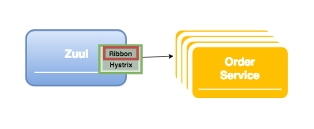

# 1. 개요
## Ribbon 이란?
Ribbon은 Inter Process Communication 라이브러리로   
Microservice 구성에서 서로 다른 서비스들을 쉽게 호출할 수 있도록 지원한다.

## Ribbon 기능
- Load balancing  
  
서비스의 instance가 여럿 실행 중인 경우 Ribbon을 통해 load balancing 기능을 이용할 수 있다.  
**Load balancer 구성요소**
  - Rule: Round robbin 방식을 기본으로 사용하고 instance별 가중치를 주는 방법으로도 지정 가능  
  - Ping: 서버 리스트의 서비스 상태를 주기적으로 확인
  - Server List: 정적으로 대상서비스를 지정하거나, eureka를 통해 동적으로 지정이 가능

- Service Discovery  
자체 discovery 기능을 이용하여, eureka 서버의 registry에 등록된 서비스 탐색이 가능하다.  
Eureka Server의 registry 정보를 local에 caching 하여 빠른 처리를 할 수 있다.
> eureka client와 중복 사용 되는 경우 둘중 하나는 생략 된다.

- Fault tolerance  
지속적인 ping을 통해 대상 서비스의 UP/DOWN 상태를 판단할 수 있다.  
Donw상태 서비스 instance는 호출 대상에서 제외된다.

- Multiple protocol support  
HTTP, TCP, UDP 를 모두 지원한다.

ribbon은 주로 zuul, feign, eureka 서비스를 사용할때 내부에서 같이 작동하게 된다.


# 2. 구성방법
1. dependency 추가  
netflix의 ribbon dependency를 추가하여 사용 할수 있지만, starter zuul/feign에 포함된 ribbon을 주로 사용 한다.   

2. config 추가
```yml
# Timeout 설정값은 Hystrix의 값과 비교하여 작은 값이 우선 적용 된다.
ribbon:
  ConnectTimeout: 1000  
  ReadTimeout: 10000
```
