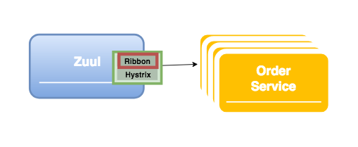

# 1. 개요
## Ribbon 이란?
Ribbon은 Inter Process Communication 라이브러리로   
Microservice 구성에서 서로 다른 서비스들을 쉽게 호출할 수 있도록 지원합니다.

#### Ribbon 기능
- Load balancing  
  
서비스의 instance가 여럿 실행 중인 경우 Ribbon을 통해 load balancing 기능을 이용할 수 있습니다.  
Round robin 방식을 기본으로 사용하고 instance별 가중치를 주는 방법으로도 지정 가능합니다.  
- Fault tolerance
- Multiple protocol support
- Caching and batching

# 2. 구성방법
