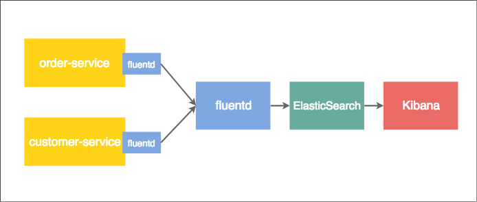

# Fluentd

### 설치
- [install-by-docker](https://docs.fluentd.org/v0.12/articles/install-by-docker)

1. ./fluentd 폴더에 fluentd.conf 파일 추가
    ```xml
    <source>
    @type http
    port 9880
    bind 0.0.0.0
    </source>
    <match **>
    @type stdout
    </match>
    ```
1. docker를 이용한 설치 및 구동
    ```bash
    $ docker pull fluent/fluentd:v0.12-debian
    $ docker run -d -p 9880:9880 -v $PWD/fluentd:/fluentd/etc -e FLUENTD_CONF=fluentd.conf fluent/fluentd
    ```
3. 테스트
    ```bash
    $ curl -X POST -d 'json={"json":"message"}' http://localhost:9880/sample.test
    $ docker ps
    CONTAINER ID        IMAGE               COMMAND                  CREATED             STATUS              PORTS                                         NAMES
    b495e527850c        fluent/fluentd      "/bin/sh -c 'exec ..."   2 hours ago         Up 2 hours          5140/tcp, 24224/tcp, 0.0.0.0:9880->9880/tcp   awesome_mcnulty
    $ docker logs b49 | tail -n 1
    ```
    > 2017-01-30 14:04:37 +0000 sample.test: {"json":"message"}

### Spring Boot 어플리케이션 로그 수집
1. Spring Boot 어플리케이션에 logback-spring.xml 추가 (/src/main/resources/)
    ```xml
    ...
        <include resource="org/springframework/boot/logging/logback/base.xml"/>
        <springProperty scope="context" name="springAppName" source="spring.application.name"/>
        <property name="LOG_FILE"
                value="${LOG_FILE:-${LOG_PATH:-${LOG_TEMP:-${java.io.tmpdir:-/tmp}}}/spring_%d{yyyy-MM-dd}.log}"/>
        <property name="LOG_PATH" value="${LOG_PATH:-${LOG_TEMP:-${java.io.tmpdir:-/tmp}}}"/>
        <property name="COE_FILE_LOG_PATTERN"
                value="%d{yyyy-MM-dd'T'HH:mm:ss.SSSZ} ${LOG_LEVEL_PATTERN:-%5p} ${PID:- } --- [%15.15t] %-40.40logger{39} [%4.4L] : %m%n${LOG_EXCEPTION_CONVERSION_WORD:-%wEx}"/>

        <appender name="dailyRollingFileAppender" class="ch.qos.logback.core.rolling.RollingFileAppender">
            <rollingPolicy class="ch.qos.logback.core.rolling.TimeBasedRollingPolicy">
                <fileNamePattern>${LOG_PATH}/application_${springAppName}_%d{yyyy-MM-dd}.log</fileNamePattern>
                <!--Log files older than 30 days are deleted-->
                <maxHistory>30</maxHistory>
                <totalSizeCap>3GB</totalSizeCap>
            </rollingPolicy>
            <filter class="ch.qos.logback.classic.filter.ThresholdFilter">
                <level>INFO</level>
            </filter>
            <encoder class="ch.qos.logback.core.encoder.LayoutWrappingEncoder">
                <layout class="ch.qos.logback.classic.PatternLayout">
                    <pattern>${COE_FILE_LOG_PATTERN}</pattern>
                </layout>
            </encoder>
        </appender>
    ...
    ```
2. fluentd.conf 설정
    ```xml
    ## INPUT
    <source>
    @type tail                                  ## 파일의 내용 감시 패턴 타입 지정
    format none                                 ## 파일 포멧 타입 지정 안함
    path /fluentd/etc/log/*.log                 ## 로그위치
    pos_file /fluentd/etc/log/order-service.pos ## 정합성을 위한 포지션 저장 파일
    tag order-service                           ## 식별자 지정
    </source>

    ## OUTPUT
    <match **>
    @type file                                  ## 파일로 output 저장
    path /fluentd/log/order-service.log         ## 저장 파일명으로 time_slice_format과 결합하여 파일 생성
                                                ## (ex /fluentd/log/order-service.log.201806081550)
    time_slice_format %Y%m%d%H%M
    time_slice_wait 10m                         ## 임시파일이 실제 파일명으로 변경되기까지의 소요시간
    time_format %Y%m%d%T%H%M%S%z
    </match>
    ```

2. docker 컨테이너 재시작
    ```bash
    $ docker restart {fluent_container_id}
    ```
3. 테스트 결과
    ```bash
    $ docker exec -t {fluent_container_id} ls /fluentd/log
    order-service.log                     order-service.log.201806080653_0.log
    order-service.log.201806080651_0.log
    $ docker exec -t {fluent_container_id} cat /fluentd/log/order-service.log.201806080651_0.log
    2018-06-08T06:51:07+00:00	fluent.info	{"worker":0,"message":"fluentd worker is now running worker=0"}
    2018-06-08T06:51:15+00:00	order-service	{"message":"2018-06-08 15:51:06.480 [http-nio-17003-exec-8] [fd660dd005aae5de, 3fbb812ba2b7ca34] INFO  o.c.c.web.rest.OrderController - hi"}
    2018-06-08T06:51:15+00:00	order-service	{"message":"2018-06-08 15:51:07.157 [http-nio-17003-exec-9] [3decc190566831ac, a1f9844c573cae20] INFO  o.c.c.web.rest.OrderController - hi"}
    2018-06-08T06:51:18+00:00	order-service	{"message":"2018-06-08 15:51:10.138 [AsyncResolver-bootstrap-executor-0] [, ] INFO  c.n.d.s.r.aws.ConfigClusterResolver - Resolving eureka endpoints via configuration"}
    2018-06-08T06:51:22+00:00	order-service	{"message":"2018-06-08 15:51:14.161 [http-nio-17003-exec-1] [707d59eb57ca72b3, 281ab827996639cf] INFO  o.c.c.web.rest.OrderController - hi"}
    ```

### 중앙 집중식 로그관리
1. client agent의 fluentd.conf 설정
2. fluentd 서버 (도커 / config)
3. 테스트


### Spring Boot + EFK 로그 수집 예제 (with Docker)
#### 구성
- order-service
- fluentd for each service
- fluentd for collector
- elasticsearch
- kibana



##### 1. Spring Boot 어플리케이션에 logback-spring.xml 추가 (/src/main/resources/)
```xml
...
    <include resource="org/springframework/boot/logging/logback/base.xml"/>
    <springProperty scope="context" name="springAppName" source="spring.application.name"/>
    <property name="LOG_FILE"
            value="${LOG_FILE:-${LOG_PATH:-${LOG_TEMP:-${java.io.tmpdir:-/tmp}}}/spring_%d{yyyy-MM-dd}.log}"/>
    <property name="LOG_PATH" value="${LOG_PATH:-${LOG_TEMP:-${java.io.tmpdir:-/tmp}}}"/>
    <property name="COE_FILE_LOG_PATTERN"
            value="%d{yyyy-MM-dd'T'HH:mm:ss.SSSZ} ${LOG_LEVEL_PATTERN:-%5p} ${PID:- } --- [%15.15t] %-40.40logger{39} [%4.4L] : %m%n${LOG_EXCEPTION_CONVERSION_WORD:-%wEx}"/>

    <appender name="dailyRollingFileAppender" class="ch.qos.logback.core.rolling.RollingFileAppender">
        <rollingPolicy class="ch.qos.logback.core.rolling.TimeBasedRollingPolicy">
            <fileNamePattern>${LOG_PATH}/application_${springAppName}_%d{yyyy-MM-dd}.log</fileNamePattern>
            <!--Log files older than 30 days are deleted-->
            <maxHistory>30</maxHistory>
            <totalSizeCap>3GB</totalSizeCap>
        </rollingPolicy>
        <filter class="ch.qos.logback.classic.filter.ThresholdFilter">
            <level>INFO</level>
        </filter>
        <encoder class="ch.qos.logback.core.encoder.LayoutWrappingEncoder">
            <layout class="ch.qos.logback.classic.PatternLayout">
                <pattern>${COE_FILE_LOG_PATTERN}</pattern>
            </layout>
        </encoder>
    </appender>
...
```

#### 2. fluent(client, collector), elasticsearch, kibana는 도커를 이용해 구성한다
  docker-compose를 이용하여 4개의 컨테이너를 실행시킨다.
  - fluent-client : 서비스의 로그파일을 읽어 중앙에 있는 fluentd-collector에게 전송한다.
  - fluent-collector : 각 fluent-client로부터 전달 된 로그들을 elasticsearch로 포워딩한다.
  - elasticsearch : 로그 저장소
  - kibana : elasticsearch에 저장돼 있는 로그들을 시각화한다.

  실행을 위한 로컬 파일 목록
  ```text
  Step-a
  ./docker-compose.xml
  Step-b
  ./fluentd-client/Dockerfile
  ./fluentd-client/conf/fluentd.conf
  Step-c
  ./fluentd-collector/Dockerfile
  ./fluentd-collector/conf/fluentd.conf
  ```

  a. ./docker-compose.yml 작성
  ```yaml
  version: '2'
services:
  fluentd-client:
    build: ./fluentd-client
    volumes:
      - ./fluentd-client/conf:/fluentd/etc    # 로컬의 fluentd.conf 파일을 컨테이너로 마운트  
      - /Users/boston/Developer/log:/var/log  # 로컬에 쌓인 서비스의 로그파일을 컨테이너로 마운트
    links:
      - "fluentd-collector"
    ports:
      - "25000:25000"

  fluentd-collector:
    build: ./fluentd-collector
    volumes:
      - ./fluentd-collector/conf:/fluentd/etc # 로컬의 fluentd.conf 파일을 컨테이너로 마운트
    links:
      - "elasticsearch"
    ports:
      - "24224:24224"
      - "24224:24224/udp"

  elasticsearch:
    image: elasticsearch
    expose:
      - 9200
    ports:
      - "9200:9200"

  kibana:
    image: kibana
    links:
      - "elasticsearch"
    ports:
      - "5601:5601"
  ```

 b. fluentd-client 도커파일 및 fluentd config 파일 생성

  도커파일 생성

  ```bash
  > mkdir fluentd-client
  > cd fluentd-client
  > vi Dockerfile
  ```
  ```bash
  # fluent-client/Dockerfile
  FROM fluent/fluentd
  RUN ["gem", "install", "fluent-plugin-grok-parser", "-v 2.1.4"]
  ```
    - grok-parser : 로그파일을 항목별로 파싱하기 위한 라이브러리 (fluent.conf의 parser 영역에 패턴을 지정한다)

  fluentd config 파일 생성

  ```bash
  > mkdir conf
  > cd conf
  > vi fluent.conf
  ```

  ```text
  # fluent-client/conf/fluent.conf
  <source>
        @type tail
        format none
        path /var/log/*.log
        pos_file /var/log/order-service.pos
        tag order-service
        <parse>
                @type multiline_grok
                grok_pattern %{TIMESTAMP_ISO8601:timestamp}\s+%{LOGLEVEL:severity}\s+\[%{DATA:service},%{DATA:trace},%{DATA:span},%{DATA:exportable}\]\s+%{DATA:pid}\s+---\s+\[\s*%{DATA:thread}\]\s+%{DATA:class}\s+\[\s*%{NUMBER:line}\]\s:\s+%{GREEDYDATA:rest}
    multiline_start_regexp /^[\d]/
        </parse>
</source>
<match order-service>
        @type forward
        <server>
                name fluentd-collector
                host fluentd-collector
                port 24224
        </server>
</match>
<match order-service>
        @type stdout
</match>
```
    - source : log파일을 읽어와(@type tail) grok을 통해 파싱한다(@type multiline_grok).
    - match : source에서 읽어온 데이터를 fluentd-collector에 포워딩한다(@type forward).

  c. fluentd-collector 도커파일 및 fluentd config 파일 생성
  도커파일 생성

  ```bash
  > mkdir fluentd-collector
  > cd fluentd-collector
  > vi Dockerfile
  ```
  ```bash
  # fluent-collector/Dockerfile
  FROM fluent/fluentd
  RUN ["gem", "install", "fluent-plugin-elasticsearch", "--no-rdoc", "--no-ri", "--version", "1.9.2"]
  ```
    - fluent-plugin-elasticsearch : elasticsearch로 전송하기 위한 라이브러리  

  fluentd config 파일 생성

  ```bash
  > mkdir conf
  > cd conf
  > vi fluent.conf
  ```

  ```text
  # fluent-collector/conf/fluent.conf
  <source>
      @type forward
      port 24224
      bind 0.0.0.0
  </source>
  <match *.**>
      @type copy
      <store>
        @type elasticsearch
        host elasticsearch
        port 9200
        logstash_format true
        logstash_prefix fluentd     # elasticsearch index 생성 정보(미입력시 logstash)
        logstash_dateformat %Y%m%d  # fluentd-20180101 형식으로 index 생성
        include_tag_key true
        type_name access_log
        tag_key @log_name
        flush_interval 1s
      </store>
  </match>
  ```
    - source : fluentd-client에서 포워딩한 데이터
    - match : source에서 읽어온 데이터를 elasticsearch로 전송한다(@type elasticsearch).

#### 4. Docker 컨테이너 실행
  ```bash
  > docker-compose up
  ```
  정상 작동 시 아래와 같이 4개의 컨테이너가 구동된다.
  

#### 5. Kibana 확인
localhost:5601로 접속하여 kibana 작동 확인

a. Index Pattern 설정
    


  - index pattern : elasticsearch 인덱스 패턴
  - Time Filter field name : Time 필드가 있을 경우 설정

b. 로그 확인
 
  - Selected Field와 Available Field를 Add/Remove 하여 컬럼에 노출될 데이터 및 순서를 변경할 수 있다.


# 참고
- [EFK with Docker Compose](https://docs.fluentd.org/v0.12/articles/docker-logging-efk-compose)
