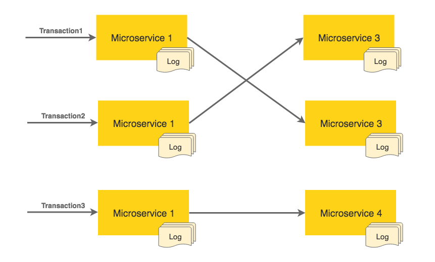
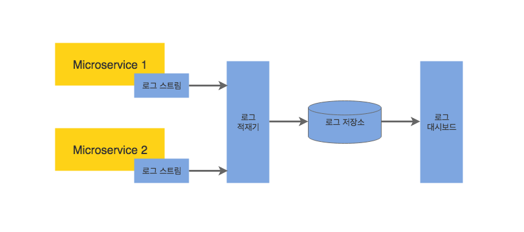
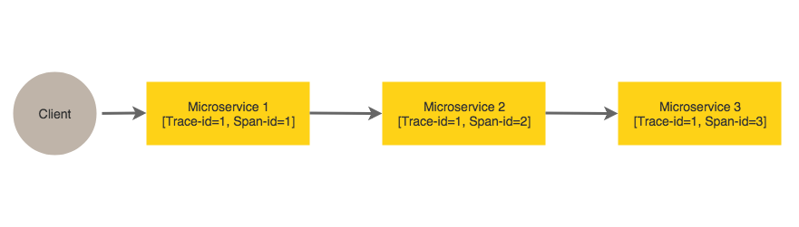

# 1. MSA에서의 로그 관리

### 로그 관리의 어려움



각 마이크로서비스는 독립적인 물리적 장비나 가상머신에서 운영된다.  
만약 각자의 로컬 파일 시스템에 로그를 남긴다면 여러 서비스에 걸쳐서 발생하는 트랜잭션의 흐름을 처음부터 끝까지 연결해가며 이해하는 것이 매우 어렵고 서비스 수준에서 로그를 통합하고 집계하는 것은 거의 불가능하다.

### 중앙 집중형 로깅
위와 같은 문제들을 해결하려면 로그의 출처와 관계없이 모든 로그를 중앙 집중적으로 저장하고 분석해야 한다.  
이를 위해선 로그의 저장과 처리를 서비스 실행 환경에서 떼어 내야 한다.
각 서비스에서 발생한 로그들은 한곳에 모아진 후 중앙의 빅데이터 저장소로 보내지고, 빅데이터 솔루션을 이용해 로그를 분석하고 처리해야한다.   


- 로그 스트림(log stream) : 로그 생성자가 만들어내는 로그 메시지의 스트림. (일반적인 자바 기반 시스템에서 Log4j 로그스트림)
- 로그 적재기(log shipper) : 메시지를 데이터베이스에 쓰거나, 대시보드에 푸시, 스트림 처리 종단점으로 보내는 등 여러 다른 종단점으로 메세지를 전송
ex) Logstash, Fluentd
- 로그 저장소(log store) : 로그 메시지 저장을 위한 대용량 데이터 저장소
ex) HDFS, Elasticsearch, NoSQL
- 로그 대시보드 : 로그 분석 결과를 시각화.
ex) Kibana, Graphite

#### EFK or ELK
- Elasticsearch, Fluentd, Kibana
- Elasticsearch, Logstash, Kibana   
[참고: comparing fluentd and logstash](https://www.alibabacloud.com/help/doc-detail/44259.html?spm=a2c5t.11065259.1996646101.searchclickresult.4687619dZP3Baj)


##### Kibana Dashboard


### 트랜젝션 추적
중앙 집중형 로깅 솔루션을 사용하여 모든 로그를 중앙 저장소에 보관하였다. 그러나 여전히 트랜젝션의 전 구간을 추적하는 것은 거의 불가능하다.
여러 마이크로서비스에 걸쳐 있는 트랜잭션의 전 구간을 추적하려면 연관 ID가 있어야 한다.


하나의 클라이언트 호출에 대해 Trace Id가 생성되고, 각 서비스간 호출 시 새로운 Span Id가 생성된다.
이를 통해 전체 트랜잭션 Flow를 확인하거나 트랜잭션(TraceId) 또는 구간별(SpanId) 시간을 추적 할 수 있다.
트위터의 집킨(Zipkin), 클라우데라의 HTrace 및 구글의 대퍼(Dapper)가 분산 추적에 사용되는 시스템이며,
Spring Cloud는 Spring Cloud Sleuth 라이브러리를 사용한다.


```text
(구현체) Log4j
(구현체) Logback - log4j 만든 사람이 log4j 아키텍쳐 기반으로 재작성
                  Automatic reloading of configuration files - 로그 레벌 변경 시 재기동 불필요
                  Graceful recovery from I/O failures
                  Automatic removal of old log archives...

(facade) SLF4j - 로깅에 대한 추상 레이어 제공하여 창구 일원화. 구현체의 종류와 상관없이 일관된 로깅 코드 작성하도록 함.
```
http://bcho.tistory.com/1243?category=502863
