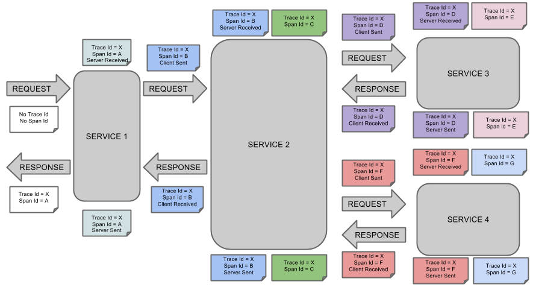

# 1. 개요
## Sleuth 란?

MSA 구조에서 클라이언트의 호출이 내부적으로 여러개의 서비스를 거쳐서 일어나서 전체 트랜잭션에 대한 로그 트레이싱이 어렵다.  
이를 쉽게 하기 위해 트랜잭션의 전 구간을 추적하기 위한 하나의 연관 ID가 필요하다.  
**Sleuth를 사용하면 이 연관 ID(traceID, spanID)를 자동으로 생성**해 준다.  


### Spring Cloud Sleuth의 id 체계
#### Span ID
- 작업의 기본 단위이다. 각 서비스 호출시에 새로운 Span이 하나 생성  
- 유일한 64-bit ID로 구분  
- Description, key-value annotation, process ID 등의 추가 정보를 가짐
- Trace에서 제일 처음 만들어지는 Span을 root span이라 함(trace id와 동일)

#### Trace ID
- 최초 호출시 인입 서비스에서 생성 
- 동일한 Trace ID를 갖는 span들을 묶어서 Tree로 구성 가능하게 함  
- 유일한 64-bit ID로 구분
- 예를 들어 분산 데이터 서비스를 운영할때, 하나의 Put 리퀘스트에 의해 하나의 Trace가 생성

이를 통해 전체 트랜잭션 Flow를 확인하거나 트랜잭션(TraceId) 또는 구간별(SpanId) 로그를 추적 할 수 있다.  
트위터의 집킨(Zipkin), 클라우데라의 HTrace 및 구글의 대퍼(Dapper)등의 UI툴을 이용하면 분산 환경의 로그 트레이싱을 쉽게 할 수 있다.  

Global Transaction ID를 이용한 분산 트랜잭션 로그 모니터링 예시

- 서비스 호출 시 API Gateway에서 gTxId(Global Transaction ID) 생성
- 각 서비스는 로깅 시 gTxID를 함께 logging하며, 다른 서비스 호출 시 header에 gTxID를 포함

### 기록되는 이벤트 시간의 종류
- cs(Client Sent) : Span의 시작 시점
- sr(Server Received) : 서버가 요청을 받고 프로세스를 실행하는 시점. [sr - cs = network latency]
- ss(Server Sent) : 요청 프로세스 완료 시점(클라이언트에 response 전달) [ss - sr = 서버가 요청 처리하는데 걸린 시간]
- cr(Client Received) : Span의 종료 시점 [cr - cs = 클라이언트가 서버로부터 응답받는데 걸리는 전체 시간]




## Spring Cloud Sleuth의 기능

- Slf4J MDC(Mapped Diagnostic Context)을 통해 Trace와 Span Ids를 로그에 추가할 수 있다.  
이를 통해 로그로 부터 Trace와 Span 정보들을 로그 수집기에서 추출할 수 있다.
  - 스프링 어플리케이션의 공통 진출입점에 적용 가능하다.
(servlet filter, rest template, scheduled actions, message channels, zuul filters, feign client)
  - 로그 예제
    ```text
    2018-05-11 15:21:46.466  INFO [sleuth-example,8f8964f0eebf01a8,8f8964f0eebf01a8,false     ] 2647 --- [nio-8080-exec-1] com.example.slueth.SleuthApplication     : This is your home!
                                [appname       ,traceId         ,spanId          ,exportable]
    ```

# 2. 구성방법  

모니터링을 원하는 모든 서비스에 아래 항목을 추가 한다.  
1. Sleuth dependency 추가
    ```xml
    <dependencyManagement>
        <dependencies>
            <dependency>
                <groupId>org.springframework.cloud</groupId>
                <artifactId>spring-cloud-sleuth</artifactId>
                <version>1.3.4.BUILD-SNAPSHOT</version>
                <type>pom</type>
                <scope>import</scope>
            </dependency>
        </dependencies>
    </dependencyManagement>
    <dependencies>
        <dependency>
            <groupId>org.springframework.cloud</groupId>
            <artifactId>spring-cloud-starter-sleuth</artifactId>
        </dependency>
    </dependencies><repositories>
        <repository>
            <id>spring-snapshots</id>
            <name>Spring Snapshots</name>
            <url>https://repo.spring.io/libs-snapshot</url>
            <snapshots>
                <enabled>true</enabled>
            </snapshots>
        </repository>
    </repositories>
    ```
2. log 추가 예제 코드 (sl4j 로깅 시 traceID/spanID가 자동 추가 됨)
    ```java
    @SpringBootApplication
    @RestController
    public class Application {

    private static Logger log = LoggerFactory.getLogger(DemoController.class);

    @RequestMapping("/")
    public String home() {
        log.info("Handling home");
        return "Hello World";
    }

    public static void main(String[] args) {
        SpringApplication.run(Application.class, args);
    }

    }
    ```

3. Logback.xml 에서 로깅 포맷 변경 가능
    ```xml
					<pattern>
						{
						"severity": "%level",
						"service": "${springAppName:-}",
						"trace": "%X{X-B3-TraceId:-}",
						"span": "%X{X-B3-SpanId:-}",
						"parent": "%X{X-B3-ParentSpanId:-}",
						"exportable": "%X{X-Span-Export:-}",
						"pid": "${PID:-}",
						"thread": "%thread",
						"class": "%logger{40}",
						"rest": "%message"
						}
					</pattern>
    ```


# 참고
> zipkin vs. jaeger 참고

[출처](https://sematext.com/blog/jaeger-vs-zipkin-opentracing-distributed-tracers/)

http://bcho.tistory.com/1243?category=502863
