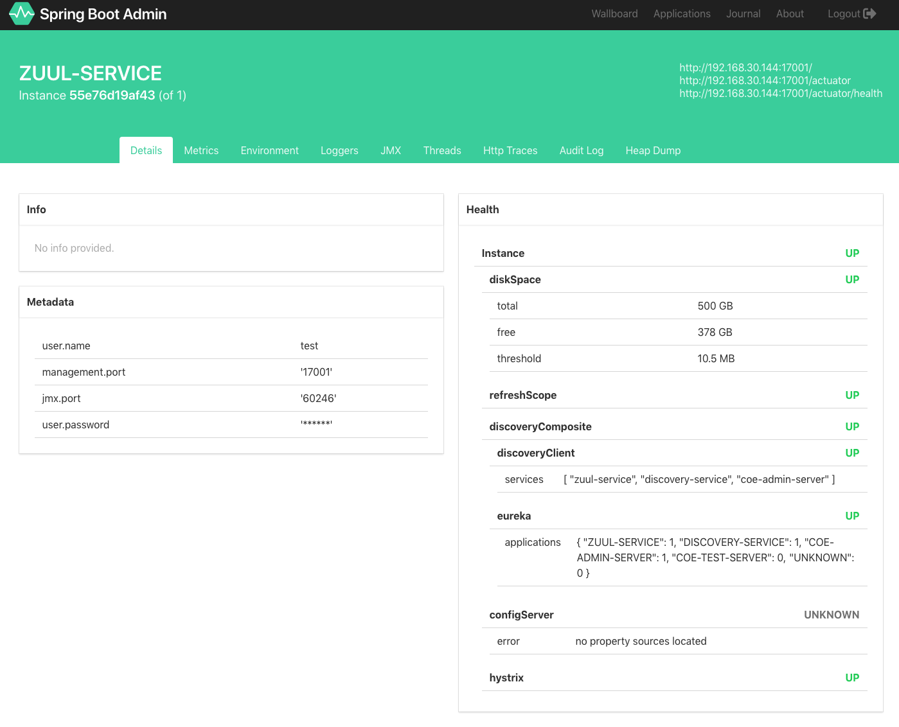

# 1. 개요

Spring Boot Admin 은 Spring Boot 어플리케이션의 admin interface를 제공하는 UI 프레임워크이다.
각 서비스의 Spring Actuator Endpoints의 정보를 읽어와 Dashboard를 제공한다.  


### 제공하는 기능
- Health Status
- Application 상세 정보
    - JVM & memory metrics
    - Datasource metrics
    - Cache metrics 등
- 빌드 정보
- Spring Boot Actuator 제공 정보
- Hystrix stream 정보 등



# 2. 구성방법
## SBA 1.5.x 구성

#### a. Server-side 구성 (1.5.x)
1. Spring boot project 생성
2. pom.xml dependency 추가
  ```xml
    <dependencyManagement>
      <dependencies>
        <dependency>
          <groupId>org.springframework.cloud</groupId>
          <artifactId>spring-cloud-dependencies</artifactId>
          <version>${spring-cloud.version}</version>
          <type>pom</type>
          <scope>import</scope>
        </dependency>
        <dependency>
          <groupId>de.codecentric</groupId>
          <artifactId>spring-boot-admin-dependencies</artifactId>
          <version>${spring-boot-admin.version}</version>
          <type>pom</type>
          <scope>import</scope>
        </dependency>
      </dependencies>
    </dependencyManagement>
    <properties>
      <spring-boot-admin.version>1.5.7</spring-boot-admin.version>
      <spring-cloud.version>Edgware.RC1</spring-cloud.version>
      ...
    </properties>
    <dependencies>
      <dependency>
        <groupId>de.codecentric</groupId>
        <artifactId>spring-boot-admin-starter-server</artifactId>
      </dependency>
      <dependency>
        <groupId>org.springframework.cloud</groupId>
        <artifactId>spring-cloud-starter-netflix-eureka-client</artifactId>
      </dependency>
      ...
    </dependencies>
  ```
3. application.yml - eureka 설정 추가
  ```yaml
  server:
    port: 8080
  eureka:
    instance:
  #    leaseRenewalIntervalInSeconds: 10
    client:
  #    registryFetchIntervalSeconds: 5
      serviceUrl:
        defaultZone: ${EUREKA_SERVER_URL:http://localhost}:${EUREKA_SERVER_PORT:8761}/eureka/
  ```

4. @EnableAdminServer Annotation 추가  
    ```java
    @SpringBootApplication
    @EnableDiscoveryClient
    @Configuration
    @EnableAutoConfiguration
    @EnableAdminServer
    public class CoeAdminApplication {
    s	public static void main(String[] args) {
    		SpringApplication.run(CoeAdminApplication.class, args);
    	}
    }
    ```

#### b. Client-side 구성 with Eureka Client (1.5.x)
각 마이크로서비스가 Eureka Client로 구성되어 있는 경우, Actuator 정보만 추가하여 Admin Server에 자동 등록하고 사용할 수 있다.

> Eureka 는 필수가 아니며, Spring Boot Admin Client 를 통해 구성 가능하다.

1. Spring boot project 생성
2. pom.xml dependency 추가
  ```xml
  <dependency>
    <groupId>org.springframework.boot</groupId>
    <artifactId>spring-boot-starter-actuator</artifactId>
  </dependency>
  <dependency>
    <groupId>org.springframework.cloud</groupId>
    <artifactId>spring-cloud-starter-netflix-eureka-client</artifactId>
  </dependency>
  <dependency>
    <groupId>org.jolokia</groupId> <!--JMX-bean management-->
    <artifactId>jolokia-core</artifactId>
  </dependency>
  ```
3. application.yml - eureka 설정 추가
  ```yaml
  management:
    security:
      enabled: false # actuator endpoint access security
  eureka:
    client:
      serviceUrl:
        defaultZone: ${EUREKA_SERVER_URL:http://localhost}:${EUREKA_SERVER_PORT:8761}/eureka/
  ```


## SBA 2.0.x 구성

#### a. Server-side 구성 (2.0.x)
  1. Spring boot project 생성
  2. pom.xml dependency 추가
    ```xml
      <dependencyManagement>
        <dependencies>
          <dependency>
            <groupId>org.springframework.cloud</groupId>
            <artifactId>spring-cloud-dependencies</artifactId>
            <version>${spring-cloud.version}</version>
            <type>pom</type>
            <scope>import</scope>
          </dependency>
          <dependency>
            <groupId>de.codecentric</groupId>
            <artifactId>spring-boot-admin-dependencies</artifactId>
            <version>${spring-boot-admin.version}</version>
            <type>pom</type>
            <scope>import</scope>
          </dependency>
        </dependencies>
      </dependencyManagement>
      <properties>
        <spring-boot-admin.version>2.0.1-SNAPSHOT</spring-boot-admin.version>
    		<spring-cloud.version>Finchley.RC2</spring-cloud.version>
        ...
      </properties>
      <dependencies>
        <dependency>
          <groupId>de.codecentric</groupId>
          <artifactId>spring-boot-admin-starter-server</artifactId>
        </dependency>
        <dependency>
          <groupId>org.springframework.cloud</groupId>
          <artifactId>spring-cloud-starter-netflix-eureka-client</artifactId>
        </dependency>
        ...
      </dependencies>
    ```
  3. application.yml - eureka 설정 추가
    ```yaml
    server:
      port: 8080
    eureka:
      client:
        serviceUrl:
          defaultZone: ${EUREKA_SERVER_URL:http://localhost}:${EUREKA_SERVER_PORT:8761}/eureka/
    ```
  4. @EnableAdminServer Annotation 추가  
      ```java
      @SpringBootApplication
      @EnableDiscoveryClient
      @Configuration
      @EnableAutoConfiguration
      @EnableAdminServer
      public class CoeAdminApplication {
      s	public static void main(String[] args) {
      		SpringApplication.run(CoeAdminApplication.class, args);
      	}
      }
      ```

#### b. Client-side 구성 with Eureka Client (2.0.x)
  각 마이크로서비스가 Eureka Client로 구성되어 있는 경우, Actuator 정보만 추가하여 Admin Server에 자동 등록하고 사용할 수 있다.

  > Eureka 는 필수가 아니며, Spring Boot Admin Client 를 통해 구성 가능하다.

  1. Spring boot project 생성
  2. pom.xml dependency 추가
    ```xml
    <dependency>
      <groupId>org.springframework.boot</groupId>
      <artifactId>spring-boot-starter-actuator</artifactId>
    </dependency>
    <dependency>
      <groupId>org.springframework.boot</groupId>
      <artifactId>spring-boot-starter-security</artifactId>
    </dependency>
    <dependency>
      <groupId>org.springframework.cloud</groupId>
      <artifactId>spring-cloud-starter-netflix-eureka-client</artifactId>
    </dependency>
    <dependency>
      <groupId>org.jolokia</groupId> <!--JMX-bean management-->
      <artifactId>jolokia-core</artifactId>
    </dependency>
    ```
  3. application.yml - eureka, actuator 설정 추가
    ```yaml
    management:
      endpoints:
        web:
          exposure:
            include: "*"
      endpoint:
        health:
          show-details: ALWAYS
    eureka:
      client:
        serviceUrl:
          defaultZone: ${EUREKA_SERVER_URL:http://localhost}:${EUREKA_SERVER_PORT:8761}/eureka/
    ```
    - Spring boot 2.x 버전의 경우 default actuator endpoint는 health, info뿐이므로 명시적으로 열어줘야 함("*")
  4. Eureka Discovery Annotation 추가, actuator access security 설정 추가
  ```java
  @SpringBootApplication
  @EnableDiscoveryClient
  @Configuration
  @EnableAutoConfiguration
  public class CoeZuulApplication {

      public static void main(String[] args) {
          SpringApplication.run(CoeZuulApplication.class, args);
      }

     @Configuration
      public static class SecurityPermitAllConfig extends WebSecurityConfigurerAdapter {
          @Override
          protected void configure(HttpSecurity http) throws Exception {
              http.authorizeRequests().anyRequest().permitAll()
                      .and().csrf().disable();
          }
      }
  }
  ```


# 3. Login Page 설정
## 1.5.x Server 설정 추가
1. pom.xml dependency 추가
  ```xml
  <dependency>
    <groupId>de.codecentric</groupId>
    <artifactId>spring-boot-admin-server-ui-login</artifactId>
  </dependency>
  <dependency>
    <groupId>org.springframework.boot</groupId>
    <artifactId>spring-boot-starter-security</artifactId>
  </dependency>
  ```
2. application.yml 인증정보 추가
  ```yaml
  security:
    user:
      name: "user"
      password: "user"
  ```
3. SecurityConfig 설정 코드 추가
  ```java
  @Configuration
  public static class SecurityConfig extends WebSecurityConfigurerAdapter {
    @Override
    protected void configure(HttpSecurity http) throws Exception {
      // Page with login form is served as /login.html and does a POST on /login
      http.formLogin().loginPage("/login.html").loginProcessingUrl("/login").permitAll();
      // The UI does a POST on /logout on logout
      http.logout().logoutUrl("/logout");
      // The ui currently doesn't support csrf
      http.csrf().disable();

      // Requests for the login page and the static assets are allowed
      http.authorizeRequests()
          .antMatchers("/login.html", "/**/*.css", "/img/**", "/third-party/**")
          .permitAll();
      // ... and any other request needs to be authorized
      http.authorizeRequests().antMatchers("/**").authenticated();

      // Enable so that the clients can authenticate via HTTP basic for registering
      http.httpBasic();
    }
  }
  ```

## 2.0.x Server 설정 추가
1. pom.xml dependency 추가
  ```xml
  <dependency>
    <groupId>org.springframework.boot</groupId>
    <artifactId>spring-boot-starter-security</artifactId>
  </dependency>
  <dependency>
    <groupId>org.springframework.boot</groupId>
    <artifactId>spring-boot-starter-web</artifactId>
  </dependency>
  ```
2. application.yml 인증정보 추가
  ```yaml
  spring:
    security:
      user:
        name: "user"
        password: "user"
  eureka:
  instance:
    metadata-map:
      user.name: ${spring.security.user.name}
      user.password: ${spring.security.user.password}
  ```
  - eureka.instance.metadataMap.user.name/password

    Registration 단계에서 SBA에 아래와 같은 형식으로 전달되어, SBA에서 해당 서비스의 actuator endpoint에 접근할 때 사용한다. (각 Client Service에서 Security가 필요한 경우 1,2단계를 동일하게 적용)   
    ```json
    {
    "registration": {
        "name": "FOO-SERVICE",
        "managementUrl": "http://localhost:8080/actuator",
        "healthUrl": "http://localhost:8080/actuator/health",
        "serviceUrl": "http://localhost:8080/",
        "source": "discovery",
        "metadata": {
            "user.name": "user",
            "management.port": "8080",
            "jmx.port": "52698",
            "user.password": "******"
            }
        }
    }
    ```
3. SecurityConfig 설정 코드 추가
  ```java
  @Configuration
	public static class SecuritySecureConfig extends WebSecurityConfigurerAdapter {
		private final String adminContextPath;

		public SecuritySecureConfig(AdminServerProperties adminServerProperties) {
			this.adminContextPath = adminServerProperties.getContextPath();
		}

		@Override
		protected void configure(HttpSecurity http) throws Exception {
			// @formatter:off
			SavedRequestAwareAuthenticationSuccessHandler successHandler = new SavedRequestAwareAuthenticationSuccessHandler();
			successHandler.setTargetUrlParameter("redirectTo");

			http.authorizeRequests()
					.antMatchers(adminContextPath + "/assets/**").permitAll()
					.antMatchers(adminContextPath + "/login").permitAll()
					.anyRequest().authenticated()
					.and()
					.formLogin().loginPage(adminContextPath + "/login").successHandler(successHandler).and()
					.logout().logoutUrl(adminContextPath + "/logout").and()
					.httpBasic().and()
					.csrf().disable();
		}
	}
  ```

# 4. Hystrix, Turbine UI 모듈
1.5.x 버전의 경우 hystrix-ui, turbine-ui 모듈을 추가할 수 있다. (2.x 버전은 지원하지 않음)


# 참고
## 버전이슈
SpringBoot Admin Sever의 버전과 마이크로 서비스의 SpringBoot(Actuator) 버전에 따라 이슈가 있음
1. SpringBoot Admin Sever : 2.0.0

  ```text
  Eureka 에 등록된 서버 정보를   SpringBoot Admin에 등록하지 못하는 문제 (springBoot-admin-client를 통해서는 등록 됨)
  (참고 : https://github.com/codecentric/spring-boot-admin/issues/776)

  ==> Spring Boot 2.0.1-SNAPSHOT 사용 권장
  ```
2. SpringBoot Admin Sever : 2.0.1-SNAPSHOT
  ```text
  - admin server issue
      spring-boot-admin-server-ui-hystrix, spring-boot-admin-server-ui-turbine의 최종 버전 1.5.8 이고
      Spring Admin 2.x에서 해당 버전을 지원하지 않음(추후 계획 없음)
      (참고 : https://github.com/codecentric/spring-boot-admin/issues/657)
  - client issue
      마이크로 서비스가 Spring Boot 1.x 버전을 사용할 경우 Admin Server에서 모든 Endpoint 지원하지 않음
      (참고 : http://codecentric.github.io/spring-boot-admin/2.0.0/)
      >As some of the actuator endpoints changed with the Spring Boot 2 release not all options might be available (e.g. /metrics endpoint); for some of the endpoints we provide legacy converters.
  ```
3. SpringBoot Admin Server : 1.5.7
  ```text
    - client issue
        마이크로 서비스가 Spring Boot 2.x 버전을 사용할 경우 Admin Server에서 모든 Endpoint 지원하지 않음
  ```

> SpringBoot Admin Server와 각 마이크로 서비스의 버전을 맞춰서 사용하는 것을 권장.
> SpringBoot Admin 2.x를 사용하는 경우 turbine은 별도의 서비스로 제공 해야 함

## reference guide

1.5.x

http://codecentric.github.io/spring-boot-admin/1.5.7/

https://github.com/altfatterz/spring-boot-admin-eureka-edgware

2.x

https://codecentric.github.io/spring-boot-admin/current/

https://github.com/altfatterz/spring-boot-admin-eureka-finchley
