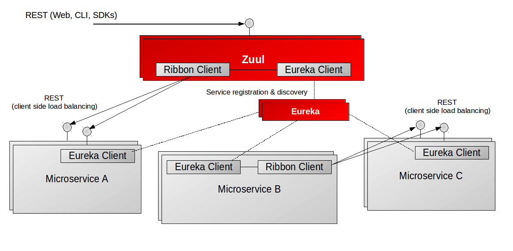

# Prologue

## 모놀리틱 애플리케이션의 한계
- 비즈니스 규모 증가
- 우버 사례
     - 배포에 2~3일, 프론트엔드는 1주일 마다 배포 vs 백엔드 배포 주기
- 빠른 서비스 딜리버리 불가 -> 생존을 위해 MSA로 전환

## 마이크로서비스 아키텍처로 전환 시 해결과제
1. 서비스간 커뮤니케이션 방법 변화
- 솔루션: Netflix Zuul, Feign
2. 클라우드, 컨테이너 활용에 따른 위치 관리, 로드밸런싱 이슈
- 솔루션: Netflix Eureka, Ribbon
3. 네트워크 문제 등 예상치 못한 에러에 대한 대응 방안
- 솔루션: Netflix Hystrix, Spring Cloud Sleuth

## Netflix OSS 탄생 배경
- 비즈니스 로직을 작성하는 것 외에 마이크로서비스 아키텍처를 위해 필요한 서비스가 많다!
- 2008년부터 7년간 MSA로 전환 경험, 내부 서비스를 Netflix OSS로 공개

## 오늘의 학습 내용
- Netflix Zuul, Eureka, Ribbon, Hystrix, Feign
- Spring Cloud Sleuth

## Eureka, Zuul, Ribbon Interation

### Zuul
- Server-side load balancer
- 왜 클라이언트와 백엔드 서비스가 직접 통신하지 않지?

### Eureka
- Service discovery
- 서비스 클라이언트: "현재 실행중인 서비스 인스턴스 정보를 모두 알려줘!"
- Eureka는 어떻게 이 주소를 알 수 있지?

### Ribbon
- Client-side load balancer
- Ribbon이 어떻게 라우팅할 인스턴스를 찾지?
