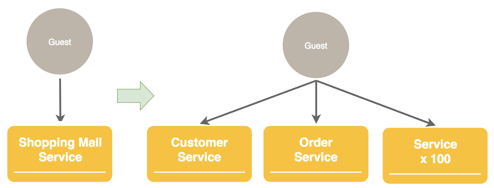
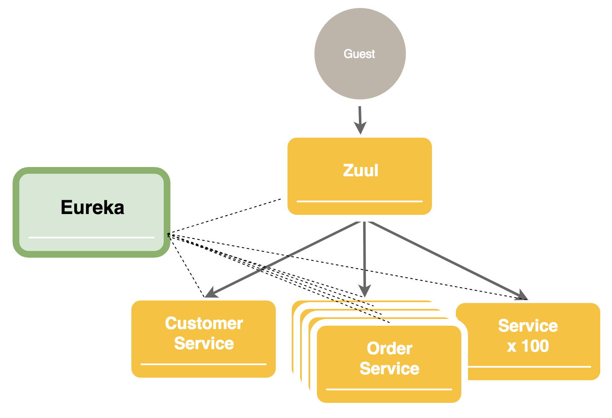
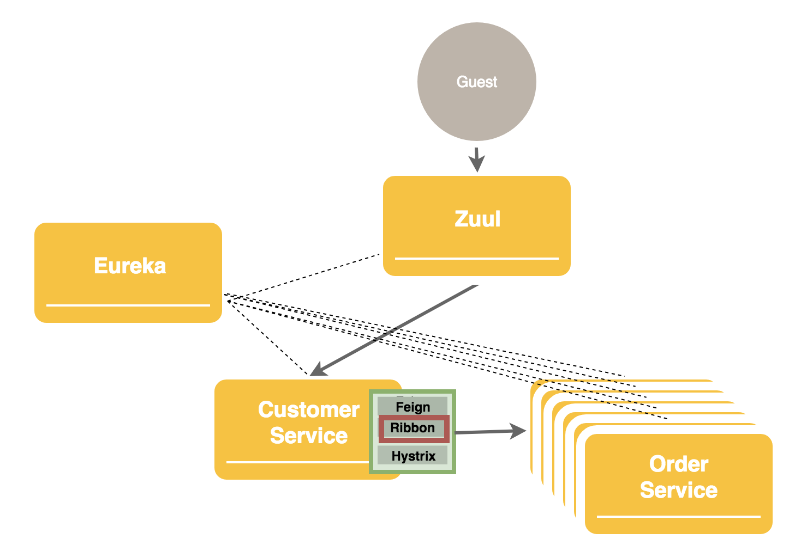
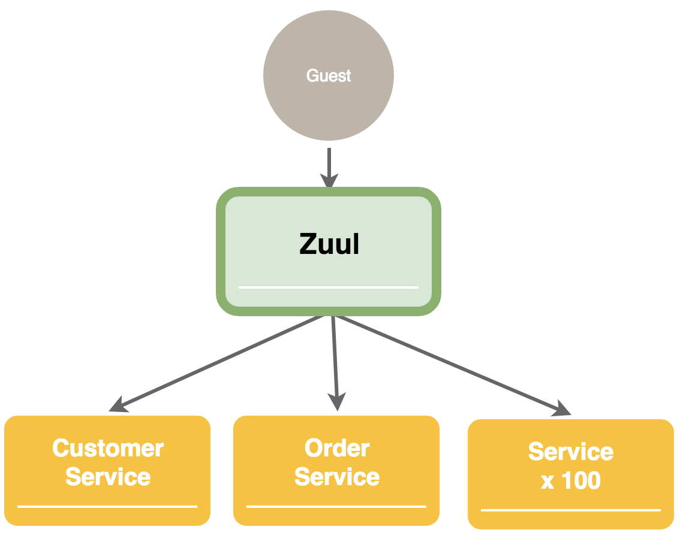
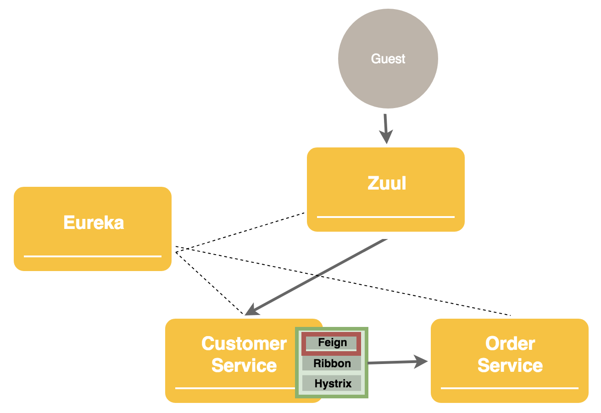
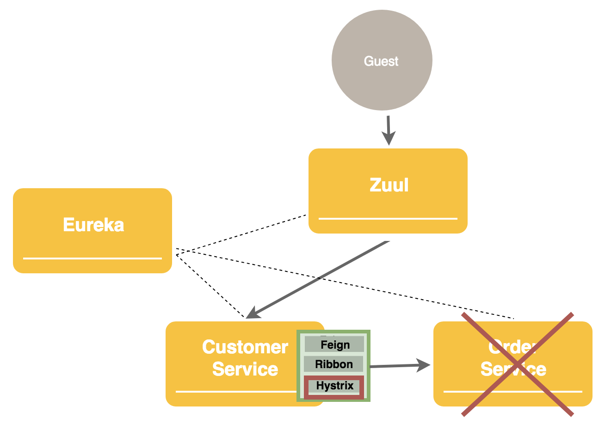
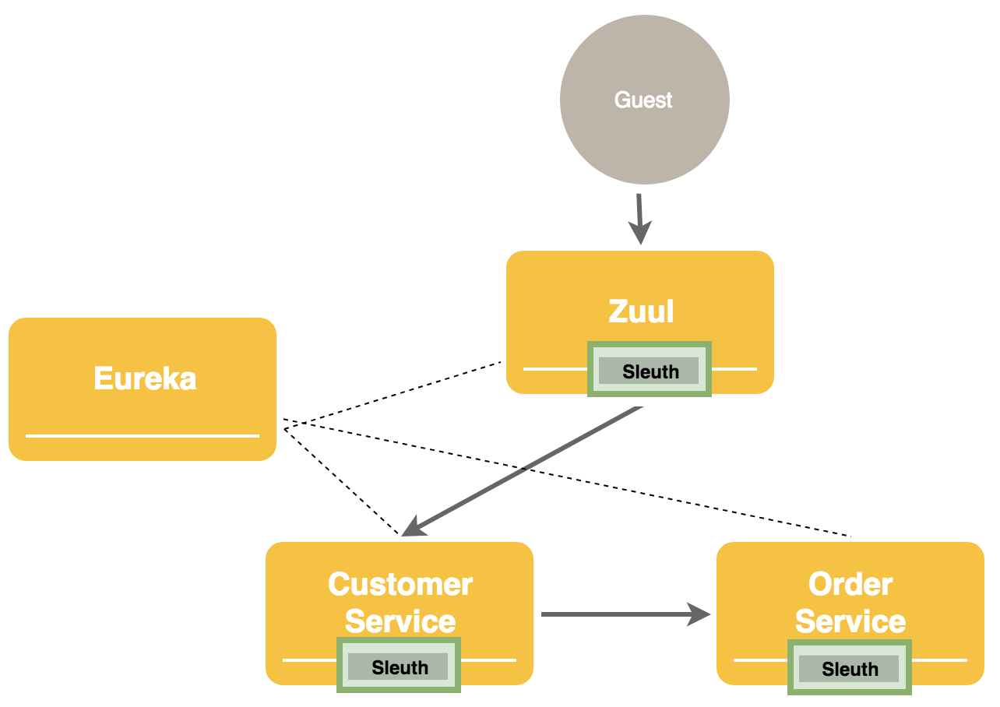
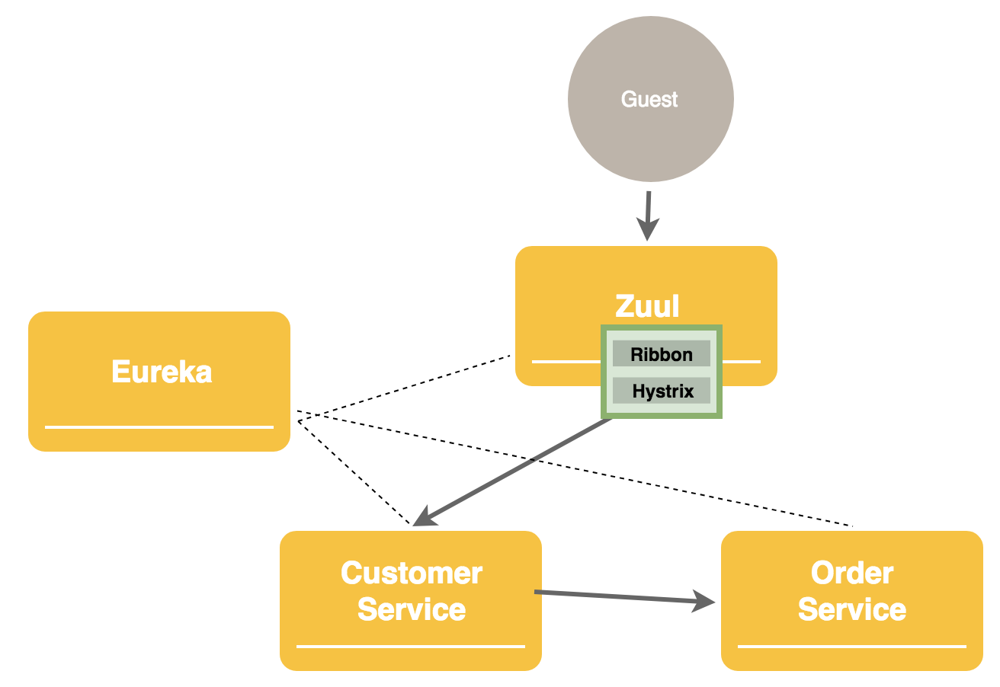
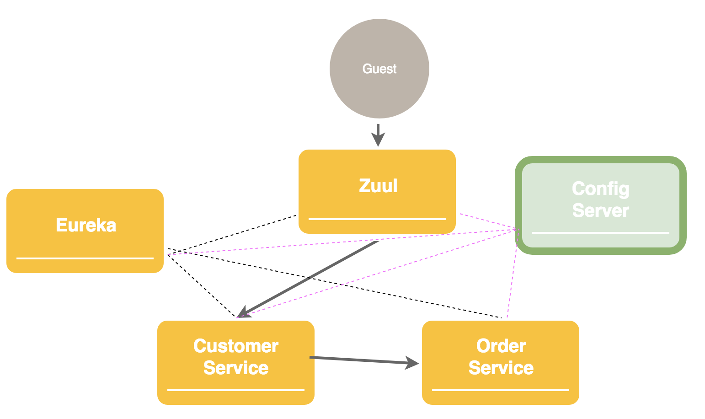

# Netflix OSS Overview

## 1. Monolithic to Microservice
- Monolithic 구조에서 Microservice 구조로 바뀜    
- 사용자가 모든 서비스로 개별 접속 할수는 없음  
- [Netflix 사례](https://github.com/SDSACT/coe-guide/blob/master/README2.md#1-netflix-oss)

## 2. Service Discovery
- Service를 eureka에 등록 하여 id 기반으로 endpoint 탐색이 가능하게 함  
- Auto scaling에 유연하게 대처할 수 있음  
- [Eureka 동작 방식](https://github.com/SDSACT/coe-guide/blob/master/Service%20Discovery/Eureka_2.md#eureka%EA%B8%B0%EB%8A%A5)

## 3. Client Load Balancing
- 여러 instances에 대해 loadbalancing이 가능  
- [Ribbon](https://github.com/SDSACT/coe-guide/blob/master/README2.md#4-ribbon)

## 4. Gateway
- Zuul을 gateway로 사용하여 하나의 인입점을 만듦
- Zuul이 모든 요청을 관련 서비스에게 routing 함    
- [Zuul](https://github.com/SDSACT/coe-guide/blob/master/Gateway/Zuul_2.md#zuul-%EC%9D%B4%EB%9E%80)

## 5. Inner Service Call
- Feign을 사용하여 다른 서비스 호출을 쉽게 할 수 있음  
- [Feign](https://github.com/SDSACT/coe-guide/blob/master/Etc/Feign.md#client-api-call)

## 6. Circuit Breaker
- 하위 서비스 장애 상황시 장애가 상위로 전파되는것을 방지 함  
- Fallback을 통해 장애시 미리 정의된 값으로 처리 할 수 있음  
- [Hystrix](https://github.com/SDSACT/coe-guide/blob/master/Circuit%20Breaker/Hystrix.md#hystrix%EB%9E%80)

## 7. Distributed Log Tracking
- Sleuth를 사용하여 분산 환경에서 로그 추적을 쉽게 할 수 있음     

## 8. Ribbon and Hystrix on Zuul
- Ribbon, Hystrix는 zuul에도 적용 가능    

## 9. Config Server
- 서비스들의 config를 통합 관리할 수 있음
- Config 변경 내용 무중단 반영 가능  

## Circuit Breaker
- Hystrix

## Config
- SpringCloudConfig

## Gateway
- Zuul

## Load Balancing
- Ribbon

## Log
- Sleuth
- EFK

## Messaging
- RabbitMQ
- Kafka

## Monitoring
- Spring Boot Admin

## Service Discovery
- Eureka

## Sidecar Pattern
- SpringCloudNetflixSidecar

## Tracing
- Pinpoint
- Elastic APM

## Etc
- Feign
