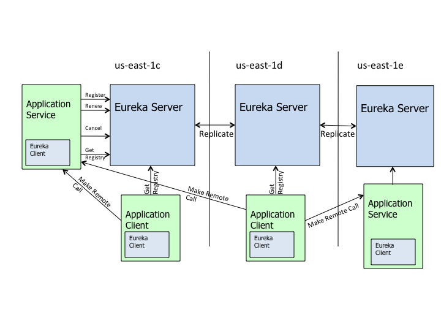

# Table of Contents
- **1. Netflix Eureka 개요**
  - 마이크로서비스 아키텍처에서 의미
  - Netflix Eureka 설계 목적
  - Netflix Eureka Architecture
     - Eureka High level Architecture
     - Netflix Eureka 등장 용어 정리
     - Eureka Client 동작과 Server간 Communication
     - Eureka Server 동작과 Peer Server간 Communication
  
- **2. Netflix Eureka Features**
  - Self-Identification & Registration
  - Service Discovery
  - Service Registry
  
- **3. Getting Started**
  - Eureka Server 설치방법
  - Eureka Client 설치방법
  - Eureka Clustering
  - Eureka registry caching
  
# 1. Netflix Eureka 개요
## 마이크로서비스 아키텍처에서 의미
- 정의
  - Client-side Service Discovery
- 역할
  - 가용한 서비스 인스턴스 목록과 그 위치(host, port)가 동적으로 변하는 가상화 혹은 컨테이너화된 환경에서 클라이언트가 서비스 인스턴스를 호출할 수 있도록 Service registry를 제공/관리하는 서비스
  - **그림TBD**
  <p align="center"></p>

## Netflix Eureka 설계 목적
- 정의
  - Middle-tier load balancer
- 목적
  - 로드밸런싱과 장애복구(failover)가 가능한 Middle-tier 서비스 환경을 구성 했을 때 클라이언트(API Gateway 또는 다른 서비스)에게 가용한 서비스 인스턴스들의 위치 정보를 동적으로 제공할 수 있어야 한다.
  - 그러나 전통적인 로드 밸런서는 서버의 고정적인 IP 주소와 Host name을 기준으로 동작하는 반면, AWS와 같은 클라우드 환경에서는 서버 위치가 동적으로 변할 수 있기 때문에 로드 밸런서에 그 위치를 등록하고 변경하는 과정이 훨씬 더 까다롭다.
  - 또한 AWS는 middle-tier load balancer를 제공하지 않는다.
 
## Netflix Eureka Architecture (설명 보기 쉽게 정리 TBD)
### Eureka High level Architecture
<p align="center"></p>

#### Eureka 등장 용어 정리
- Eureka 행동 관련
  - Service Registration: 서비스가 자기 자신의 정보를 Eureka에 등록하는 행동
  - Service Registry: 서비스가 스스로 등록한 정보들의 목록, 가용한 서비스들의 위치 정보로 갱신됨
  - Service Discovery: 서비스 클라이언트가 요청을 보내고자 하는 대상의 정보를 Service Registry를 통해 발견하는 과정
- Eureka 구성 요소 관련
  - Eureka Client: 서비스들의 위치 정보를 알아내기 위해 Eureka에 질의하는 서비스를 가리킴 (like Service consumer)
  - Eureka Service: Eureka Client에 의해 발견의 대상이 되도록 Eureka에 등록을 요청한 서비스를 가리킴 (like Service provider)
  - Eureka Server: Eureka Service가 자기 자신을 등록(Service Registration)하는 서버이자 Eureka Client가 가용한 서비스 목록(Service Registry)을 요청하는 서버
  - Eureka Instance: Eureka에 등록되어 목록에서 조회 가능한 Eureka Service를 의미

#### Eureka Client 동작과 Server간 Communication
- Self-Identification & Registration
  - Instance Startup 시점
    - eureka.instance/client 설정값을 바탕으로 Eureka에 등록하기 위한 Eureka Instance 정보를 만든다
    - Heartbeat 스케쥴러를 통해 Eureka Server에 heartbeat을 보낸다
    - Eureka에 Eureka Instance 정보를 등록한다
  - 등록 결과 확인
    - REST endpoint /eureka/apps를 통해 등록된 인스턴스 정보를 확인할 수 있다
    - Traffic을 받을 준비가 되면 Eureka Instance의 status가 STARTING → UP으로 바뀐다
    - status:STARTING은 Eureka Instance가 초기화 작업을 진행 중인 상태로 Traffic을 받을 준비가 안되었다는 의미이다
    - eureka.instance.instance-enabled-onit 설정값을 통해 Startup 후 Traffic 받을 준비가 되었을 때 status:UP이 되도록 할 수 있다 (default: false)
  - Instance Startup 이후  heartbeat 전송
    - 등록 이후 heartbeat은 eureka.instance.lease-renewal-interval-in-seconds에 설정된 주기마다 스케쥴러가 실행된다 (default: 30)
    - Eureka Server는 interval에 따라 Eureka Service의 status(UP/DOWN/..)를 판단하고 가장 최근 heartbeat 시점 + interval 이후에 heartbeat을 받지 못하면 eureka.instance.lease-expiration-duration-in-seconds에 설정된 시간만큼 기다렸다가 해당 Eureka Instance를 Registry에서 제거한다 (default: 90, 단, Eureka Instance가 정상적으로 종료된 경우 Registry에서 바로 제거된다) 
  - Instance Startup 이후 Instance 정보 Replication
    - 등록 이후 Instance 정보가 변경 되었을 때 Registry 정보를 갱신하기 위한 REST를 eureka.client.instance-info-replication-interval-seconds에 설정된 주기마다 호출한다 (default: 30)
    - eureka.client.initial-instance-info-replication-interval-seconds (default: 40)
  - Instance Startup 이후 Eureka server info refresh
    - Eureka Server 추가, 변경, 삭제가 일어날 때 Eureka Client가 얼마나 자주 service urls를 갱신할 것인지 eureka.client.eureka-service-url-poll-interval-seconds 값으로 조정할 수 있다 (default: 0, 단 DNS를 통해 service urls를 가져오는 경우)

- Service Discovery
  - Instance Startup 시점
    - Eureka로부터 Registry 정보를 fetch한다
  - Instance Startup 이후 Fetch Registry
    - 등록 이후 Eureka Client는 eureka.client.registry-fetch-interval-seconds에 설정된 주기마다 Local Cache Registry 정보를 갱신한다 (default: 30)

#### Eureka Server 동작과 Peer Server간 Communication
- Self-Identification & Registration
  - Instance Startup 시점
    - Peer nodes를 찾아서 Registry 정보 등 Sync 맞추는 작업을 한다
    - eureka.server.registry-sync-retrires 값을 통해 Peer nodes로부터 Registry 정보를 얻기 위한 재시도 횟수를 조정할 수 있다 (default: 5)
    - Eureka Server가 시작되고 Peer nodes로부터 Instance들을 가져올 수 없을 때 얼마나 기다릴 것인지 eureka.server.wait-time-in-ms-when-sync-empty 시간(milliseconds)을 조정할 수 있다 (default: 3000)
  - 나머지 과정은 Server도 Eureka Client이기 때문에 'Eureka Client > Self-Identification & Registration > Instance Startup 시점'에 설명한 바와 같이 동일하게 동작한다
  - Standalone으로 구성하는 경우 Peer nodes가 없기 때문에 eureka.client.register-with-eureka: false 설정을 통해 등록 과정을 생략할 수 있다

## 2. Netflix Eureka Features
### Self-Identification & Registration
- 다른 서비스가 자신을 발견할 수 있도록 자신의 정보를 Eureka에 등록
```yml
eureka:
  client:
    register-with-eureka: true
```
### Service Discovery (아래 그림 변경 TBD)

- 다른 서비스를 호출하기 위해서 서비스들의 인스턴스 정보 목록(Service Registry)을 Eureka에게 질의함
- 이전에 받은 registry를 갱신하기 위해 기본 30초마다 Eureka에 fetch REST 요청을 실행
```yml
eureka:
  client:
    instance-info-replication-interval-seconds: 30
```
### Service Registry (아래 그림 변경 TBD)

- Eureka Server는 Eureka Service로부터 register/renew/cancel REST 요청을 받아 Service Registry를 구성하고 관리하고 Eureka Client에게 Registry를 제공
- Eureka Server도 Eureka Client로 동작하기 때문에 Eureka HA 환경에서 Peer node에 자기 자신을 등록하고 Registry sync를 맞추기 위해 replication 작업을 수행함
```yml
eureka:
  server:
    registry-sync-retrires: 5
```

# 3. Getting Started

## Eureka Server 설치방법
1. Spring Boot project 생성
1. pom.xml에 Eureka Server dependency 추가

    ```xml
    <dependency>
        <groupId>org.springframework.cloud</groupId>
        <artifactId>spring-cloud-starter-netflix-eureka-server</artifactId>
    </dependency>
    ```

3. configuration - application.yml 수정

    ```yaml
    server:
      port: 8761
    spring:
      application:
        name: discovery-service
    eureka:
      instance:
        hostname: localhost
      client:
        registerWithEureka: false
        fetchRegistry: false
        serviceUrl:
          defaultZone: http://${eureka.instance.hostname}:${server.port}/eureka/
      server:
        enable-self-preservation: true
    ```
    - localhost:8761 에 Eureka Server 설정
    - DefaultZone Url 설정을 통해 동일한 zone의 eureka server clustering 설정
    - 설정값 설명
      - eureka.client.registerWithEureka: 본인 서비스를 eureka 서버에 등록 할지 여부.(eureka는 서버이면서 client가 될 수도 있음)
      - eureka.client.fetchRegistry: client 서비스가 eureka 서버로 부터 서비스 리스트 정보를 local에 caching 할지 여부

4. @EnableEurekaServer Annotation 추가하여 Eureka Server Application으로 선언

    ```java
    @EnableEurekaServer
    @SpringBootApplication
    public class CoeEurekaApplication {

      public static void main(String[] args) {
        SpringApplication.run(CoeEurekaApplication.class, args);
      }
    }
    ```

5. Eureka server 구동 후 Eureka Dashboard 확인
   
    - 웹브라우저에서 Eureka Server로 설정한 URL에 접속시 Eureka 콘솔 화면을 볼 수 있음  

## Eureka Client 설치방법

1. Spring Boot project 생성
2. pom.xml에 Eureka Client dependency 추가
    ```xml
    <dependency>
        <groupId>org.springframework.cloud</groupId>
        <artifactId>spring-cloud-starter-netflix-eureka-client</artifactId>
        <version>1.4.4.RELEASE</version>
    </dependency>
    ```
3. property 추가
    ```yaml
    spring:
      application:
        name: customer-service

    eureka:
      client:
        serviceUrl:
          defaultZone: http://192.168.1.19:8761/eureka/
        enabled: true
      instance:
        preferIpAddress: true # 서비스간 통신 시 hostname 보다 ip 를 우선 사용 함
    ```
    - Eureka Server 연결 설정
    - Service 명 customer-service로 설정 (eureka server에 등록되는 서비스 명)

4. @EnableDiscoveryClient Annotation 추가하여 Eureka Client 선언

    ```java
    @EnableDiscoveryClient  //eureka, consul, zookeeper의 implements를 모두 포함. @EnableEurekaClient는 only works for eureka.
    @SpringBootApplication
    public class CustomerApplication {

        public static void main(String[] args) {
            SpringApplication.run(CustomerApplication.class, args);
        }

        @Bean
        public RestTemplate restTemplate() {
            return new RestTemplate();
        }

    }
    ```

## Eureka Clustering
- application.yml (Server)

  ```yaml
  server:
    port: 8761

  eureak:
    server:
      enable-self-preservation: true
    client:
      registerWithEureka: true      
      fetchRegistry: true           

  ---

  spring:
    profiles: eureka1
  eureka:
    instance:
      hostname: eureka1
      serviceUrl:
        defaultZone: http://eureka2:8761/eureka/

  ---
  spring:
    profiles: eureka2
  eureka:
    instance:
      hostname: eureka2
    client:
      serviceUrl:
        defaultZone: http://eureka1:8761/eureka/
  ```

  - 동일서버에서 실행하는 경우 instance hostname은 unique하게 설정되어야 한다.
  - registerWithEureka true로 설정
    - true설정시 서버 자신도 유레카 클라이언트로 등록한다.
  - fetchRegistry true로 설정
    - defaultZone의 유레카 서버에서 클라이언트 정보를 가져온다(registerWithEureka가 true로 설정되어야 동작함)
  - profile 추가하여 서로 참조하도록 serviceUrl.defaultZone 설정
  - self preservation [참조](https://medium.com/@fahimfarookme/the-mystery-of-eureka-self-preservation-c7aa0ed1b799)

- application.yml (Client)

  ```yaml
  spring:
    application:
      name: customer-service

  eureka:
    client:
      serviceUrl:
        defaultZone: http://eureka1:8761/eureka/,http://eureka2:8761/eureka/
      enabled: true
  ```
  - eureka.client.serviceUrl.defaultZone에 clustering한 유레카 서버 모두 입력
    - heart-beat는 defaultZone의 very first 항목인 eureka1에 만 전송
  - 여러개의 Eureka에 등록할 경우 defaultZone에 ,(comma)로 구분하여 입력한다.

## Eureka registry caching [참조](https://blog.asarkar.org/technical/netflix-eureka/)  
- Eureka Server Response Cache 설정  
Eureka server에서 eureka client에게 자신의 registry 정보를 제공 시 사용하는 cache.  
client에게 더 빠른 registry 정보 제공을 위해 실제 registry 값이 아닌 cache의 값을 제공 함.  
```yml
eureka.server.response-cache-update-interval-ms: 3000 # 기본 30초
```
- Eureka Client Cache 설정  
Eureka client에 존재하는 cache로 eureka server에 서비스 정보 요청 시 이 cache의 값을 이용 한다.   
eureka.client.fetchRegistry 값이 false이면 client cache는 적용되지 않는다.   
```yml
eureka.client.registryFetchIntervalSeconds: 3 # 기본 30초
```
> Ribbon cache 설정(cache를 정리하며 ribbon cache 도 포함하여 정리 함)  
> Zuul, Feign 에서 다른 서비스 호출 시 사용 되는 cache
> ```yml
> ribbon.ServerListRefreshInterval: 3000
> ```
