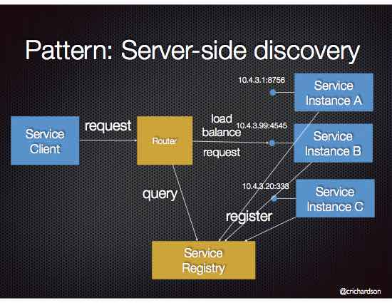
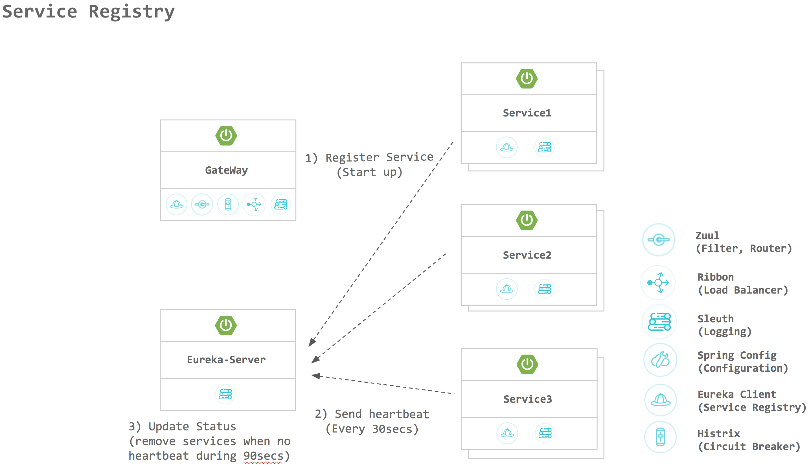
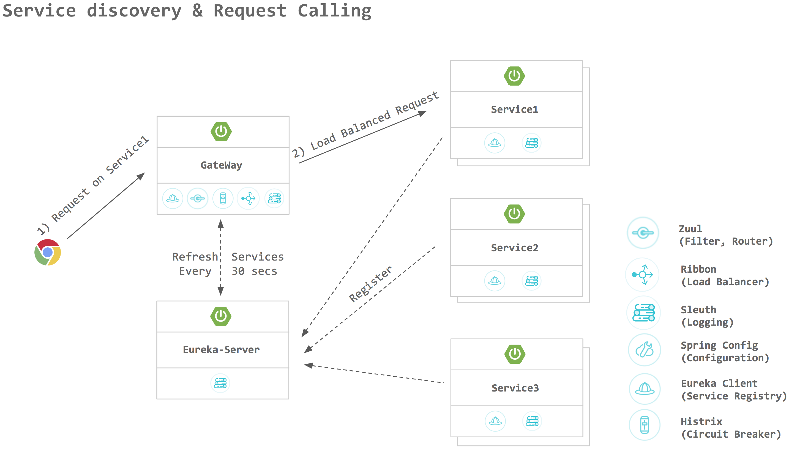
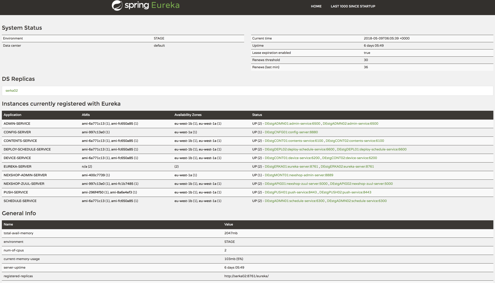

# Eureka

# 1. 개요

### Eureka란?

```text
Eureka is the Netflix Service Discovery Server and Client.
The server can be configured and deployed to be highly available,
with each server replicating state about the registered services to the others.
```

### Eureka를 사용하는 이유?
MicroService Architecture에서 다른서비스 호출하기
```text
기존 Monolithic Service에서는 다른 서비스를 호출할 때, Instance가 많지 않아 고정 된 IP 기반의 HTTP/REST 또는 RPC 를 이용하면 충분하였으나,
Microservices는 가상 환경 혹은 컨테이너 기반 환경에서 서비스가 구동되는 경우가 일반적이기 때문에 IP로 관리하기가 매우 힘들다.
그래서 서비스의 이름으로 타서비스를 호출 하는것이 효율적이며, 
이를 위해서 서비스를 등록(Service Registry)하고 찾아주는(Discovery) 기능이 필요하다. 
```

  


### Eureka 기능







## 2. 구성방법

### Eureka Server 설치방법
1. Spring Boot project 생성
1. pom.xml에 Eureka Server dependency 추가

    ```xml
    <dependency>
        <groupId>org.springframework.cloud</groupId>
        <artifactId>spring-cloud-starter-netflix-eureka-server</artifactId>
    </dependency>
    ```

3. configuration - application.yml 수정

    ```yaml
    server:
      port: 8761
    spring:
      application:
        name: discovery-service
    eureka:
      instance:
        hostname: localhost
      client:
        registerWithEureka: false
        fetchRegistry: false
        serviceUrl:
          defaultZone: http://${eureka.instance.hostname}:${server.port}/eureka/
      server:
        enable-self-preservation: true
    ```
    - localhost:8761 에 Eureka Server 설정
    - DefaultZone Url 설정을 통해 동일한 zone의 eureka server clustering 설정
    - 설정값 설명
      - eureka.client.registerWithEureka: 본인 서비스를 eureka 서버에 등록 할지 여부.(eureka는 서버이면서 client가 될 수도 있음)
      - eureka.client.fetchRegistry: client 서비스가 eureka 서버로 부터 서비스 리스트 정보를 local에 caching 할지 여부

4. @EnableEurekaServer Annotation 추가하여 Eureka Server Application으로 선언

    ```java
    @EnableEurekaServer
    @SpringBootApplication
    public class CoeEurekaApplication {

      public static void main(String[] args) {
        SpringApplication.run(CoeEurekaApplication.class, args);
      }
    }
    ```

5. Eureka server 구동 후 Eureka Dashboard 확인
   
    - 웹브라우저에서 Eureka Server로 설정한 URL에 접속시 Eureka 콘솔 화면을 볼 수 있음  

### Eureka Client 설치방법

1. Spring Boot project 생성
1. pom.xml에 Eureka Client dependency 추가
    ```xml
    <dependency>
        <groupId>org.springframework.cloud</groupId>
        <artifactId>spring-cloud-starter-netflix-eureka-client</artifactId>
        <version>1.4.4.RELEASE</version>
    </dependency>
    ```
3. property 추가
    ```yaml
    spring:
      application:
        name: customer-service

    eureka:
      client:
        serviceUrl:
          defaultZone: http://192.168.1.19:8761/eureka/
        enabled: true
    ```
    - Eureka Server 연결 설정
    - Service 명 customer-service로 설정 (eureka server에 등록되는 서비스 명)

4. @EnableDiscoveryClient Annotation 추가하여 Eureka Client 선언

    ```java
    @EnableDiscoveryClient
    @SpringBootApplication
    public class CustomerApplication {

        public static void main(String[] args) {
            SpringApplication.run(CustomerApplication.class, args);
        }

        @Bean
        public RestTemplate restTemplate() {
            return new RestTemplate();
        }

    }
    ```

## 3. Eureka Clustering
- application.yml (Server)

  ```yaml
  server:
    port: 8761

  eureak:
    server:
      enable-self-preservation: true
    client:
      registerWithEureka: true      
      fetchRegistry: true           

  ---

  spring:
    profiles: eureka1
  eureka:
    instance:
      hostname: eureka1
      serviceUrl:
        defaultZone: http://eureka2:8761/eureka/

  ---
  spring:
    profiles: eureka2
  eureka:
    instance:
      hostname: eureka2
    client:
      serviceUrl:
        defaultZone: http://eureka1:8761/eureka/
  ```

  - 동일서버에서 실행하는 경우 instance hostname은 unique하게 설정되어야 한다.
  - registerWithEureka true로 설정
    - true설정시 서버 자신도 유레카 클라이언트로 등록한다.
  - fetchRegistry true로 설정
    - defaultZone의 유레카 서버에서 클라이언트 정보를 가져온다(registerWithEureka가 true로 설정되어야 동작함)
  - profile 추가하여 서로 참조하도록 serviceUrl.defaultZone 설정
  - self preservation [참조](https://medium.com/@fahimfarookme/the-mystery-of-eureka-self-preservation-c7aa0ed1b799)

- application.yml (Client)

  ```yaml
  spring:
    application:
      name: customer-service

  eureka:
    client:
      serviceUrl:
        defaultZone: http://eureka1:8761/eureka/,http://eureka2:8761/eureka/
      enabled: true
  ```
  - eureka.client.serviceUrl.defaultZone에 clustering한 유레카 서버 모두 입력
    - heart-beat는 defaultZone의 very first 항목인 eureka1에 만 전송
  - 여러개의 Eureka에 등록할 경우 defaultZone에 ,(comma)로 구분하여 입력한다.


