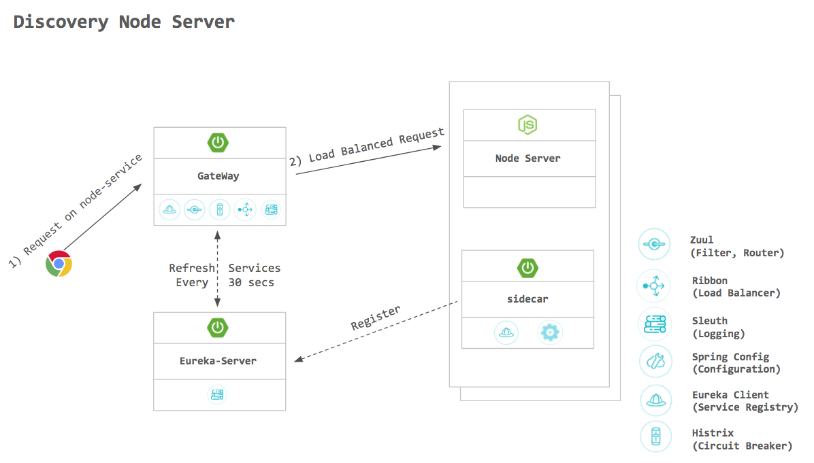
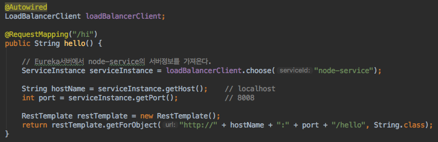
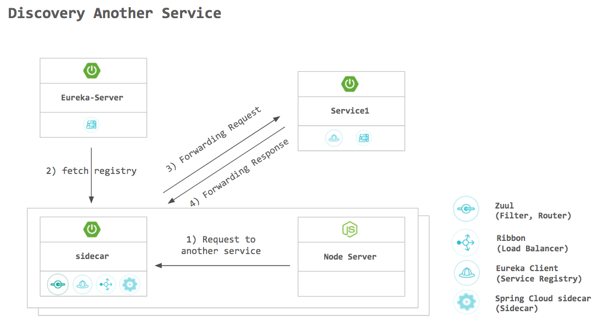

# 1. 개요

### Spring Cloud Netflix Sidecar 란?

 >A Sidecar as referred to in Polyglot support with Sidecar is a Spring Boot application that acts as a bridge between your service infrastructure and a service that is not written in a JVM language. Apps written in Python, Go, Ruby, C#, NodeJS, Erlang or really any other language that can bind something to a port come to mind.
 - Non-JVM 어플리케이션을 Spring Cloud(Zuul, Eureka, Spring Cloud Config ...)에 쉽게 편입 시키는 기능을 지원한다.

### 사용하는 이유

1. service discovery : host:port/<serviceId> 를 통하여 다른 방법에 비해 편하게 Non-JVM 어플리케이션에서 다른 Eureka 클라이언트를 찾을 수 있다.
2. monitoring : health check uri 설정을 통해 Eureka서버에서 Non-JVM 어플리케이션의 동작 여부를 알수 있다.
3. routing / proxying : Zuul을 통하여 Request를 받을 수 있다.
4. balancing : 내장된 Ribbon을 통해 Client side load balancing 기능을 지원 한다.
5. counfiguration : Spring Cloud Config를 통하여 configuration properties를 받을 수 있다.

# 2. 구성방법

### 설치방법

1. Spring boot 프로젝트 생성
2. pom.xml에 dependency 추가
    ```xml
	<properties>
		<project.build.sourceEncoding>UTF-8</project.build.sourceEncoding>
		<project.reporting.outputEncoding>UTF-8</project.reporting.outputEncoding>
		<java.version>1.8</java.version>
		<spring-cloud.version>Finchley.RELEASE</spring-cloud.version>
	</properties>

	<dependencyManagement>
		<dependencies>
			<dependency>
				<groupId>org.springframework.cloud</groupId>
				<artifactId>spring-cloud-dependencies</artifactId>
				<version>${spring-cloud.version}</version>
				<type>pom</type>
				<scope>import</scope>
			</dependency>
		</dependencies>
	</dependencyManagement>

	<dependencies>
		<dependency>
			<groupId>org.springframework.cloud</groupId>
			<artifactId>spring-cloud-netflix-sidecar</artifactId>
		</dependency>
	</dependencies>
    ```
3. @EnableSidecar 어노테이션 추가
    ```java
    @SpringBootApplication
    @EnableSidecar
    public class SidecarApplication {

        public static void main(String[] args) {
            SpringApplication.run(SidecarApplication.class, args);
        }
    }
    ```
4. bootstrap.yml 파일에 설정 추가
    ```yml
    server:
      port: PORT

    spring:
      application:
        name: node-service

    sidecar:
      port: NON-JVM-APP-PORT
      health-uri: HEALTH-CHECK-URI

    eureka:
      client:
        serviceUrl:
          defaultZone: http://eureka:8761/eureka/
    ```

# 3. 동작

1. discovery sidecar application
    - Eureka에 등록된 serviceId(NODE-SERVICE)로 사용 가능

    - 내부 서비스에서 node sever를 접근하는 예제 코드


2. discovery another application
    - **sidecarHostName** : **sidecarPort** / **servceId**
    - serviceId를 이용하여 Node Server에서 다른 micro service 사용 가능
    - Node server에서 http://localhost:8009/Service1/someEndPoint 를 접근하는 경우 sidecar application이 Eureka서버에서 서버 정보를 가져와 Service1으로 라우팅 해준다.
 