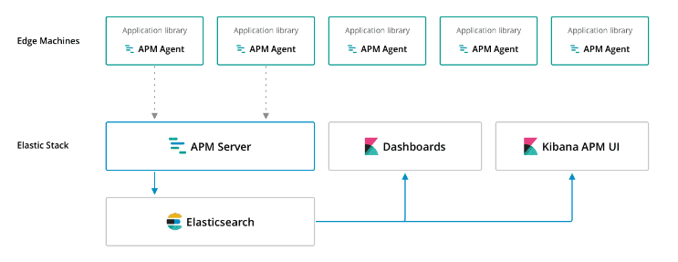

# 1. 개요

Elastic Stack에 구성된 APM(Application Performance Monitoring) 시스템으로, Elasticsearch를 데이터 저장소로 사용한다.

## APM Components
- Elasticsearch
- APM Agents
- APM Server
- Kibana APM UI

각 서버에 설치된 APM agents들이 응답 시간, DB처리시간, 외부 HTTP 요청, 에러 등과 같은 퍼포먼스 관련 데이터들을 수집하여 APM Server로 전송한다.

APM Server는 agent에서 받은 데이터로 도큐먼트를 만들어 Elasticsearch에 저장한다. 저장된 데이터는 X-Pack에 포함된 APM UI나 Kibana Dashboard를 통해 확인할 수 있다.

APM Server는 Go로 개발되었고, APM Agent는 Node.js, Python를 제공한다. (Ruby, Javascript 제공 예정)

# 참고
### Elastic APM vs Pinpoint 

|          | APM                                                                                                      | Pinpoint                                                                                                                                                                                   |                                                                                            |
|----------|----------------------------------------------------------------------------------------------------------|--------------------------------------------------------------------------------------------------------------------------------------------------------------------------------------------|--------------------------------------------------------------------------------------------|
| UI       |  Kibana Dashboard 또는 전용 UI 사용  - Application (Response/Request Info)  - Error Tracking  - Transaction |  별도 UI Server 구성  - ServerMap  - Realtime Active Thread Chart  - Request/Response Scatter Chart  - Transaction Callstack  - Inspector (CPU usage, Memory/Garbage Collection, TPS, JVM args) | pinpoint 더 다양한 동적 UI 제공 APM은 ELK Stack 사용할 경우 별도 UI 구성 필요없음 (Kibana) |
| Store    | Elasticsearch                                                                                            | HBase                                                                                                                                                                                      | APM은 ELK Stack 사용할 경우 별도 DB 구성 필요없음                                          |
| Language | Server - GO  Agent - Python, Nodejs                                                                       | Agent/Collector/Web - JAVA                                                                                                                                                                 |                                                                                            |
