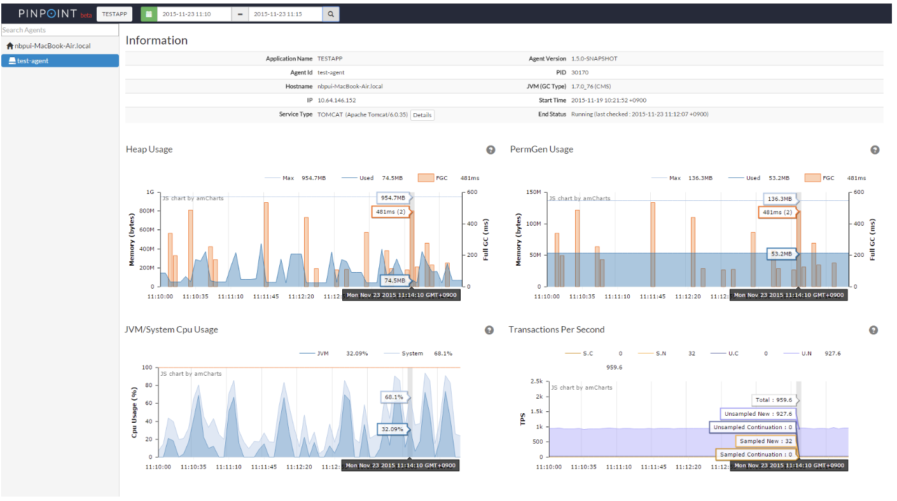

# 1. 개요
- Pinpoint는 분산 시스템 환경에서 log tracing/request tracing을 해주는 도구 이다.  
- bytecode instrumentation 방식 으로 소스코드 수정이 불필요 하다.
(클래스를 로드하는 시점에 코드를 가로채 바이트코드를 변경)
- 사용성 분석 관련 Google Analytics로 데이터를 전송하는데, pinpoint-web.propertis에 아래 속성 추가 필요
```xml
config.sendUsage=false
```
- pinpoint 사용시 기존 resource 사용량에 3% 정도의 추가 resource 사용량이 필요 하다고 함(과연 그럴지...)

### Architecture
Agent(서비스단에 추가되는 bytecode), Collector, HBase, UI Web 로 구성 됨.
  
[출처: Naver Pinpoint](http://naver.github.io/pinpoint/quickstart.html#extra)  

### 주요 기능
#### callstack monitoring
  
[출처: Naver Pinpoint](http://naver.github.io/pinpoint/quickstart.html#extra)  
#### 서비스 성능 inspector
  
[출처: Naver Pinpoint](http://naver.github.io/pinpoint/quickstart.html#extra)  
#### request tracking
  
[출처: Naver Pinpoint](http://naver.github.io/pinpoint/quickstart.html#extra)  

# 2. Quick Start
소스코드 다운로드 [Naver Pinpoint]('https://github.com/naver/pinpoint.git')  
서비스 시작  
1. quickstart/bin/start-hbase.sh  
2. quickstart/bin/start-collector.sh  
3. quickstart/bin/start-web.sh  
4. 사용자 서비스 시작 시 아래 parma 추가
```sh
-javaagent:/Users/actmember/workspace/msa-study/pinpoint/quickstart/agent/target/pinpoint-agent/pinpoint-bootstrap-1.8.0-SNAPSHOT.jar  
-Dpinpoint.agentId=service01  
-Dpinpoint.applicationName=service01  
```
5. http://localhost:28080로 접속하여 서비스 이용 가능

# 3. Applicatinos 간 관계 설정
TBD

# 참고
작동원리 : https://d2.naver.com/helloworld/1194202
